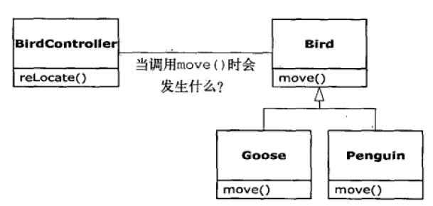
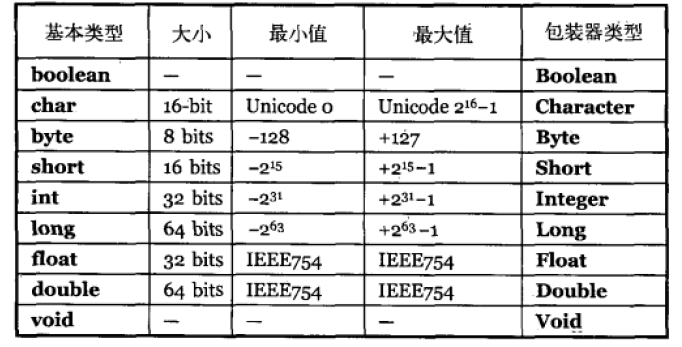

# 1对象导论


## 抽象过程

Alan Kay 纯粹面向对象程序五个特性

1. 万物皆为对象。 任何现实中物体都可以抽象为程序中对象，将对象视为特殊变量，即可存储数据，也可以在自身上执行操作

2. 程序是对象集合。程序可以完全由对象来集成，它们通过调用方法来告知彼此

3. 对象可以包含对象，以构建存储复杂数据结构，再使用时隐藏复杂性

4. 每个对象都拥有其类型，即每个对象都是某个类的实例，类型就是指程序中类，类与其他类最大区别是定义成员和方法不同。

5. 同一个类型的对象，具有相同方法

而Booch对对象提出更加简洁的描述：对象具有状态，行为和标识。

这意味着每个对象都具有内部数据和行为，并为了区别其他对象，每个对象在内存中都有唯一的地址。

## 每个对象都有一个接口


## 每个对象都提供服务

在理解一个程序设计时，最好的方法是将对象想象为“服务提供者”。

程序本身将向用户提供服务。它通过调用其他对象服务来实现这个目标。

将对象看作是服务提供者的另外一个好处：它有助于提高对象的内聚性。

高内聚性可以将某一个功能“组合”的很好，通过多个对象来实现，

每个对象提供单一的服务，提高代码复用性

## 被隐藏的具体实现

将程序开发人员按角色分为类创建者和客户端程序员，

类创建者是指创建新的数据类型，或者类库，客户端程序员使用新的数据类型或类库来实现应用开发类或类库

类创建者创建的新类，只向客户端暴露必须的部分，隐藏具体实现逻辑。

防止新类被某个客户端程序破坏，导致其他客户端代码不可用。减少bug

因此类必须存在**访问控制**

访问控制，
1. 让客户端程序无法触及他们不应用触及的部分
2. 允许类库设计者可以改变内部的逻辑，而不影响客户端的调用

java用三个关键字来设立类的访问边界：public, private protected, 如果没有指明，则使用默认访问权限即是包访问权限

## 复用具体实现

代码的复用是面向对象设计最大优点

## 继承

### “是一个”与”像是一个” 关系

若从基类继承下来的子类，只是覆盖原来方法，并没有新增成员和新的方法，则我们认为子类完全可以替代基类，这个称谓**替代原则**

若从基类继承下来的子类，除了覆盖原来方法外，还新增成员或新的方法，则子类也可以替代基类，但是基类变量不能访问新的成员或方法。

## 多态	的可互换对象

如果继承从上到下，那么java支持向上转型，实现替代功能，达到多态的目的



```java
relocate(Bird bird){
	bird.move();
}

Goose goose = new Goose();

relocate(goose)
relocate(penguin)
```
当我们在调用move时，可以忽略Brid的具体类型，也会产生正确的行为

在过程编程中，调用函数时，在编译时就已经知道真实的函数地址，

而OOP中，编译时是不知道真实地址，只有在运行时，靠动态绑定来确认要调用的真实地址，这也称为后期绑定

## 单根继承

在OOP中，所有类都继承自Object的基类，这就是单根继承，

好处
1. 保证所有对象都具备某些功能
2. 使垃圾回收器实现变得容易


## 对象容器 -集合类

## 参数类型  - 泛型

## 对象生命周期

C++，Delphi，对象的创建和销毁都是在代码中明确指定，对象在堆键上创建和销毁，性能比堆上要快很多

而java对象创建在堆上的，属于在运行时动态创建

java采用垃圾回收机制来销毁不用的对象

好处
1. 简化代码开发
2. 防止内存溢出错误


## 异常处理

## 并发编程


## 一切都是对象

java基于C++的，但是相比之下，Java是一种更纯粹的面向对象程序设计语言

所有的编程都以对象为核心，对象创建，对象的引用，操作对象等等操作

### 用引用操纵对象

java统一的语法，就使用通过引用来操纵对象，像遥控器操控电视机一样

遥控可以单独存在
```java
   String name;
```
但是还不能操控，否则报空指针错误


### 必须由你创建所有对象
一旦创建了一个引用，就必须以一个新的对象关联
```java
   String name = new String("su");
```

### 对象可以存储到什么地方

1. 寄存器， CPU内部，最快的存储区
2. 堆栈，随机访问存储器RAM，将对象的引用存入RAM中后，CPU可以使用堆栈指针下移来快速定义对象引用，
上移来释放对象的引用，速度仅次于寄存器， java对象存在堆上，而对象引用存放堆栈上
3. 堆， 随机访问存储器RAM，定义了一块通用内存池，用于存储java对象，编译器不需要知道对象在堆中存活多长时间，只是在程序在运行时，会在堆中new一个对象，代价是，用堆进行存储分配和清理比堆栈需要跟多时间
4. 常量存储。存放在只读存储器ROM，因为常量是不能被改变的，读取速度快
5. 非RAM存储，数据存放在磁盘，或其他机器上，数据不受程序任何控制，在程序没有运行时也存在，实例 **流对象和持久化对象**


## 特例 - 基本类型

Java为了保持程序运行的性能，将非常小的数据 - 基本类型，不通过new的方式存在堆中，而是直接以值的方式存储在堆栈中


### 高精度类型
