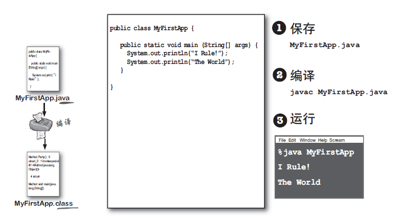
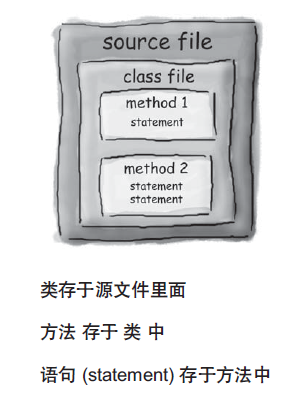

# 1这门语言
    发展史
    认识java程序
      如何实践java
      实践第一个java程序
        编写java程序
        编译java文件
        运行class文件
      语法要点
      java文件结构
      java虚拟机是如何运行java程序
    编译器与虚拟机
    深入思考

## 发展史


截止到2019-09-40主流版本为java8(java 1.8)，最新版本java11

java1.1, 1.2, 1.5, 1.8是开发版本号了，而java2， java5， java8是销售部门使用版本号了。

而java3， java4没有出现过。

## 认识java程序

### 如何实践java


### 实践第一个java程序

1. 编写java程序
2. 编译java文件
3. 运行class文件



#### 编写java程序

在本地创建一个myfirstapp目录，

使用任何的编辑器，比如EditPlus，创建如下java代码
```java
/**
 * @author : zhenyun.su
 * @comment :  运行时，配置program arguments hello world
 * @since : 2019/9/12
 */
public class MyJavaApp {
    public static void main(String[] args){
        System.out.println("your first java app");
        System.out.println(args[0]);
        System.out.println(args[1]);
    }
}
```

保存文件名 **MyJavaApp.java**, java源代码文件以java扩展名，文件名和类名相同

#### 编译java源代码

下面使用JDK工具来编译和运行
```
mkdir out   //创建class文件输出目录
javac mypackage/*.java -d out  // 参数 -d 表示用保存class字节码文件的目录
```

通过编译java源代码，生成class文件

#### 运行class文件

通过java虚拟机来运行class文件，从而java程序
```
java -cp out MyJavaApp hello zhenyun.su
```

指定运行参数, hello zhenyun.su

运行结果如下
```
your first java app
hello
zhenyun.su
```

java程序由java文件组成，每个java文件结构是怎么样的呢？

### 语法要点

1. 语句以分号;结束，花括号{},小括号()不用使用分号;
2. 程序块用{}来圈定

### java文件结构



1. 源文件， 带着类定义，以扩展名为.java的文件，类用来表示一个程序组，内容必须包含在花括号里面。
2. 类， 类中带着一个或多个方法，方法必须定义在类内部声明。
3. 方法，方法内容包含在花括号里面，定义可执行的语句

### java虚拟机是如何运行java程序

当java虚拟机启动时，或查找命令列表指定的类，然后再查找类中main()方法。


接着java虚拟机就会执行main方法中所有代码语句。

每个java程序必须有至少一个类及只有一个main方法


## 编译器与虚拟机

编译器用来编译java源代码，并生成可被jvm执行的class文件

1. 语法检查，防止低级debug再运行时出现，比如类型检查
2. 将源代码编译为字节码（java虚拟机可识别可运行的代码）

为什么不直接编译成二进制代码呢？，为了支持跨平台，一次编写，多平台运行

java虚拟机用来执行class文件

不同平台通过安装不同版本的JDK，这些JDK都能统一识别和执行class(java字节码)文件

kolin，scale等语言，都是通过编译出可识别的字节码文件，而被jvm执行。

关于字节码文件，请看 深入Java虚拟机的字节码

## 深入思考

1. 为什么所有语句必须包含在类中，因为java是面向对象编程，
2. 不是每个类都需要加上main()方法
3. java是强类型语言，不能使用integer直接替换boolean来使用
