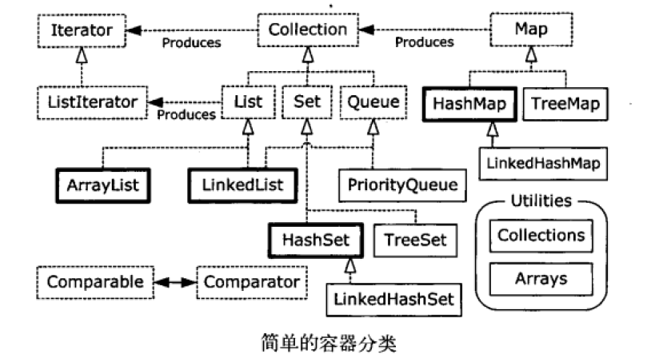

# 3总结
    集合类一览表
    常用集合类
    下一步行动

## 集合类一览表

可以看到，只有四种集合类：List, Set, Queue和Map，它们都有两到三个实现类。

常用集合类用黑色线框来表示，点线框表示接口，实线框表示具体类。

带有空心箭头的点线表示一个特定类实现了一个接口，实心箭头表示某个类可以生产箭头所指向的对象。

例如任何Collection可以生产Iterator，而List可以生产ListIterator

## 常用集合类
java提供了大量容器类来存储对象

### 数组

数组将数字和对象联系起来。 它保留类型明确的对象，查询对象时不用做类型转换。

数组可用保存对象，也可以保存基本类型，也可以用多维的存储，但是一旦生成，其容量不可调整。

### 集合

Collection保存单一的元素，而Map保存相关联的键值对。

使用java的泛型，就可以存放任意类型的对象，也禁止了存放错误的类型对象，取出时也不用强制转换类型

Collection和Map会根据存放的元素，自动调整大小。

集合不支持基本类型，但是当存放基本类型时，自动包装成对应的包装类

### List

和数组一样，List也建立数字索引与对象的关联，因此数组和List都是排好序的容器。不过List能自动扩充容量

如果想大量随机访问，就使用ArrayList，如果经常从表中间插入或删除元素，则应该使用LinkedList。

### queue

各种queue和stack的行为，除了java提供原生集合类外，也可从LinkedList提供支持

queue使用先进先出FIFO的结构来存储和读取，Stack使用后进先出LIFO的结构来存储和读取

### set

set不接受重复值， 擅长查找元素和处理集合之间的操作，比如，验证元素是否存在，集合并集，交集等等操作

HashSet提供最快查询速度， TreeSet保存元素处于排序状态，LinkedHashSet以插入顺序来保存元素

### map
Map是一种将对象与对象相关联的设计。

HashMap提供最快查询速度，TreeMap按Key保存元素处于排序状态，

LinkedHashMap以保持元素插入顺序，但是也通过散列提供了快速访问的能力

## 下一步行动

1. 学习泛型
2. 并发编程
