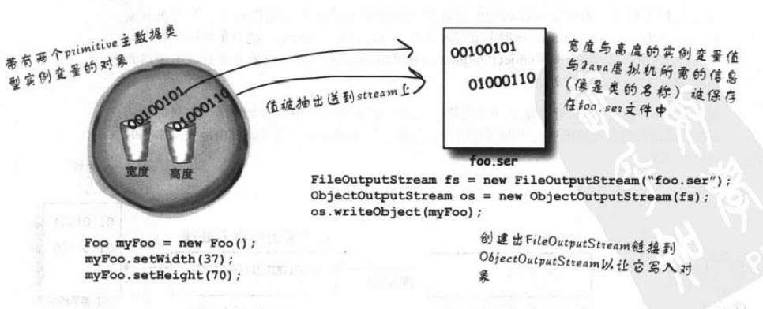

# 1对象流
    对象状态
    如何实现
      创建Duck类
      保存对象状态
      实例化对象
    深入思考

## 对象状态

如果你想保存正在运行时程序中状态，使其可以在下次运行时继续上次的操作。

可以通过保存对象状态到文件，下次从文件中读取对象状态并继续执行。

通过对象流来实现保存对象状态到文件，或从文件中读取对象状态并实例化对象。

这个过程称为对象序列化和反序列化。

## 如何实现

java io提供ObjectInputStream和ObjectOutputStream来实现。

### 创建Duck类

创建Duck类
```java
public class Duck {
    private String name;
    public void print(){
        System.out.println(name);
    }
    //setting and getting
}
```

### 保存对象状态

```java
public class MySerializable {
    private static final String FILE_DATA_NAME = "src\\serializable\\duck.txt";

    public static void main(String[] args) {
        try {
            saveObject();
        } catch (Exception e) {
            e.printStackTrace();
        }
    }

    public static void saveObject() throws IOException {
        ObjectOutputStream objectOutputStream = null;
        try {
            Duck duck = new Duck();
            duck.setName("duck");
            objectOutputStream = new ObjectOutputStream(new FileOutputStream(FILE_DATA_NAME));
            objectOutputStream.writeObject(duck);
        } catch (Exception e) {
            e.printStackTrace();
        } finally {
            if (objectOutputStream != null) {
                objectOutputStream.close();
            }
        }
    }
}
```

参考下面，来了解如何实现序列化过程


### 实例化对象

```java
public class MySerializable {
    private static final String FILE_DATA_NAME = "src\\serializable\\duck.txt";

    public static void main(String[] args) {
        try {
            instanceObject();
        } catch (Exception e) {
            e.printStackTrace();
        }
    }

    public static void instanceObject() throws IOException {
        ObjectInputStream objectInputStream = null;
        try {
            objectInputStream = new ObjectInputStream(new FileInputStream(FILE_DATA_NAME));
            Duck duck = (Duck) objectInputStream.readObject();
            duck.print();
        } catch (Exception e) {
            e.printStackTrace();
        } finally {
            if (objectInputStream != null) {
                objectInputStream.close();
            }
        }
    }
}
```

执行报错： `java.io.NotSerializableException: serializable.Duck`

这次因为，Duck没有实现序列化接口Serializable，则在反序列化中报错

修改Duck类定义 `public class Duck implements Serializable`

重新运行，成功输出duck

在反序列化过程


## 深入思考

如果对象实例变量为引用变量，是否还能序列化，如何序列化呢？

1. 能够序列化，对象所有嵌套的对象都会被序列化，前提这些对象都要实现Serializable接口
2. 所有对象都会被序列化，并保存到文件中

序列化的文件是不可读的，保证安全性，防止对象状态被修改

一个文件可以保存多个对象，及时是相同类的对象，当然也可以从文件中实例化多个对象。

由于程序更新，类更新，导致文件中的对象状态和原来类不一致，导致反序列化失败

为了保存对象状态与类一致性，引入对象序列化版本号**serialVersionUID**来标记

```java
public class Duck implements Serializable {
    static final long serialVersionUID = -623843412345623425L;
    private String name;
    public void print(){
        System.out.println(name);
    }
}
```
