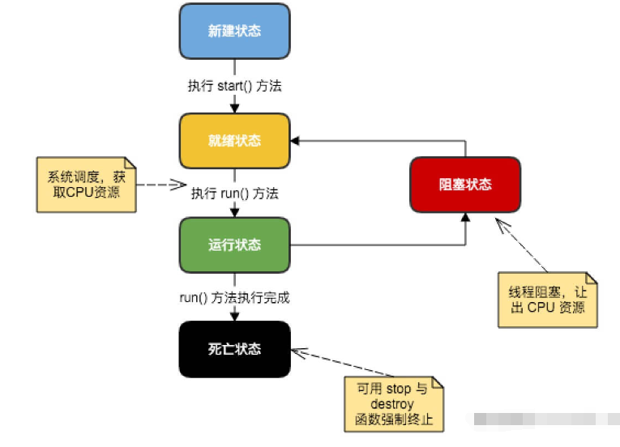

# 1概念
    概念
    java多线程
    线程生命周期
    线程属性
      线程优先级
      后台线程
## 概念

到目前为止，之前你学到都是顺序编程，程序都是串行执行，

对于某些问题，如果能并行执行程序中多个部分，可极大提供执行效率。

掌握并发编程，对应java技能是一种飞跃

对应并发编程，你可以仔细设计和代码审查，编程出正确工作的代码，

但是实际上，在给定特殊条件下，并发程序将工作失败，虽然这种条件可能都不会发生，发生概率极低，

使你在测试代码时不会出现，因为你很难编写这些测试代码，

所以我们对应并发编程是风险的，必须敬畏的态度对待

## java多线程

Java 给多线程编程提供了内置的支持。

一条线程指的是进程中一个单一顺序的控制流，一个进程中可以并发多个线程，每条线程并行执行不同的任务。

多线程是多任务的一种特别的形式，但多线程使用了更小的资源开销。

这里定义和线程相关的另一个术语 - 进程：
```
一个进程包括由操作系统分配的内存空间，包含一个或多个线程。
一个线程不能独立的存在，它必须是进程的一部分。
一个进程一直运行，直到所有的非守护线程都结束运行后才能结束。
```
多线程能满足程序员编写高效率的程序来达到充分利用 CPU 的目的。

## 线程生命周期

线程是一个动态执行的过程，它也有一个从产生到死亡的过程。

下图显示了一个线程完整的生命周期。


### 1 新建状态 - new
表示线程被创建时的状态，此时它已分配了系统资源并执行初始化，已具有获取CPU时间的资格。

此状态时短暂的，很快更新就绪状态
### 2 就绪状态 - Runnable
表示线程开始的状态，等待JVM线程调度器随时把CPU时间片分配给线程，线程就可以执行，此时线程状态更新为运行状态

### 3 运行状态 - Run
表示线程运行的状态，正在执行run()代码，运行时的线程最复杂，它可以变为阻塞状态，死亡状态或就绪状态。

### 4 阻塞状态 - Block
表示由于某个条件，导致线程失去CPU资源，不在运行的状态，当线程处阻塞状态时线程调度器会忽视线程，

不会分配CPU时间，直到线程重新进入就绪状态

下面有几种情况导致进入阻塞状态
1. 等待阻塞：运行状态中的线程执行 wait() 方法，使线程进入到等待阻塞状态。
2. 同步阻塞：线程在获取 synchronized 同步锁失败(因为同步锁被其他线程占用)。
3. 其他阻塞：通过调用线程的 sleep()，线程就会进入到阻塞状态。当sleep()状态超时，线程重新转入就绪状态。

### 5 死亡状态 - Dead
表示线程运行结束，进入终止状态。通常run()方法直接结束

## 线程属性

### 线程优先级

线程的执行是不确定的，它由JVM线程调度器来分配CPU资源使线程运行的，

不过线程享有不同的优先级，优先级越高，被线程调度器分配CPU资源概率越大。反之，越小

java优先级由 Thread.MIN_PRIORITY= 1 到 Thread.MAX_PRIORITY =10， 默认为 Thread.NORM_PRIORITY=5

需要注意一点，线程的优先级并不能保证线程执行先后顺序

### 后台线程

默认情况下，创建的线程都是非后台线程，当然线程可以设置为后台线程
```java
        Thread thread = new Thread(new Entrance(1));
        thread.setDaemon(true);
```

区别在于后台线程随着非后台线程的结束而结束(就算后台线程没有终止)
