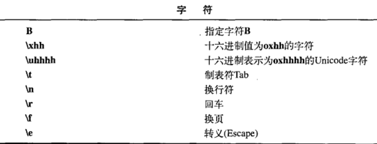
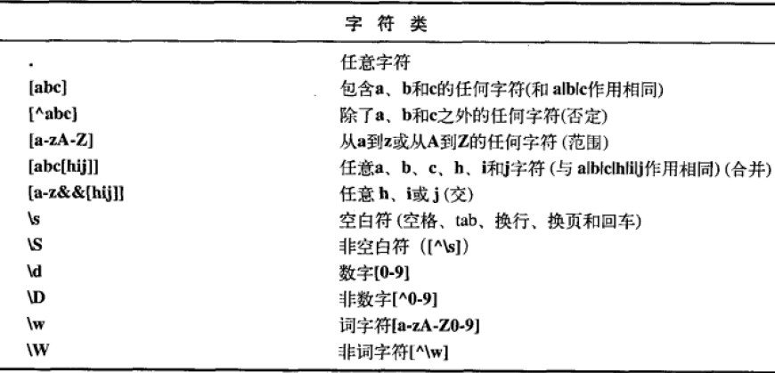

# 正则表达式
		概念
			java正则表达式对反斜杠\不同的处理
			正则表达式在String类中的应用
		创建正则表达式
		常用的正则表达式

## 概念

正则表达式提供一个种通用的方式来解决各种字符串处理相关的问题：匹配，选择，编辑及验证

## java正则表达式对反斜杠\不同的处理

```
在其他语言中反斜杠 使用一个反斜杠\来表示转义符
因此 \\表示在正则表达式中插入反斜杠\,
     \d表示一位数字
在java语言中 使用两个反斜杠\\来表示转义符
     \\d表示一位数字
		 \\\\才表示插入反斜杠
```

正则表达式符号的含义
```
有哪些字符需要转义呢?  比如反斜杠\  +
? 修饰符，表示可以有或无
| 表示或的关系，
()  括号表示分组
```

实例说明
`-？\\d+`  表示包含一个负号，或没有符号的数字, -123， 123是正确的，而+123是错误的
`(-|\\+)？\\d+`  表示第一个字符，可以是一个负号，正号，没有符号,后面是数字，因此 -123， 123，+123都是正确的


###  正则表达式在String类中的应用

```java
    public static void testString() {
        System.out.println("-123".matches("-?\\d+"));  //true
        System.out.println("123".matches("-?\\d+"));   //true
        System.out.println("+123".matches("-?\\d+"));  //false
        System.out.println("+123".matches("(-|\\+)?\\d+"));  //true

        String value = "hello.. su zhen yun";
        System.out.println(Arrays.toString(value.split(" ")));  //[hello.., su, zhen, yun]
        System.out.println(Arrays.toString(value.split("\\W+")));  //[hello, su, zhen, yun]
        System.out.println(Arrays.toString(value.split("u\\W+")));  //[hello.. s, zhen yun]
    }
```

当然还有其他很多处理字符串的函数，也使用了正则表达式

## 创建正则表达式






## 常用的正则表达式

### 邮箱
```
(?:[a-z0-9!#$%&'*+/=?^_`{|}~-]+(?:\.[a-z0-9!#$%&'*+/=?^_`{|}~-]+)*|"(?:[\x01-\x08\x0b\x0c\x0e-\x1f\x21\x23-\x5b\x5d-\x7f]|\\[\x01-\x09\x0b\x0c\x0e-\x7f])*")@(?:(?:[a-z0-9](?:[a-z0-9-]*[a-z0-9])?\.)+[a-z0-9](?:[a-z0-9-]*[a-z0-9])?|\[(?:(?:25[0-5]|2[0-4][0-9]|[01]?[0-9][0-9]?)\.){3}(?:25[0-5]|2[0-4][0-9]|[01]?[0-9][0-9]?|[a-z0-9-]*[a-z0-9]:(?:[\x01-\x08\x0b\x0c\x0e-\x1f\x21-\x5a\x53-\x7f]|\\[\x01-\x09\x0b\x0c\x0e-\x7f])+)\])
```

### 手机
```
^[1](([3|5|8][\\d])|([4][4,5,6,7,8,9])|([6][2,5,6,7])|([7][^9])|([9][1,8,9]))[\\d]{8}$
```


```java
public class mobile {
    /*  <br>　　　　　2019年1月16日已知
    中国电信号段
        133,149,153,173,174,177,180,181,189,199
    中国联通号段
        130,131,132,145,146,155,156,166,175,176,185,186
    中国移动号段
        134(0-8),135,136,137,138,139,147,148,150,151,152,157,158,159,165,178,182,183,184,187,188,198
    上网卡专属号段（用于上网和收发短信，不能打电话）
        如中国联通的是145
    虚拟运营商
        电信：1700,1701,1702
        移动：1703,1705,1706
        联通：1704,1707,1708,1709,171
    卫星通信： 1349 <br>　　　　　未知号段：141、142、143、144、154
    */
    public static void main(String[] args) {
        System.out.println("是正确格式的手机号:"+isMobile("13496215263"));
    }
    public static boolean isMobile(String str) {
        Pattern p = null;
        Matcher m = null;
        boolean b = false;
        String s2="^[1](([3|5|8][\\d])|([4][4,5,6,7,8,9])|([6][2,5,6,7])|([7][^9])|([9][1,8,9]))[\\d]{8}$";// 验证手机号
        if(StringUtils.isNotBlank(str)){
            p = Pattern.compile(s2);
            m = p.matcher(str);
            b = m.matches();
        }
        return b;
    }
}
```
