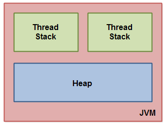
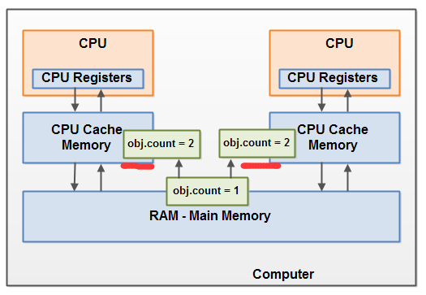

# Java memory model  ------   java内存模型

		JVM内存模型
			JVM内存模型结构
			实例说明内存结构
		硬件内存结构
		Java内存模型与硬件内存架构之间的差距
			共享对象，在不同线程中不可见
			在读\写共享对象时产生竞争
		synchronized blocks同步块
			实例方法
			静态方法
			实例方法里面的代码块
			静态方法里面的代码块
		Synchronized  实例演示
			单线程实例
			多线程异常
			同步线程
		Volatile标识
			能保证不同线程可见性
			不能保证共享数据竞争

			
			
## JVM内存模型

Java内存模型指定Java虚拟机如何与计算机的内存（RAM）一起使用，

如果要设计正确的并发程序，了解Java内存模型非常重要。 

Java内存模型指定了不同线程如何以及何时可以看到其他线程写入共享变量的值，以及如何在必要时同步对共享变量的访问。

### JVM内存模型结构

JVM内部使用的Java内存模型在 **线程堆栈thread stack**和 **堆heap**之间划分内存



在JVM中每个线程用于自己的线程堆栈。

线程堆栈包含有关线程调用哪些方法以达到当前执行点的信息。 我将其称为“调用堆栈”。

当线程执行其代码时，调用堆栈会发生变化。


线程堆栈还包含正在执行的每个方法的所有局部变量（调用堆栈上的所有方法）。

线程只能访问它自己的线程堆栈。由线程创建的局部变量对于除创建它的线程之外的所有其他线程是不可见的。

即使两个线程正在执行完全相同的代码，两个线程仍将在每个自己的线程堆栈中创建该代码的局部变量。

因此，每个线程都有自己的每个局部变量的版本。

原始类型的所有局部变量（boolean，byte，short，char，int，long，float，double）完全存储在线程堆栈中，因此对其他线程不可见。

一个线程可以将一个pritimive变量的副本传递给另一个线程，但它不能共享原始局部变量本身。

堆包含在Java应用程序中创建的所有对象，无论创建该对象的线程是什么。这包括基元类型的对象版本（例如Byte，Integer，Long等）。

无论是创建对象并将其分配给局部变量，还是创建为另一个对象的成员变量，该对象仍然存储在堆上。

下面的图表说明了存储在线程堆栈上的调用堆栈和局部变量，以及存储在堆上的对象


局部变量可以是基本类型，在这种情况下，它完全保留在线程堆栈上。

局部变量也可以是对象的引用。在这种情况下，引用（局部变量）存储在线程堆栈中，但是对象本身存储在堆上。

对象可能包含方法，这些方法可能包含局部变量。即使方法所属的对象存储在堆上，这些局部变量也存储在线程堆栈中。

对象的成员变量与对象本身一起存储在堆上。当成员变量是基本类型时，以及它是对象的引用时都是如此。

静态类变量也与类定义一起存储在堆上。

所有具有对象引用的线程都可以访问堆上的对象。当一个线程有权访问一个对象时，它也可以访问该对象的成员变量。

如果两个线程同时在同一个对象上调用一个方法，它们都可以访问该对象的成员变量，但每个线程都有自己的局部变量副本。


### 实例说明内存结构

两个线程有​​一组局部变量。其中一个局部变量（局部变量2）指向堆上的共享对象（对象3）。

两个线程各自对同一对象具有不同的引用。它们的引用是局部变量，因此存储在每个线程的线程堆栈中（在每个线程堆栈上）。

但是，这两个不同的引用指向堆上的同一个对象。

注意共享对象（对象3）如何将对象2和对象4作为成员变量引用（由对象3到对象2和对象4的箭头所示）。

通过对象3中的这些成员变量引用，两个线程可以访问对象2和对象4。

该图还显示了一个局部变量，该变量指向堆上的两个不同对象。在这种情况下，引用指向两个不同的对象（对象1和对象5），而不是同一个对象。

理论上，如果两个线程都引用了两个对象，则两个线程都可以访问对象1和对象5。但是在上图中，每个线程只引用了两个对象中的一个。

那么，什么样的Java代码可以导致上面的内存图？好吧，代码就像下面的代码一样简单：


```
public class MyRunnable implements Runnable() {

    public void run() {
        methodOne();
    }

    public void methodOne() {
        int localVariable1 = 45;

        MySharedObject localVariable2 =
            MySharedObject.sharedInstance;

        //... do more with local variables.

        methodTwo();
    }

    public void methodTwo() {
        Integer localVariable1 = new Integer(99);

        //... do more with local variable.
    }
}

public class MySharedObject {

    //static variable pointing to instance of MySharedObject

    public static final MySharedObject sharedInstance =
        new MySharedObject();


    //member variables pointing to two objects on the heap

    public Integer object2 = new Integer(22);
    public Integer object4 = new Integer(44);

    public long member1 = 12345;
    public long member1 = 67890;
}
```

如果两个线程正在执行run（）方法，那么前面显示的图表将是结果。 run（）方法调用methodOne（），methodOne（）调用methodTwo（）。

methodOne（）声明一个原始局部变量（类型为int的localVariable1）和一个局部变量，它是一个对象引用（localVariable2）。

执行methodOne（）的每个线程将在各自的线程堆栈上创建自己的localVariable1和localVariable2副本。

localVariable1变量将彼此完全分离，仅存在于每个线程的线程堆栈中。一个线程无法看到另一个线程对其localVariable1副本所做的更改。

执行methodOne（）的每个线程也将创建自己的localVariable2副本。但是，localVariable2的两个不同副本最终都指向堆上的同一个对象。

代码将localVariable2设置为指向静态变量引用的对象。只有一个静态变量的副本，并且此副本存储在堆上。

因此，localVariable2的两个副本最终都指向静态变量指向的MySharedObject的同一个实例。 MySharedObject实例也存储在堆上。它对应于上图中的对象3。

注意MySharedObject类如何包含两个成员变量。成员变量本身与对象一起存储在堆上。两个成员变量指向另外两个Integer对象。

这些Integer对象对应于上图中的Object 2和Object 4。

另请注意methodTwo（）如何创建名为localVariable1的局部变量。此局部变量是对Integer对象的对象引用。

该方法将localVariable1引用设置为指向新的Integer实例。 localVariable1引用将存储在执行methodTwo（）的每个线程的一个副本中。

实例化的两个Integer对象将存储在堆上，但由于该方法每次执行该方法时都会创建一个新的Integer对象，

因此执行此方法的两个线程将创建单独的Integer实例。在methodTwo（）中创建的Integer对象对应于上图中的Object 1和Object 5。

还要注意类型为long的类MySharedObject中的两个成员变量，它们是基本类型。由于这些变量是成员变量，

因此它们仍与对象一起存储在堆上。只有局部变量存储在线程堆栈中。

##  硬件内存结构 Hardware Memory Architecture   

现在硬件内存结构和JVM内存模型是不一样的，所以理解JVM内存模型是如何在硬件内存结构上运行是很重要的。

下图硬件内存结构图形


现代计算机通常有2个或更多CPU。其中一些CPU也可能有多个内核。

每个CPU都能够在任何给定时间运行一个线程。这意味着在多CPU或多核CPU上运行您的Java应用程序时可以是多线程的。

这样Java应用程序在每个CPU上可以并发执行线程。

下面我们理解下CPU如何工作的？

每个CPU包含一组基本上在CPU内存中的寄存器。 CPU可以在这些寄存器上执行的操作比在主存储器中对变量执行的操作快得多。

这是因为CPU可以比访问主存储器更快地访问这些寄存器。


每个CPU还可以具有CPU高速缓存存储器层。事实上，大多数现代CPU都有一些大小的缓存存储层。

CPU可以比主存储器更快地访问其高速缓冲存储器，但通常不会像访问其内部寄存器那样快。

因此，CPU高速缓存存储器介于内部寄存器和主存储器的速度之间。

某些CPU可能有多个缓存层（级别1和级别2），但要了解Java内存模型如何与内存交互，这一点并不重要。

重要的是要知道CPU可以有某种缓存存储层。


计算机还包含主存储区（RAM）。所有CPU都可以访问主内存。主存储器区域通常比CPU的高速缓存存储器大得多。

通常，当CPU需要访问主存储器时，它会将部分主存储器读入其CPU缓存。它甚至可以将部分缓存读入其内部寄存器，然后对其执行操作。

当CPU需要将结果写回主存储器时，它会将值从其内部寄存器刷新到高速缓冲存储器，并在某些时候将值刷新回主存储器。

当CPU需要在缓存存储器中存储其他东西时，存储在高速缓存存储器中的值通常被刷回到主存储器。 

CPU缓存可以一次将数据写入其内存的一部分，并一次刷新部分内存。它不必在每次更新时读/写完整缓存。

通常，缓存在称为“缓存行”的较小存储块中更新。可以将一个或多个高速缓存行读入高速缓冲存储器，

并且可以再次将一个或多个高速缓存行刷回到主存储器

##   Java内存模型与硬件内存架构之间的差距

如前所述，Java内存模型和硬件内存架构是不同的。 硬件内存架构不区分线程堆栈和堆。 

启动程序时线程堆栈和堆都位于主存储器中。 只需线程时，线程堆栈和堆的一部分有时可能存在于CPU高速缓存和内部CPU寄存器中。 

这在图中说明


不同内存结构导致下面两个问题：

1. 共享对象，在不同线程中不可见
2. 在读\写共享对象时产生竞争


### 共享对象，在不同线程中不可见

想象一下，共享对象最初存储在主存储器中。然后，在CPU上运行的线程将共享对象读入其CPU缓存中。它在那里对共享对象进行了更改。

只要CPU高速缓存尚未刷新回主内存，共享对象的更改版本对于在其他CPU上运行的线程是不可见的。

这样，每个线程最终都可以拥有自己的共享对象副本，每个副本都位于不同的CPU缓存中。

下图说明了草绘的情况。

在左CPU上运行的一个线程将共享对象复制到其CPU缓存中，并将其count变量更改为2.此更改对于在正确的CPU上运行的其他线程不可见，

因为计数更新尚未刷新回主存储器呢


要解决此问题，您可以使用Java的volatile关键字。 

volatile关键字可以确保直接从主内存读取给定变量，并在更新时始终写回主内存。

### 在读\写共享对象时产生竞争

如果两个或多个线程共享一个对象，并且多个线程更新该共享对象中的变量，则可能发生竞争条件。

想象一下，如果线程A将共享对象的变量计数读入其CPU缓存中，线程B做同样的事情，但进入不同的CPU缓存。

现在线程A将1添加到count，而线程B执行相同的操作。按理现在var1已经增加了两次，每个CPU缓存一次。

如果这些增量按顺序执行，则变量计数将增加两次，并将原始值+ 2写回主存储器。

但是两个增量同时执行而没有适当的同步，无论将其更新版本的计数写回主存储器的线程A和B中的哪一个，

更新的值将仅比原始值高1，尽管有两个增量。

该图说明了如上所述的竞争条件问题的发生




解决此问题，您可以使用Java synchronized同步块。 

1. 同步块保证在任何给定时间只有一个线程可以进入代码的给定关键部分。 

2. 同步块还保证在同步块内访问的所有变量都将从主内存读入，当线程退出同步块时，无论变量是否声明为volatile，所有更新的变量都将再次刷回主内存

## synchronized blocks同步块

**synchronized**用于标记一个方法或一个代码块是一个同步块。同步块是为了避免竞争条件

被标记的同步块在同一个时间只能有一个线程在执行，若其他线程也在要执行相同的同步块时会阻塞，直到之前的线程执行结束其他线程才能执行。

synchronized 可以用标记四种代码块类型

1. 实例方法
2. 静态方法
3. 实例方法里面的代码块
4. 静态方法里面的代码块

### 1. 实例方法

```
  public synchronized void add(int value){
      this.count += value;
  }
```

在实例方法声明之前，添加 **synchronized**关键字，表名为这个方法为同步方法

类的每个实例中，指定同步方法的代码同一个时间只能由一个线程来操作。 

如果存在多个实例，则一次一个线程可以在每个实例的同步实例方法内执行。 每个实例一个线程

### 2. 静态方法

和实例方法一样在静态方法 static前面添加 **synchronized**关键字，将静态方法标记为静态同步方法。

```
 public static synchronized void add(int value){
      count += value;
  }
```

由于每个类在Java VM中只存在一个类，因此在同一个类中的静态同步方法中只能执行一个线程。

也就是在JVM中，同一时间只有一个线程来执行

如果静态同步方法位于不同的类中， 每个类一个线程，无论它调用哪个静态同步方法。

### 3. 实例方法里面的代码块

我们没有对整个实例方法做同步，有时候需要对方法中部分对面做同步块，来解决多线程竞争条件问题。

```
public void add(int value){

    synchronized(this){
       this.count += value;   
    }
  }
```

实例使用Java synchronized块构造将代码块标记为已同步

**this** 表示add方法的实例，通过在synchronized构造方法中传入this对象来表明是 **监控对象**

我们可以在监控对象上指定代码为同步块，这样同一时间只有一个线程可以同步块代码执行。

下面两个示例在调用它们的实例上同步。 因此，它们在同步方面是等效的：
```
  public class MyClass {
  
    public synchronized void log1(String msg1, String msg2){
       log.writeln(msg1);
       log.writeln(msg2);
    }

  
    public void log2(String msg1, String msg2){
       synchronized(this){
          log.writeln(msg1);
          log.writeln(msg2);
       }
    }
  }
```


### 4. 静态方法里面的代码块

 和上面类似，下面两个示例的静态方法，指定同步块

```
  public class MyClass {

    public static synchronized void log1(String msg1, String msg2){
       log.writeln(msg1);
       log.writeln(msg2);
    }

  
    public static void log2(String msg1, String msg2){
       synchronized(MyClass.class){
          log.writeln(msg1);
          log.writeln(msg2);  
       }
    }
  }
```

**MyClass.class** 表示监控类，通过监控类来达到代码块同步的目的。

## Synchronized  实例演示

下面我们还是使用计数逻辑来演示多线程问题

### 单线程实例

计数器类
```
/**
 * @author : zhenyun.su
 * @since : 2018/12/27
 */

public class Counter {

    private long count=0;

    public long getCount() {
        return count;
    }

    public void add(int value){
        this.count += value;
    }
}

```
计数器线程类
```

public class CounterThread extends Thread {

    protected Counter counter = null;

    public CounterThread(String name, Counter counter) {
        super(name);
        this.counter = counter;
    }

    @Override
    public void run() {
        for (int i = 1; i <= 100; i++) {
            counter.add(i);
        }
        System.out.println(this.getName()+" counter= "+counter.getCount()+" ;");
    }
}
```
测试代码
```

public class TestMain {

    public static void main(String[] args) {
        TestMain.thread_test();
    }

    public static void thread_test(){
        Counter counter = new Counter();
        CounterThread counterThreadA = new CounterThread("CounterThreadA",counter);
        counterThreadA.start();
        System.out.println("---thread_test---");
    }
}
```

运行输入 10100

### 多线程异常

下面我们创建两个线程执行
```

public class TestMain {

    public static void main(String[] args) {
//       TestMain.thread_test();
        TestMain.mutil_thread_test();
    }

    public static void mutil_thread_test(){
        Counter counter = new Counter();
        CounterThread counterThreadA = new CounterThread("CounterThreadA",counter);
        CounterThread counterThreadB = new CounterThread("CounterThreadB",counter);
        counterThreadA.start();
        counterThreadB.start();

        System.out.println("---mutil_thread_test---");
    }
}

```

运行结果如下：

```
CounterThreadA counter= 9857 ;
CounterThreadB counter= 9857 ;
```
说明结果出现异常

由于每个线程处理是对象和对象成员，因此它们存放在heap是共享数据，线程A和线程B操作临界区add和成员count时，

没有同步标识，按照Java内存模型和计算内存结构，这就看计算机随机优先处理哪个线程，最后有cpu缓存刷新到RAM主存储的值为哪个？


### 同步线程

给计数器add方法添加同步标记 **synchronized**
```
public class Counter {

    private long count=0;

    public long getCount() {
        return count;
    }

    public synchronized void add(int value){
        this.count += value;
    }
}
```

重新运行mutil_thread_test

输出结果
```
CounterThreadA counter= 5050 ;
CounterThreadB counter= 10100 ;
```

不管运行几次都会有10100的结果

当然我们也可以将实例方法的同步，修改为代码块的同步，如下

```
    public synchronized void add(int value){
        this.count += value;
    }

    public void add1(int value){
        synchronized(this){
        this.count += value;
        }
    }
```

经测试结果一样

提示： 多线程的监控，可以通过VisualVM工具来监控

虽然同步机制是java的多线处理第一种机制，但是同步机制实现还不够方便，

因此Java5以后提供了很多 **同步机制类**来帮助开发并发程序。


## Volatile标识

Java volatile关键字用于将Java变量标记为“存储在主存储器中”。 

更确切地说，每次读取一个volatile变量都将从计算机的主内存中读取，而不是从CPU缓存中读取，

并且每次写入volatile变量都将写入主内存，而不仅仅是CPU缓存。

而从Java 5开始，volatile关键字不仅仅保证向主内存写入和读取volatile变量

1. 能保证不同线程可见性
2. 不能保证共享数据竞争

### 1. 能保证不同线程可见性

在没有volatile标识的变量，数据读写从CPU缓存操作的，两个线程则在两个CPU缓存中，不可见的，如下图：

```
public class SharedObject {

    public int counter = 0;

}
```


若有volatile标识

```
public class SharedObject {

    public volatile  int counter = 0;

}
```

通过声明计数器变量volatile，对计数器变量的所有写操作都将立即写回主存储器。 此外计数器变量的所有读取都将直接从主存储器中读取。

保证了不同线程对共享数据volatile可见性。

### 2. 不能保证共享数据竞争

从上面知道，可以保证线程B读取是线程A的写入的数据，但是还无法保证线程A和线程B同时写入时数据的一致性


由于线程在读取或写入volatile变量时同一个时间点不会阻止其他线程读取或写入。

为此必须在关键部分周围使用synchronized关键字，来保证同一个时间只有一个线程在操作。

当然也可以使用java.util.concurrent包中的众多原子数据类型之一。例如，AtomicLong或AtomicReference或其他之一

我们将在以后章节详细介绍