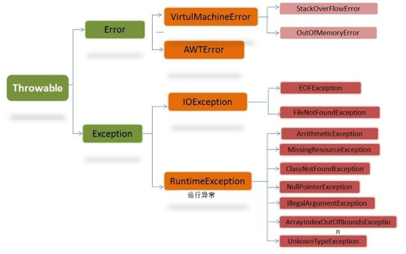

# java exception  - java异常机制

		异常概念
		try-catch-finally运行机制
			语法规则
			执行顺序
		Java存在的异常
			Throwable类
			Java常见异常
				运行时异常类及子类 runtimeException
				非运行时异常类及子类
		设计自己异常类


## 异常概念

Java中异常是指不期而至的各种状况，如：文件找不到、网络连接失败、非法参数等。

异常是一个事件，它发生在程序运行期间，干扰了正常的指令流程

Java异常都是对象，从Throwable类继承而来的并且已提供很多子类来描述各种不同的异常。

异常类层级结构图：



Throwable： 有两个重要的子类：Exception（异常）和 Error（错误），二者都是 Java 异常处理的重要子类，各自都包含大量子类。

Error：这些错误表示故障发生于虚拟机自身、或者发生在虚拟机试图执行应用时，

如Java虚拟机运行错误（Virtual MachineError）、类定义错误（NoClassDefFoundError）等。

这些错误是不可查的，因为它们在应用程序的控制和处理能力之 外，而且绝大多数是程序运行时不允许出现的状况。

对于设计合理的应用程序来说，即使确实发生了错误，本质上也不应该试图去处理它所引起的异常状况。在 Java中错误通过Error的子类描述。

Exception： 是程序本身可以处理的异常，分为运行时异常RuntimeException和非运行异常除了RuntimeException其他类

** 异常和错误的区别：异常能被程序本身可以处理，错误是无法处理** 

运行时异常：RuntimeException类及其子类都是运行时异常，如NullPointerException(空指针异常)、IndexOutOfBoundsException(下标越界异常)等，

这些异常在编译时不进行检查异常(即使没有用try-catch语句捕获它，也没有用throws子句声明抛出它，也会编译通过)

我们可以选择捕获处理，也可以不处理。这些异常一般是由程序逻辑错误引起的，程序应该从逻辑角度尽可能避免这类异常的发生。


非运行时异常 （编译异常）：是RuntimeException以外的异常，比如IOException、SQLException等

从程序语法角度讲是必须进行处理的异常，如果不处理，程序就不能编译通过。


## try-catch-finally运行机制

### 语法规则

1. try之后必须添加 catch 或 finally 块。try 块后可同时接 catch 和 finally 块并且catch在finally前面，但至少有一个块。
2. catch 块与相应的异常类的类型相关。
4. 一个 try 块可能有多个 catch 块。若如此，则执行第一个匹配块。即Java虚拟机会把实际抛出的异常对象依次和各个catch代码块声明的异常类型匹配，如果异常对象为某个异常类型或其子类的实例，就执行这个catch代码块，不会再执行其他的 catch代码块
5. 可嵌套 try-catch-finally 结构。
6. 在 try-catch-finally 结构中，可重新抛出异常。
7. 除了下列情况，总将执行 finally 做为结束：JVM 过早终止（调用 System.exit(int)）；在 finally 块中抛出一个未处理的异常；计算机断电、失火、或遭遇病毒攻击。

### 执行顺序

1. try没有捕获到异常，try语句块中的语句逐一被执行，程序将跳过catch语句块，执行finally语句块和其后的语句；

2. try捕获到异常，catch语句块里没有匹配对应异常类，异常没有被处理。

此异常将会传播给上层方法处理，finally语句块里的语句还是会被执行，但finally语句块后的语句不会被执行；

特别提示：如果finally存在 return语句，异常不会被传播到上层方法。

3. try捕获到异常，catch语句块里有匹配对应异常类,异常被处理。

try后面语句不会被执行，其他的catch语句块也不会被执行，catch语句块执行完后，执行finally语句块里的语句，最后执行finally语句块后的语句；


## Java存在的异常


### Throwable类

getCause()：返回抛出异常的原因。如果 cause 不存在或未知，则返回 null。

getMeage()：返回异常的消息信息。

printStackTrace()：对象的堆栈跟踪输出至错误输出流，作为字段 System.err 的值。

有时为了简单会忽略掉catch语句后的代码，这样try-catch语句就成了一种摆设，

一旦程序在运行过程中出现了异常，就会忽略处理异常，而错误发生的原因很难查找。除非自己想吃掉异常


### Java常见异常

####  运行时异常类及子类 runtimeException

1.  java.lang.ArrayIndexOutOfBoundsException

    数组索引越界异常。当对数组的索引值为负数或大于等于数组大小时抛出。

2. java.lang.ArithmeticException

    算术条件异常。譬如：整数除零等。

3. java.lang.NullPointerException

    空指针异常。当应用试图在要求使用对象的地方使用了null时，抛出该异常。譬如：调用null对象的实例方法. 访问null对象的属性. 计算null对象的长度. 使用throw语句抛出null等等

4. java.lang.ClassNotFoundException

    找不到类异常。当应用试图根据字符串形式的类名构造类，而在遍历CLASSPAH之后找不到对应名称的class文件时，抛出该异常。

5. java.lang.NegativeArraySizeException  数组长度为负异常

6. java.lang.ArrayStoreException 数组中包含不兼容的值抛出的异常

7. java.lang.SecurityException 安全性异常

8. java.lang.IllegalArgumentException 非法参数异常

#### 非运行时异常类和子类

IOException：操作输入流和输出流时可能出现的异常。

EOFException   文件已结束异常

FileNotFoundException   文件未找到异常

ClassCastException    类型转换异常类

ArrayStoreException  数组中包含不兼容的值抛出的异常

SQLException   操作数据库异常类

NoSuchFieldException   字段未找到异常

NoSuchMethodException   方法未找到抛出的异常

NumberFormatException    字符串转换为数字抛出的异常

StringIndexOutOfBoundsException 字符串索引超出范围抛出的异常

IllegalAccessException  不允许访问某类异常

InstantiationException  当应用程序试图使用Class类中的newInstance()方法创建一个类的实例，而指定的类对象无法被实例化时，抛出该异常


## 设计自己异常类

用户自定义异常类，只需继承Exception类即可

创建UserException异常
```
/**
 * @author : zhenyun.su
 * @since : 2019/1/3
 */

public class UserException extends Exception {
    public UserException(String message) {
        super(message);
    }

    public static void getException(String message) throws UserException {
        throw new UserException(message);
    }
}

```

静态方法getException用于快速创建异常

使用如下

```
    public static void main(String[] args) {
        try {
            UserException.getException("运行报错");
        }catch (UserException e) {
            System.out.println(e.getMessage());
        }
    }
```

