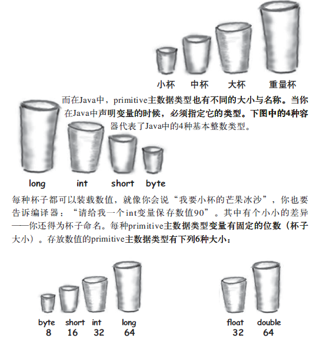

# 2java核心概念

    语言特性
      一切都是对象


    变量&数据类型
      1. 为什么要不同数据类型
      2. 变量分类
      3. 数据类型
      4. 变量语法
    类与对象
      1. Java Fields
      2. Java Methods
      3. Constructors
    包

## 语言特性

### 一切都是对象

一切都是对象，永远不需要销毁对象


## 变量&数据类型

1. 为什么要不同数据类型
2. 变量分类
3. 数据类型
4. 变量语法

### 为什么要不同数据类型

为了保证java安全性，java注重类型，

我们可以想象变量就是杯子，它是一种容器。不同类型就是不同大小杯子。

java不会让你做出将大杯子的水装入小杯子中的危险动作。



### 变量分类

#### 按存储分为

1. 值变量： 存放实际值
2. 引用变量： 存放对象引用地址

#### 按变量声明位置和方式分

1. Non-static fields  belong to an object, called instance variables
2. Static fields      belong to an  class, called class variables, static fields have same value for all object of a class
3. Local variables    a variable declared inside a method, local variables used inside a method
4. Parameters         A parameter is a variable that is passed to a method when the method is called

### 数据类型

#### base data types
Here are examples of how to declare variables of all the primitive data types in Java:
* boolean myBoolean   true or falses
* byte    myByte;      8bit   -128 ~ 127
* short   myShort;     16bit
* char    myChar;      16bit
* int     myInt;       32bit
* long    myLong;      64bit
* float   myFloat;     32bit
* double  myDouble;    64bit

特别注意：
1. 所有数值类型都有正负号，所以不要去找无符号的数值类型
2. boolean类型所占用空间大小没有明确指定，定义取true或false
3. 基本数据类型存放在"堆栈"中,速度更快
4. 基本数据类型都有一个包装类

#### 包装类
Here are examples of how to declare variables of the object types in Java:
* Boolean myBoolean   true or falses
* Byte    myByte;      8bit   -128 ~ 127
* Short   myShort;     16bit
* Char    myChar;      16bit
* Int     myInt;       32bit
* Long    myLong;      64bit
* Float   myFloat;     32bit
* Double  myDouble;    64bit
* String  myString;

#### 高精度数字

java提供两个高精度计算的类：BigInteger和BigDecimal。

它们没有对应基本类型，但是可以向Integer和Float操作数据

他们不能直接使用运算符号来完成**加减乘除**操作,通过调用对象方法来实现，

相对速度慢，但是精度高，不会丢失信息

BigDecimal一般用来表示金额


### 变量语法

1. 基本语法
2. 命名规范
3. 默认值

#### 基本语法

```
变量声明
type name ;
int myInt ;

变量赋值
myInt =1 ;
float myFloat =2.0 ;

读取变量内容
float myFloat =2.0 ;
myFloat = myFloat +1;
```
#### 命名规范
1. Java variable names are case sensitive. The variable name money is not the same as Money or MONEY.
2. Java variable names must start with a letter, or the $ or _ character.
3. Variable names cannot be equal to reserved key words in Java. For instance, the words int or for
4. If variable names consist of multiple words, each word after the first word has its first letter written in uppercase.
   For instance, "variableName" or "bigApple".
5. Static final fields (constants) are named in all uppercase, .  For instance "EXCHANGE_RATE" or "COEFFICIENT".

#### 默认值

如果是类成员的话，在实例对象后，默认值如下：
|类型|默认值|
|-|-|
|boolean   |false   |
|char   |\u0000(null)  |
|byte   |(byte)0   |
|short   |(short)0   |
|int   |0   |
|long   |0   |
|float   |0.0f   |
|double   |0.0d   |

局部变量，方法中变量

如果没有赋值，则不能使用

## 类与对象

类定义对象的所知所为：

* 所知即是对象的实例变量
* 所为即是对象的方法

1. 方法可依据实例变量来执行不同逻辑
2. 方法可以有参数，返回值

方法定义的参数称为形参，供方法内部使用，传给方法的参数称为实参，

实参传形参都是值得拷贝，如果是对象的话，则将对象的引用拷贝给形参。

方法一定指定返回值，如果是void类型，则不需要返回，否则一定要返回可以类型一致的值。


Define Java Class in Java File

```java
public class MyClass {
    private int number = 0;

    public MyClass() {
    }
    public MyClass(int theNumber) {
        this.number = theNumber;
    }
}
```

java class access Modifiers  `package, public`, can not `private, protected`


A Java class can contain:

1. Java Fields
2. Java Methods
3. Constructors


### Java Fields

Field Declaration Syntax

[access_modifier] [static] [final] type name[= initial value] ;

#### Java Field Access Modifiers

```java
public class Customer {

    private   String email;      // the class itself can access this java field.
    [package] String position;  // no modifier = package access modifier  class in the same package can access
    protected String name;      // class itself and subclass can access modifier
    public    String city;      // all class in same application can access

}
```

#### Static and Non-static Fields

* Static Fields  // called class Variables
* Non-static Fields // called Object or install Variable

#### final Fields

A final field after object instance, cannot have its value changed

 when object instance, once assigned

```java
public class Customer {
    final String field1 = "Fixed Value";
}
```


Since static final fields are often used as constants

```java
public class Customer {
    static final String CONSTANT_1 = "Fixed Value";
}
```


### Java Methods

[access_modifier] [static] return_type function_name([final method parameter]) [throws Exception] ;

1. method parameter
2. access modifier
3. throws Exception
4. return type

#### method parameter
A method parameter similar to a variable. You can read its value, and change its value too

```java
public MyClass{
    public void writeText(String text1, String text2) {
        System.out.print(text1);    // read value of text1 parameter.
        System.out.print(text2);    // read value of text2 parameter.

        text1 = "new value 1";      // change value of text1
        text2 = "new value 2";      // change value of text2
    }
}
```

Final Parameters

The value of a final parameter cannot be changed. That is, if the parameter is a reference to an object, the reference cannot be changed,

```java
public void writeText(final String text1, final String text2) {
    System.out.print(text1);    // read value of text1 parameter.
    System.out.print(text2);    // read value of text2 parameter.

    text1 = "new value 1";      // error
    text2 = "new value 2";      // error
}
```

#### access modifier

same java field access Modifiers  `private, protected, package, public`

#### throws Exception
If an error occurs inside a method, the method may throw an exception.

Exceptions have to be declared in the method declaration, like this (marked in bold):

```java
public String concat(String string1, String string2) throws MyException {

    if(string1 == null) {
        throw new MyException("string1 was null");
    }
    if(string2 == null) {
        throw new MyException("string2 was null");
    }

    return string1 + string2;
}
```

#### return type

任何数据类型，若不需要返回，可定义为Void

### constructors

constructor name is same class name

constructor access modifies like public

Constructor Overloading

```java
public class MyClass {
    private int number = 0;

    public MyClass() {
    }
    public MyClass(int theNumber) {
        this.number = theNumber;
    }
}
```

Default, no-arg Constructor


Calling a Constructor From a Constructor
```java
public class Employee {
    private String firstName = null;
    private String lastName  = null;
    private int    birthYear = 0;

    public Employee(String first,
        String last,
        int    year   ) {

        firstName = first;
        lastName  = last;
        birthYear = year;
    }

    public Employee(String first, String last){
        this(first, last, -1);
    }
}
```

##  5.Java Packages

Java packages are always written in lowercase letters
