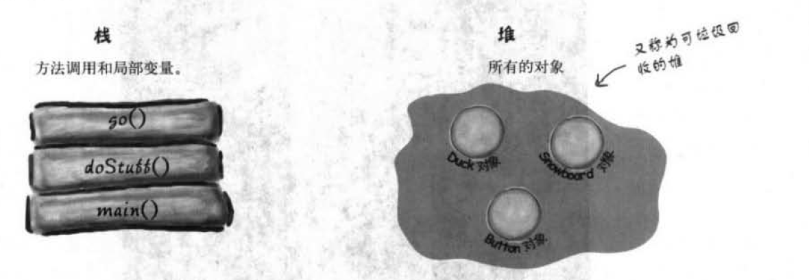
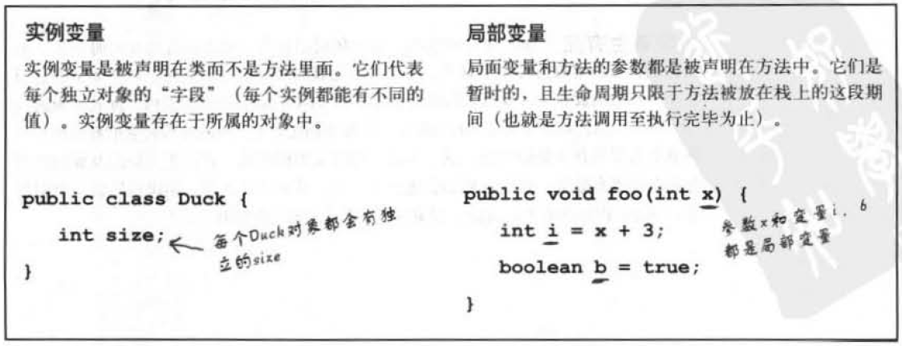
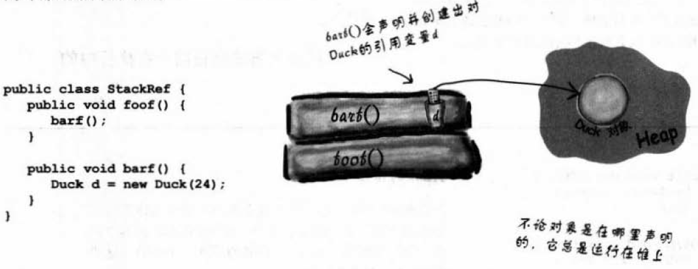
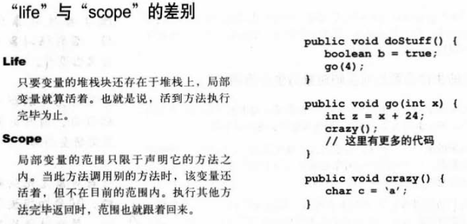
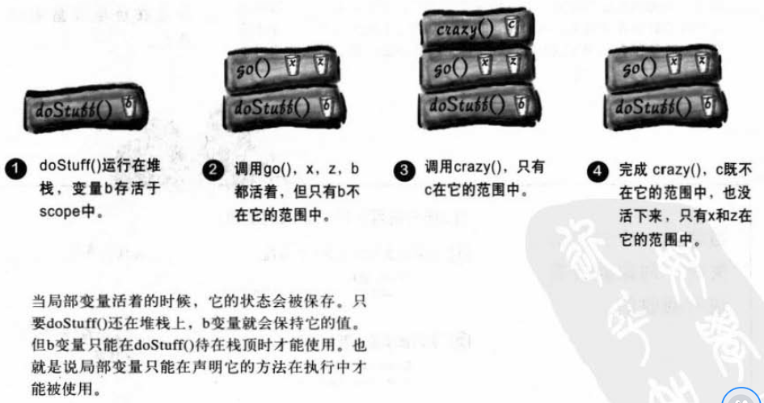

# 5对象

		对象如何被创建，何时被创建，如何保存和抛去更有效率

			栈与堆机制 - 对象生存空间
			对象创建过程
			对象生命周期 -  引用变量生命周期

先了解对象存储

## 栈与堆机制 - 对象生存空间

栈(stack)与堆(heap)机制：生存空间


* 栈堆机制
* 栈上的方法
* 堆上的对象

### 栈堆机制
了解栈堆机制很重要，它有利于了解变量的有效范围，对象的建立，内存管理，线程和异常处理。

对象及实例变量放在**堆**中，方法及局部变量放在**栈**中

当JVM启动时会从操作系统取得一块内存，以此区域来执行java程序。

至于有多少内存要看，启动参数及机器实际物理内存。





### 栈上的方法
当调用方法时，该方法会放在调用栈的栈顶，

实际存放在堆栈块上，它带有方法状态，包括执行到哪一个行以及所有参数和局部变量值。

栈顶上的方法是目前正在执行的方法。方法会一直待在这里到执行完毕。


如果foo方法调用bar方法，则bar方法会放在foor方法上面


#### 下面用实例说明


#### 局部变量为对象时 - 栈上的对象引用

如果局部变量是个对象的引用，则这个引用是放在栈上，而对象本身只能，只会在堆上。



### 堆上的对象

所有的实例变量都放在对象中，而对象存放在堆空间上，

如果对象的实例变量为基本类型，变量占用空间为基本类型的大小，int为32位，long位64位等等

如果对象的实例变量为对象的引用变量，是否引用变量的对象也存放在这个对象的堆中呢？

这个实例变量存放对象中，只是引用变量的引用，并不是引用的对象，引用的对象放在堆中的另外一个区域。

## 创建对象过程

创建对象经过三个阶段
1. 声明引用变量
2. 创建对象
3. 将对象赋值给引用变量

Duck duck = new Duck();

Duck()看起来像方法，但是它不是方法，而是Duck的构造函数，它会在new的之后执行的代码。

一般用于初始化实例变量
```java
public Duck(){

}
```

### 构造函数特性

构造函数有两个特点 1. 名称和类名一致； 2.没有像方法一样有返回值

构造函数在new之后，也就是创建对象后执行

如果类中**没有指定任何**的构造函数，则编译器会自动添加一个没有参数的构造函数。

构造函数支持重载，类可以同时存在多个构造函数，只要参数个数，类型，顺序不一致就行。

一般除了定义有参数的构造函数外，都需要定义无参数的构造函数，让人选择使用默认值。

如果你已经存在带有参数的构造函数，若还需要无参数的构造函数，你需要自己编写，编译器不会帮你创建。


对象实例变量默认值有 0/ 0.0/ false/ null

### 继承与构造函数关系

由于继承导致**构造函数链**


可知最后输出A的答案

从上面代码知道，在继承关系中Hippo的构造函数已经自动调用父类Animal构造方法，

编译器会自动在Hippo()构造函数添加supper();
```java
public Hippo(){
	supper();
	System.out.println("Making an animal");
}
```

那如果Hippo类没有提供任何的构造函数，则编译器自动添加supper()构造函数
```java
public class Hippo extends Animal {
	 supper();
}
```
supper()代表父类的构造函数，如果父类有参数，则supper(带参数)

```java
public class Animal {
    public Animal(int size) {
        System.out.println("animal is "+size);
    }
}

public class Duck extends Animal {
    public Duck() {

    }
}

Duck duck=new Duck();
```

上面的代码在创建Duck对象时会报错，是因为编译器会自动在Duck()构造函数中添加supper();

而父类animal只有带参数的构造函数，
两种方法
1. 在父类Animal中添加无参数构造函数
2. 在子类中显示添加父类构造函数，`Duck(){ supper(12);}`

提示： supper(12) 必须放在构造函数第一行

### 构造函数中this和supper

使用this我们可以很方便，调用其他重载构造函数

在一个构造函数中，不能同时存在this和supper

对象已经创建好了，那么对象能存活多久呢？

## 对象生命周期 -  引用变量生命周期


对象生命周期完全看引用，如果引用活着，对象活着；如果引用死了，则对象就跟着**死了**

因此对象能活多久，主要看局部变量或实例变量而定


### 基本类型的变量

先看下面实例


结论：
1. 局部变量只会存活在声明该变量的方法中，方法执行结束变量也结束
2. 实例变量的寿命与对象相同，如果对象活着，则实例变量也活着，反之也一样。

```java
public class Life{
		int size;
		public void setSize(int s){
			size=s; //s在该方法中结束，而size在这个对象中都可以使用
		}
}
```





那么引用变量呢？

引用变量的规则和基本类型的变量一样，只有处于它的范围中才能被使用。

对于对象，只要有活着的引用，对象也就活着。

即使对象的引用已经不在它的范围之中（这时本方法可能调用其他方法），只要引用活着，对象也是活着。

如果对象唯一引用死了（方法执行结束，方法中声明的引用变量），引用变量会和堆栈中一块释放。

对象就被抛弃，成为可回收的对象，等待垃圾回收GC。

当内存不足，GC就会歼灭部分或全部可回收对象，

当然即使回收全面的可回收的对象也有可能出现内存不足。

只有对象用完后立即被抛弃，GC才有东西可以回收。下面有三种情况


更多垃圾回收内存，请客JVM中垃圾回收GC

### 引用类型的变量
