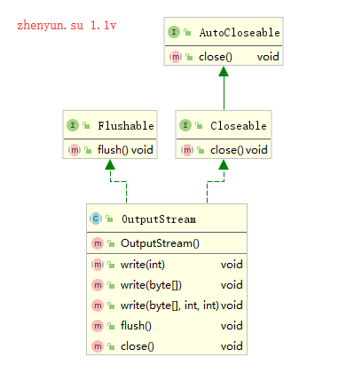
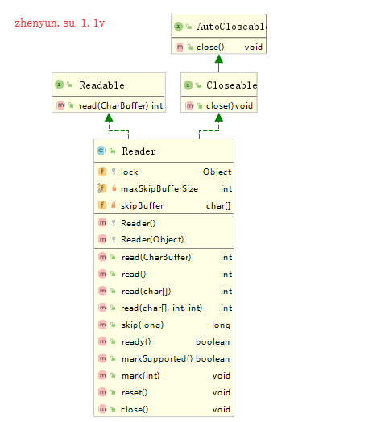

# 1 io概念

		IO简介
			常见来源或目的地
			如何实现数据读写操作
		IO实现类
			类一览表
			基于字节抽象类
			基于字符抽象类

## IO简介

Java提供IO的API用于从来源地读取数据，或将数据写入目的地。

例如，可以从本地或通过网络读取数据，将数据写入本地文件中，或通过网络传输数据。

The Java IO API 位于 **Java IO package (java.io)**.

### 常见来源或目的地

下面最常见的来源sources和目的地destinations

* Files
* Pipes
* Network Connections
* In-memory Buffers (e.g. arrays)
* System.in, System.out, System.error

a program reading data from-source and writing it to some destination:

> Source --> Program  --> Destination

Java IO contains many subclasses of the InputStream, OutputStream, Reader and Writer classes

* File Access
* Network Access
* Internal Memory Buffer Access
* Inter-Thread Communication (Pipes)
* Buffering
* Filtering
* Parsing
* Reading and Writing Text (Readers / Writers)
* Reading and Writing Primitive Data (long, int etc.)
* Reading and Writing Objects

### 如何实现数据读写操作

java io通过**流 stream**来实现从来源读取数据和将数据写入目的地。

流用于连接来源地的数据或连接目的地的数据，这样就能从流读取数据，或将数据写入流中

java中的Streams可以基于字节byte或基于字符char来实现数据读取写入

从来源地读取数据
> Source --> InputStream / Reader  --> Program
将数据写入目的地
> Program  --> OutputStream / Writer  -->  Destination

## IO实现类

### 类一览表

| -	|Input(Byte Based)|Output(Byte Based)|Input(Char Based)|Output(Char Based)|
| - | - | - | - | - |
|Basic	|InputStream	|OutputStream	|Reader InputStreamReader	|Writer OutputStreamWriter|
|Arrays	|ByteArrayInputStream	|ByteArrayOutputStream	|CharArrayReader	|CharArrayWriter|
|Files	|FileInputStream RandomAccessFile	|FileOutputStream RandomAccessFile	|FileReader	|FileWriter|
|Pipes	|PipedInputStream	|PipedOutputStream	|PipedReader	|PipedWriter|
|Buffering	|BufferedInputStream	|BufferedOutputStream	|BufferedReader	|BufferedWriter|
|Filtering	|FilterInputStream	|FilterOutputStream	|FilterReader	|FilterWriter|
|Parsing	|PushbackInputStream StreamTokenizer |	 - 	|PushbackReader LineNumberReader	 |- |
|Data - Formatted |-	|PrintStream	 |	-|PrintWriter|
|Data	|DataInputStream	|DataOutputStream	 	| -|- |
|Objects	|ObjectInputStream	|ObjectOutputStream	 	 |- |- |
|Strings	 | -	| 	-|StringReader	|StringWriter|
|Utilities	|SequenceInputStream| -|-|-|

### 基于字节抽象类

读取流抽象类
```java
public abstract class InputStream implements Closeable {
}
```
InputStream是一个不能被实例化的抽象类，实现Closeable接口，可以在try语句执行结束后，自动释放资源。

类图如下


写入流抽象类
```java
public abstract class OutputStream implements Closeable, Flushable {
}
```
OutputStream是一个不能被实例化的抽象类，

实现Closeable接口，可以在try语句执行结束后，自动释放资源。

也实现Flushable接口，可以将数据写入目的地中。

类图如下



其他字节流都是继承自InputStream或OuputStream抽象类

### 基于字符抽象类

读取字符流抽象类
```java
public abstract class Reader implements Readable, Closeable {
}
```
类图如下



写入字符流抽象类
```java
public abstract class Writer implements Appendable, Closeable, Flushable {
}
```
类图如下


其他字符流都是继承自Reader或Writer抽象类

下一章详解介绍 ，**文件的操作和流操作**
