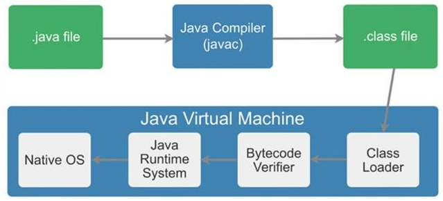
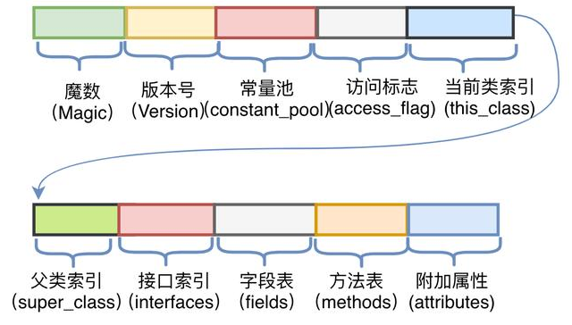
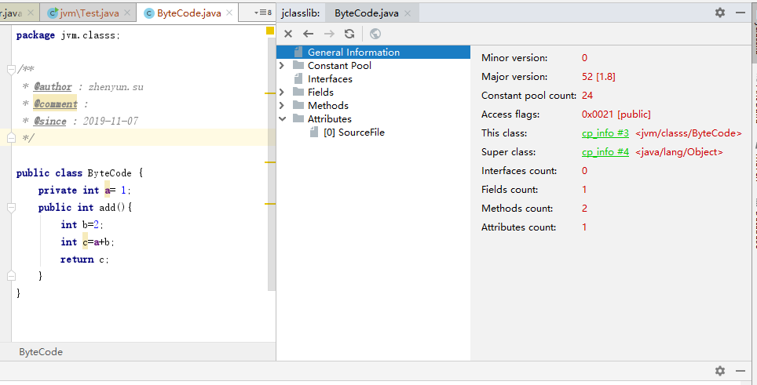

# 1何为字节码
  什么是字节码？
  了解字节码有什么好处
  字节码结构
  查看字节码工具
  参考文章

## 什么是字节码？

Java可以“一次编译，到处运行”，可理解为一次编译为字节码文件，然后将字节码文件放在任何平台的JVM上运行。

前提条件
1. 必须有运行在不同平台的JVM，而JVM都能够运行字节码文件
2. java代码可以编译为统一的固定格式字节码文件(.class文件)

.class文件由两个十六进制值为一组，而组成字节码文件，JVM以字节为单位进行读取。

在Java中一般是用javac命令编译源代码为字节码文件，

一个.java文件从编译到运行如下：


## 了解字节码有什么好处
```
对于开发人员，了解字节码可以更准确、直观地理解Java语言中更深层次的东西，
比如通过字节码，可以很直观地看到Volatile关键字如何在字节码上生效。
另外，字节码增强技术在Spring AOP、各种ORM框架、热部署中的应用屡见不鲜，
深入理解其原理对于我们来说大有裨益。
除此之外，由于JVM规范的存在，只要最终可以生成符合规范的字节码就可以在JVM上运行，
因此这就给了各种运行在JVM上的语言（如Scala、Groovy、Kotlin）一种契机，可以扩展Java所没有的特性或者实现各种语法糖
```

## 字节码结构


JVM对于字节码是有规范要求的，那么看似杂乱的十六进制符合什么结构呢？


JVM规范要求每一个字节码文件都要由十部分按照固定的顺序组成，整体结构如图3所示。



## 查看字节码工具

这里推荐一个Idea插件：jclasslib。

代码编译后在菜单栏"View"中选择"Show Bytecode With jclasslib"，

可以很直观地看到当前字节码文件的类信息、常量池、方法区等信息。


了解字节码，可以使用字节码增强技术，来实现更多框架功能，请看下章

## 参考文章

头条 - 美团技术团队 - Java字节码增强探秘
https://www.toutiao.com/a6733163252718502414/?tt_from=weixin&utm_campaign=client_share&wxshare_count=1&timestamp=1572406438&app=news_article&utm_source=weixin&utm_medium=toutiao_android&req_id=201910301133570100140481331C11B15C&group_id=6733163252718502414
