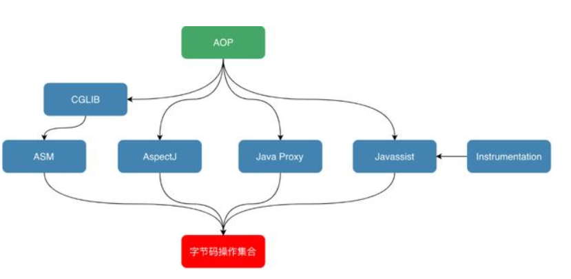

# 2字节码增强

## 可应用的场景

在上文中，着重介绍了字节码的结构，这为我们了解字节码增强技术的实现打下了基础。

字节码增强技术就是一类对现有字节码进行修改或者动态生成全新字节码文件的技术。

接下来，我们将从最直接操纵字节码的实现方式开始深入进行剖析。

参考文章

头条 - 美团技术团队 - Java字节码增强探秘
https://www.toutiao.com/a6733163252718502414/?tt_from=weixin&utm_campaign=client_share&wxshare_count=1&timestamp=1572406438&app=news_article&utm_source=weixin&utm_medium=toutiao_android&req_id=201910301133570100140481331C11B15C&group_id=6733163252718502414
