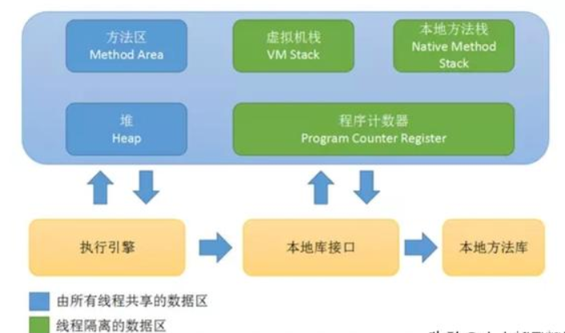
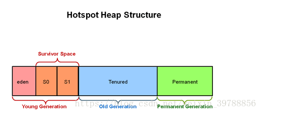

# 3内存管理

    java内存结构

## java内存结构

根据JVM规范，JVM把内存划分了如下几个区域
* 1程序计数器
* 2虚拟机栈
* 3本地方法栈
* 4方法区
* 5堆区


### 1程序计数器（Program Counter Register）

```
程序计数器是一个比较小的内存区域，主要用于指示当前线程所执行的字节码执行到了第几行。
字节码在执行时，会通过改变这个计数器的值来取下一条语句指令。
每个线程都会有自己的程序计数器，用于记录线程执行的指令行号
```

### 2虚拟机栈（JVM Stack）

```
    虚拟机栈占用的是操作系统内存，每个线程都对应着一个虚拟机栈，它是线程私有的，而且分配非常高效。
一个线程的每个方法在执行的同时，都会创建一个栈帧（Statck Frame），栈帧中存储的有局部变量表、操作站、动态链接、方法出口等，
当方法被调用时，栈帧在虚拟机栈中入栈，当方法执行完成时，栈帧出栈。

    局部变量表中存储着方法的相关局部变量，包括各种基本数据类型，对象的引用，返回地址等。
在局部变量表中，只有long和double类型会占用2个局部变量空间（Slot，对于32位机器，一个Slot就是32个bit），其它都是1个Slot。
需要注意的是，局部变量表是在编译时就已经确定好的，方法运行所需要分配的空间在栈帧中是完全确定的，在方法的生命周期内都不会改变。

    虚拟机栈中定义了两种异常，如果线程调用的栈深度大于虚拟机允许的最大深度，则抛出StatckOverFlowError（栈溢出）；
不过多数Java虚拟机都允许动态扩展虚拟机栈的大小(有少部分是固定长度的)，所以线程可以一直申请栈，直到内存不足，
此时，会抛出OutOfMemoryError（内存溢出）
```

### 3本地方法栈
```
本地方法栈用于支持native方法的执行，存储了每个native方法调用的状态。
本地方法栈和虚拟机方法栈运行机制一致，
它们唯一的区别就是，虚拟机栈是执行Java方法的，而本地方法栈是用来执行native方法的，
在很多虚拟机中（如Sun的JDK默认的HotSpot虚拟机），会将本地方法栈与虚拟机栈放在一起使用。
```

### 4方法区
```
    方法区存放了要加载的类的信息(如类名，修饰符)、类中的静态变量、final定义的常量、类中的field、方法信息，
当开发人员调用类对象中的getName、isInterface等方法来获取信息时，这些数据都来源于方法区。
方法区是全局共享的，在一定条件下它也会被GC。
当方法区使用的内存超过它允许的大小时，就会抛出OutOfMemory：PermGen Space异常。
    在Hotspot虚拟机中，这块区域对应的是Permanent Generation(持久代)，一般的，方法区上执行的垃圾收集是很少的，
因此方法区又被称为持久代的原因之一，但这也不代表着在方法区上完全没有垃圾收集，其上的垃圾收集主要是针对常量池的内存回收和对已加载类的卸载。在方法区上进行垃圾收集，条件苛刻而且相当困难。    
    运行时常量池（Runtime Constant Pool）是方法区的一部分，用于存储编译期就生成的字面常量、符号引用、翻译出来的直接引用（符号引用就是编码是用字符串表示某个变量、接口的位置，直接引用就是根据符号引用翻译出来的地址，将在类链接阶段完成翻译）；运行时常量池除了存储编译期常量外，也可以存储在运行时间产生的常量，比如String类的intern()方法，作用是String维护了一个常量池，如果调用的字符“abc”已经在常量池中，则返回池中的字符串地址，否则，新建一个常量加入池中，并返回地址。
```

### 5java堆

```
在JVM所管理的内存中，堆区是最大的一块，堆区也是JavaGC机制所管理的主要内存区域，
堆区由所有线程共享，在虚拟机启动时创建。
堆区用来存储对象实例及数组值，可以认为java中所有通过new创建的对象都在此分配。
```

```
对于堆区大小，可以通过参数-Xms和-Xmx来控制，
-Xms为JVM启动时申请的初始堆内存，默认为物理内存的1/64但小于1GB;
-Xmx为JVM可申请的最大堆内存，默认为物理内存的1/4但小于1GB,

默认当剩余堆空间小于40%时，JVM会增大堆到-Xmx大小，可通过-XX:MinHeapFreeRadio参数来控制这个比例；
当空余堆内存大于70%时，JVM会减小Heap大小到-Xms指定大小，可通过-XX:MaxHeapFreeRatio来指定这个比例。
对于系统而言，为了避免在运行期间频繁的调整Heap大小，通常将-Xms和-Xmx设置成一样。

为了让内存回收更加高效，从Sun JDK 1.2开始对堆采用了分代管理方式，如下图所示：
```


#### 年轻代（Young Generation）

```
    对象在被创建时，内存首先是在年轻代进行分配（注意，大对象可以直接在老年代分配）。当年轻代需要回收时会触发Minor GC(也称作Young GC)。

        年轻代由Eden Space和两块相同大小的Survivor Space（又称From Space和To Space）构成，Eden区和Servior区的内存比为8:1，可通过-Xmn参数来调整新生代大小，也可通过-XX:SurvivorRadio来调整Eden Space和Survivor Space大小。不同的GC方式会按不同的方式来按此值划分Eden Space和Survivor Space，有些GC方式还会根据运行状况来动态调整Eden、From Space、To Space的大小。

        年轻代的Eden区内存是连续的，所以其分配会非常快；同样Eden区的回收也非常快（因为大部分情况下Eden区对象存活时间非常短，而Eden区采用的复制回收算法，此算法在存活对象比例很少的情况下非常高效）。如果在执行垃圾回收之后，仍没有足够的内存分配，也不能再扩展，将会抛出OutOfMemoryError:Java Heap Space异常。
```

#### 老年代（Old Generation）

```
          老年代用于存放在年轻代中经多次垃圾回收仍然存活的对象，可以理解为比较老一点的对象，例如缓存对象；新建的对象也有可能在老年代上直接分配内存，这主要有两种情况：一种为大对象，可以通过启动参数设置-XX:PretenureSizeThreshold=1024，表示超过多大时就不在年轻代分配，而是直接在老年代分配。此参数在年轻代采用Parallel Scavenge GC时无效，因为其会根据运行情况自己决定什么对象直接在老年代上分配内存；另一种为大的数组对象，且数组对象中无引用外部对象。

        当老年代满了的时候就需要对老年代进行垃圾回收，老年代的垃圾回收称作Full GC。老年代所占用的内存大小为-Xmx对应的值减去-Xmn对应的值。
```

## 参考资料

https://blog.csdn.net/weixin_39788856/article/details/80388002
