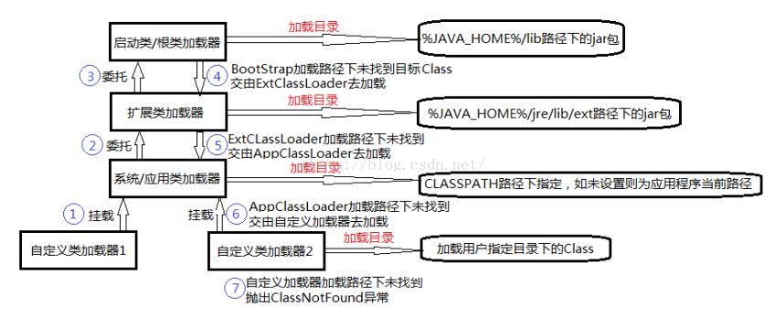

# 2类加载
    类加载过程
      加载
      链接
      初始化
    类加载器
    参考资料

## 类生命周期

类在jvm内存中，需要经历七个生命周期，称为类的生命周期


可以简化为四个阶段： 加载 -> 链接(验证, 备，解析) -> 初始化 -> 使用 -> 卸载

在使用前需要进行加载和初始化，称为类加载过程

## 类加载过程

因此类加载过程为 加载 -> 链接(验证, 备，解析) -> 初始化

### 1加载

这里说的加载只是类加载第一阶段，根据JVM规范，在这个阶段需要完成下面三件事

1. 通过类的全名(包名和类名)来获取定义此类的二进制字节流。
2. 将二进制字节流所代表静态存储结构转化方法区中运行时数据结构。
3. 在内存中创建一个代表此类的java.lang.Class的类对象，作为方法区这个类的各种数据访问入口。

#### 1. 通过类的全名(包名和类名)来获取定义此类的二进制字节流。

这里并没有指明获取二进制字节流是从哪里获取，怎么获取？

或许可以从.class文件，jar包、war包、网络中获取甚至从JSP文件中生成Servlet类

既可以使用系统的类加载器来完成加载，也可以自定义的类加载器来完成加载。

jvm开发团队为开发人提供了最灵活，可控的方式，可以引申出更多功能

#### 2. 将二进制字节流所代表静态存储结构转化方法区中运行时数据结构。

#### 3. 在内存中创建一个代表此类的java.lang.Class的类对象，作为方法区这个类的各种数据访问入口。

这里内存并不是堆内存，？？?


### 2链接

类的加载过程后生成了类的java.lang.Class对象，接着会进入连接阶段，

类的连接大致分三个阶段。

### 验证

验证被加载的类的二进制字节流是否为正确的结构，是否会符合虚拟机的要求，确保不会危害虚拟机安全。

不同的虚拟机对类验证的实现可能会有所不同，但大致都会完成以下四个阶段的验证：
1. 文件格式的验证
2. 元数据的验证
3. 字节码验证
4. 符号引用验证

文件格式的验证
```
验证字节流是否符合Jvm字节流的规范，并且能被当前版本的虚拟机处理，
该验证的主要目的是保证输入的字节流能正确地解析并存储于方法区之内。
经过该阶段的验证后，字节流才会进入内存的方法区中进行存储，后面的三个验证都是基于方法区的存储结构进行的。
```

元数据验证
```
对类的元数据信息进行语义校验（其实就是对类中的各数据类型进行语法校验），保证不存在不符合Java语法规范的元数据信息。
```

字节码验证
```
该阶段验证的主要工作是进行数据流和控制流分析，对类的方法体进行校验分析，
以保证被校验的类的方法在运行时不会做出危害虚拟机安全的行为。
```
符号引用验证
```
这是最后一个阶段的验证，它发生在虚拟机将符号引用转化为直接引用的时候（解析阶段中发生该转化，后面会有讲解），
主要是对类自身以外的信息（常量池中的各种符号引用）进行匹配性的校验。
```

#### 准备

准备阶段为类变量分配内存并设置类变量初始值的阶段，这些内存都将在方法区中分配。


仅针对类变量（static），而不包括实例变量，实例变量会在对象实例化时随着对象一块分配在Java堆中。

而初始值只是基本数据类型默认的零值（如0、0L、null、false等），引用变量为null

如`static int a = 100;` 静态变量a就会在准备阶段被赋默认值0。

如`static final int a = 666;`  静态常量a就会在准备阶段被直接赋值为666

对于静态变量，这个操作是在初始化阶段进行的。

这里还需要注意如下几点：
```
1对基本数据类型来说，对于类变量（static）和全局变量，
如果不显式地对其赋值而直接使用，则系统会为其赋予默认的零值，
而对于局部变量来说，在使用前必须显式地为其赋值，否则编译时不通过。

2对于同时被static和final修饰的常量，必须在声明的时候就为其显式地赋值，否则编译时不通过；

3而只被final修饰的常量则既可以在声明时显式地为其赋值，也可以在类初始化时显式地为其赋值，
总之，在使用前必须为其显式地赋值，系统不会为其赋予默认零值。

4对于引用数据类型reference来说，如数组引用、对象引用等，
如果没有对其进行显式地赋值而直接使用，系统都会为其赋予默认的零值，即null。
如果在数组初始化时没有对数组中的各元素赋值，那么其中的元素将根据对应的数据类型而被赋予默认的零值。
```

#### 解析

将类的二进制数据中的符号引用换为直接引用。

解析阶段是虚拟机将常量池中的符号引用转化为直接引用的过程。
```
解析动作主要针对类或接口、字段、类方法、接口方法四类符号引用进行，
分别对应于常量池中的
CONSTANT_Class_info、
CONSTANT_Fieldref_info、
CONSTANT_Methodref_info、
CONSTANT_InterfaceMethodref_info 四种常量类型。

1、类或接口的解析：
判断所要转化成的直接引用是对数组类型，还是普通的对象类型的引用，从而进行不同的解析。
2、字段解析：
对字段进行解析时，会先在本类中查找是否包含有简单名称和字段描述符都与目标相匹配的字段，
如果有，则查找结束；如果没有，则会按照继承关系从上往下递归搜索该类所实现的各个接口和它们的父接口，
还没有，则按照继承关系从上往下递归搜索其父类，直至查找结束，查找流程如下图所示：
```


### 类的初始化

 初始化是类加载过程的最后一步，到了此阶段，才真正开始执行类中定义的Java程序代码。

 在准备阶段，类变量已经被赋过一次系统要求的初始值，

 而在初始化阶段，是对类变量赋值的过程

 如果类中存在类变量的赋值动作或存在静态语句块，那边在编译时会产生 **clinit()方法**

 初始化阶段是执行类构造器clinit()方法的过程。

这里简单说明下clinit()方法的执行规则:
```
1 clinit()方法与实例构造器init()方法（类的构造函数）不同，
它不需要显式地调用父类构造器，虚拟机会保证在子类的clinit()方法执行之前，父类的clinit()方法已经执行完毕。
因此，在虚拟机中第一个被执行的clinit()方法的类肯定是java.lang.Object。

2 clinit()方法对于类或接口来说并不是必须的，
如果一个类中没有静态语句块，也没有对类变量的赋值操作，那么编译器可以不为这个类生成clinit()方法。

3 接口中不能使用静态语句块，但仍然有类变量（final static）初始化的赋值操作，
因此接口与类一样会生成clinit()方法。但是接口鱼类不同的是：
执行接口的clinit()方法不需要先执行父接口的clinit()方法，只有当父接口中定义的变量被使用时，父接口才会被初始化。
另外，接口的实现类在初始化时也一样不会执行接口的clinit()方法。

4 虚拟机会保证一个类的clinit()方法在多线程环境中被正确地加锁和同步，
如果多个线程同时去初始化一个类，那么只会有一个线程去执行这个类的clinit()方法，
其他线程都需要阻塞等待，直到活动线程执行clinit()方法完毕。
如果在一个类的clinit()方法中有耗时很长的操作，那就可能造成多个线程阻塞，在实际应用中这种阻塞往往是很隐蔽的。
```

以下几种情况不会执行类初始化：
```
通过类名获取Class对象，不会触发类的初始化。
通过Class.forName加载指定类时，如果指定参数initialize为false时，也不会触发类初始化,默认为true。
通过ClassLoader默认的loadClass方法，也不会触发初始化的动作。

通过子类引用父类的静态字段，只会触发父类的初始化，而不会触发子类的初始化。
定义对象数组，不会触发该类的初始化。
常量在编译期间会存入调用类的常量池中，本质上并没有直接引用定义常量的类，不会触发定义常量所在的类。
```

## 类加载器

要完成类的加载，jvm为我们提供类加载器

### 类加载器分类

1 Bootstrap ClassLoader：启动类加载器，也叫根类加载器
```
它负责加载Java的核心类库，如(%JAVA_HOME%/lib)目录下的rt.jar（包含System、String这样的核心类）。
根类加载器非常特殊，它不是java.lang.ClassLoader的子类，它是JVM自身内部由C/C++实现。
```

2 Extension ClassLoader：扩展类加载器
```
它负责加载扩展目录(%JAVA_HOME%/jre/lib/ext)下的jar包，
用户可以把自己开发的类打包成jar包放在这个目录下即可扩展核心类以外的新功能。
```

3 APP ClassLoader(System ClassLoader)：应用程序类加载器(也称为系统类加载器)
```
加载CLASSPATH环境变量所指定的jar包与类路径。一般来说，用户自定义的类就是由APP ClassLoader加载的。
```

除了启动类加载器以外，每个类加载器拥有一个上级类加载器，
* 自定义类加载器类加载器上级为应用程序类加载器
* 应用程序类加载器的上级为扩展类加载器
* 扩展类加载器的上级为启动类加载器

```java
public class ClassLoaderTest {
    public static void main(String[] args) throws Exception{
          //获取系统/应用类加载器
          ClassLoader appClassLoader = ClassLoaderTest.class.getClassLoader();
          //ClassLoader appClassLoader = ClassLoader.getSystemClassLoader();
          System.out.println("应用类加载器：" + appClassLoader);
          //获取系统/应用类加载器的父类加载器，得到扩展类加载器

          ClassLoader extcClassLoader = appClassLoader.getParent();
          System.out.println("扩展类加载器： " + extcClassLoader);
          System.out.println("扩展类加载器的加载路径： " + System.getProperty("java.ext.dirs"));

          //获取扩展类加载器的父加载器，但因根类加载器并不是用Java实现的所以不能获取
          System.out.println("扩展类的父类加载器： " + extcClassLoader.getParent());
    }
}
```
输出如下
```
应用类加载器：sun.misc.Launcher$AppClassLoader@18b4aac2
扩展类加载器： sun.misc.Launcher$ExtClassLoader@4554617c
扩展类加载器的加载路径： E:\6_Java\1_JDK\jdk1.8.0_91\jre\lib\ext;C:\WINDOWS\Sun\Java\lib\ext
扩展类的父类加载器： null
```

如果我们将ClassLoaderTest打包为Jar，拷贝到jre\lib\ext 目录下，则
```
应用类加载器： sun.misc.Launcher$ExtClassLoader@4554617c
扩展类加载器： null
```

### 双亲委派

当一个类加载器收到类加载任务时，立即将任务委派给它的上一级的类加载器去执行，直至委派给最顶层的启动类加载器为止。

如果类加载器无法加载下一级委派给它的类时，将加载任务回退给它的下一级加载器去执行;

双亲委派模型可以保证全限名指定的类，只被加载一次；它是Java设计者推荐的类加载器实现方式；



ClassLoader源码分析
```java
    protected Class<?> loadClass(String name, boolean resolve)
        throws ClassNotFoundException
    {
        synchronized (getClassLoadingLock(name)) {
            // First, check if the class has already been loaded
            Class<?> c = findLoadedClass(name);
            if (c == null) {
                long t0 = System.nanoTime();
                try {
                    if (parent != null) {
                        c = parent.loadClass(name, false);
                    } else {
                        c = findBootstrapClassOrNull(name);
                    }
                } catch (ClassNotFoundException e) {
                    // ClassNotFoundException thrown if class not found
                    // from the non-null parent class loader
                }

                if (c == null) {
                    // If still not found, then invoke findClass in order
                    // to find the class.
                    long t1 = System.nanoTime();
                    c = findClass(name);

                    // this is the defining class loader; record the stats
                    sun.misc.PerfCounter.getParentDelegationTime().addTime(t1 - t0);
                    sun.misc.PerfCounter.getFindClassTime().addElapsedTimeFrom(t1);
                    sun.misc.PerfCounter.getFindClasses().increment();
                }
            }
            if (resolve) {
                resolveClass(c);
            }
            return c;
        }
    }
```

先检查是否已经被加载过，若没有加载则调用父类加载器的loadClass()方法，

若父类加载器为空则默认使用启动类加载器作为父类加载器。

如果父类加载器加载失败，抛出ClassNotFoundException异常后，调用自己的findClass()方法进行加载

## 参考资料

类加载过程
https://www.cnblogs.com/200911/p/9006822.html
