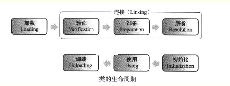
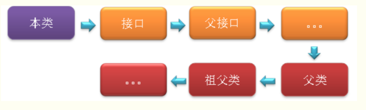

# 2类加载

    类加载过程
      加载
      链接
      初始化
    参考资料

在使用类前或实例化对象前，需要进行类加载


## 类加载过程

Class文件中的“类”从加载到JVM内存中，到卸载出内存过程有七个生命周期阶段。类加载机制包括了前五个阶段。




### 加载

这里说的加载只是类加载第一阶段，根据JVM规范，在这个阶段需要完成下面三件事

1. 通过类的全名(包名和类名)来获取定义此类的二进制字节流。
2. 将二进制字节流所代表静态存储结构转化方法区中运行时数据结构。
3. 在内存中创建一个代表此类的java.lang.Class的类对象，作为方法区这个类的各种数据访问入口。

#### 1. 通过类的全名(包名和类名)来获取定义此类的二进制字节流。

这里并没有指明获取二进制字节流是从哪里获取，怎么获取？

或许可以从.class文件，jar包、war包、网络中获取甚至从JSP文件中生成Servlet类

既可以使用系统的类加载器来完成加载，也可以自定义的类加载器来完成加载。

jvm开发团队为开发人提供了最灵活，可控的方式，可以引申出更多功能

#### 2. 将二进制字节流所代表静态存储结构转化方法区中运行时数据结构。

#### 3. 在内存中创建一个代表此类的java.lang.Class的类对象，作为方法区这个类的各种数据访问入口。

这里内存并不是堆内存，？？?


### 链接

验证

类的加载过程后生成了类的java.lang.Class对象，接着会进入连接阶段，连接阶段负责将类的二进制数据合并入JRE（Java运行时环境）中。类的连接大致分三个阶段。

1、验证：验证被加载后的类（Class文件的字节流）是否有正确的结构，类数据是否会符合虚拟机的要求，确保不会危害虚拟机安全。

    不同的虚拟机对类验证的实现可能会有所不同，但大致都会完成以下四个阶段的验证：文件格式的验证、元数据的验证、字节码验证和符号引用验证。

文件格式的验证：验证字节流是否符合Class文件格式的规范，并且能被当前版本的虚拟机处理，该验证的主要目的是保证输入的字节流能正确地解析并存储于方法区之内。经过该阶段的验证后，字节流才会进入内存的方法区中进行存储，后面的三个验证都是基于方法区的存储结构进行的。
元数据验证：对类的元数据信息进行语义校验（其实就是对类中的各数据类型进行语法校验），保证不存在不符合Java语法规范的元数据信息。
字节码验证：该阶段验证的主要工作是进行数据流和控制流分析，对类的方法体进行校验分析，以保证被校验的类的方法在运行时不会做出危害虚拟机安全的行为。
符号引用验证：这是最后一个阶段的验证，它发生在虚拟机将符号引用转化为直接引用的时候（解析阶段中发生该转化，后面会有讲解），主要是对类自身以外的信息（常量池中的各种符号引用）进行匹配性的校验。
2、准备：准备阶段是正式为类变量分配内存并设置类变量初始值的阶段，这些内存都将在方法区中分配。

 这时候进行内存分配的仅包括类变量（static），而不包括实例变量，实例变量会在对象实例化时随着对象一块分配在Java堆中。
 这里所设置的初始值通常情况下是数据类型默认的零值（如0、0L、null、false等），而不是被在Java代码中被显式地赋予。
     如static int a = 100; 静态变量a就会在准备阶段被赋默认值0。另外，静态常量（static final filed）会在准备阶段赋程序设定的初值，如static final int a = 666;  静态常量a就会在准备阶段被直接赋值为666，对于静态变量，这个操作是在初始化阶段进行的。

下面列出java基本类型和引用类型的默认值：

   这里还需要注意如下几点：
```
对基本数据类型来说，对于类变量（static）和全局变量，如果不显式地对其赋值而直接使用，则系统会为其赋予默认的零值，而对于局部变量来说，在使用前必须显式地为其赋值，否则编译时不通过。
对于同时被static和final修饰的常量，必须在声明的时候就为其显式地赋值，否则编译时不通过；而只被final修饰的常量则既可以在声明时显式地为其赋值，也可以在类初始化时显式地为其赋值，总之，在使用前必须为其显式地赋值，系统不会为其赋予默认零值。
对于引用数据类型reference来说，如数组引用、对象引用等，如果没有对其进行显式地赋值而直接使用，系统都会为其赋予默认的零值，即null。
如果在数组初始化时没有对数组中的各元素赋值，那么其中的元素将根据对应的数据类型而被赋予默认的零值。
```

3、解析：将类的二进制数据中的符号引用换为直接引用。

     解析阶段是虚拟机将常量池中的符号引用转化为直接引用的过程。在Class类文件结构一文中已经比较过了符号引用和直接引用的区别和关联，这里不再赘述。前面说解析阶段可能开始于初始化之前，也可能在初始化之后开始，虚拟机会根据需要来判断，到底是在类被加载器加载时就对常量池中的符号引用进行解析（初始化之前），还是等到一个符号引用将要被使用前才去解析它（初始化之后）。
    对同一个符号引用进行多次解析请求时很常见的事情，虚拟机实现可能会对第一次解析的结果进行缓存（在运行时常量池中记录直接引用，并把常量标示为已解析状态），从而避免解析动作重复进行。
    解析动作主要针对类或接口、字段、类方法、接口方法四类符号引用进行，分别对应于常量池中的CONSTANT_Class_info、CONSTANT_Fieldref_info、CONSTANT_Methodref_info、CONSTANT_InterfaceMethodref_info四种常量类型。
    1、类或接口的解析：判断所要转化成的直接引用是对数组类型，还是普通的对象类型的引用，从而进行不同的解析。
    2、字段解析：对字段进行解析时，会先在本类中查找是否包含有简单名称和字段描述符都与目标相匹配的字段，如果有，则查找结束；如果没有，则会按照继承关系从上往下递归搜索该类所实现的各个接口和它们的父接口，还没有，则按照继承关系从上往下递归搜索其父类，直至查找结束，查找流程如下图所示：

 

三、类的初始化

 初始化是类加载过程的最后一步，到了此阶段，才真正开始执行类中定义的Java程序代码。在准备阶段，类变量已经被赋过一次系统要求的初始值，而在初始化阶段，则是根据程序员通过程序指定的主观计划去初始化类变量和其他资源，或者可以从另一个角度来表达：初始化阶段是执行类构造器<clinit>()方法的过程。
   这里简单说明下<clinit>（）方法的执行规则:
    1、<clinit>（）方法是由编译器自动收集类中的所有类变量的赋值动作和静态语句块中的语句合并产生的，编译器收集的顺序是由语句在源文件中出现的顺序所决定的，静态语句块中只能访问到定义在静态语句块之前的变量，定义在它之后的变量，在前面的静态语句中可以赋值，但是不能访问。
    2、<clinit>（）方法与实例构造器<init>（）方法（类的构造函数）不同，它不需要显式地调用父类构造器，虚拟机会保证在子类的<clinit>（）方法执行之前，父类的<clinit>（）方法已经执行完毕。因此，在虚拟机中第一个被执行的<clinit>（）方法的类肯定是java.lang.Object。
    3、<clinit>（）方法对于类或接口来说并不是必须的，如果一个类中没有静态语句块，也没有对类变量的赋值操作，那么编译器可以不为这个类生成<clinit>（）方法。
    4、接口中不能使用静态语句块，但仍然有类变量（final static）初始化的赋值操作，因此接口与类一样会生成<clinit>（）方法。但是接口鱼类不同的是：执行接口的<clinit>（）方法不需要先执行父接口的<clinit>（）方法，只有当父接口中定义的变量被使用时，父接口才会被初始化。另外，接口的实现类在初始化时也一样不会执行接口的<clinit>（）方法。
    5、虚拟机会保证一个类的<clinit>（）方法在多线程环境中被正确地加锁和同步，如果多个线程同时去初始化一个类，那么只会有一个线程去执行这个类的<clinit>（）方法，其他线程都需要阻塞等待，直到活动线程执行<clinit>（）方法完毕。如果在一个类的<clinit>（）方法中有耗时很长的操作，那就可能造成多个线程阻塞，在实际应用中这种阻塞往往是很隐蔽的。


以下几种情况不会执行类初始化：

通过子类引用父类的静态字段，只会触发父类的初始化，而不会触发子类的初始化。
定义对象数组，不会触发该类的初始化。
常量在编译期间会存入调用类的常量池中，本质上并没有直接引用定义常量的类，不会触发定义常量所在的类。
通过类名获取Class对象，不会触发类的初始化。
通过Class.forName加载指定类时，如果指定参数initialize为false时，也不会触发类初始化，其实这个参数是告诉虚拟机，是否要对类进行初始化。
通过ClassLoader默认的loadClass方法，也不会触发初始化的动作。


## 参考资料

类加载过程
https://www.cnblogs.com/200911/p/9006822.html
