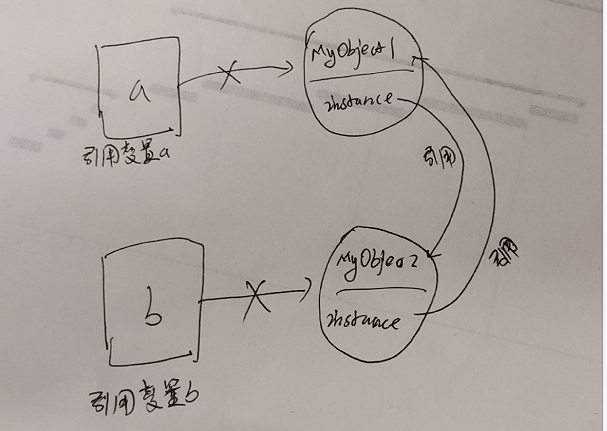

# 4垃圾回收-GC
    1什么是垃圾回收
    2java如何判断垃圾
      引用计数算法
      可达性分析算法
    3怎么进行垃圾回收
      标记清除算法 - Mark-Sweep
      复制算法 - Copying
      标记整理算法 - Mark-Compact
      分代收集算法 - Generational Collection
    4可回收的堆内存
      新生代区
        Eden 区
        Survivor 区
      老年代区
    5执行垃圾回收及负面影响
      存在哪些垃圾回收动作
      什么容易情况导致stop-the-world
    6参考资料

## 1什么是垃圾回收

垃圾回收是销毁可回收对象，释放占用内存空间。

好处：
1. 高效使用内存，防止内存不足。
2. 高效开发，无需关心对象的释放。

## 2java如何判断垃圾

没有任何引用的对象，称为垃圾，也称为可回收对象。

Jvm如何知道每个对象有没有引用呢？

1. 引用计数算法
2. 可达性分析算法

### 引用计数算法

```
引用计数算法（Reachability Counting）是通过在对象头中分配一个空间来保存该对象被引用的次数（Reference Count）。如果该对象被其它对象引用，则它的引用计数加1，如果删除对该对象的引用，那么它的引用计数就减1，当该对象的引用计数为0时，那么该对象就会被回收。
```

String m = new String("jack");

先创建一个字符串对象jack，它引用计数为0 ，当将jack赋值给引用变量m时，引用计数为加1

m= null;

当m赋值null后，jack对象引用计数减1，变为0。

jack对象变为可回收对象或可回收垃圾

```
引用计数算法是将垃圾回收分摊到整个应用程序的运行当中了，而不是在进行垃圾收集时，
要挂起整个应用的运行，直到对堆中所有对象的处理都结束。
因此，采用引用计数的垃圾收集不属于严格意义上的"Stop-The-World"的垃圾收集机制。
```

看似很美好，但我们知道JVM的垃圾回收就是"Stop-The-World"的，

那是什么原因导致我们最终放弃了引用计数算法呢？看下面的例子。

```java

public class MyObject{
  private Object instance;
}

public class Text(){
  public static void main(String[] args){
    MyObject a = new MyObject();
    MyObject b = new MyObject();

    a.instance = b;
    b.instance = a;
    a= null;
    b= null;
  }
}
```
看下图


虽然唯一的a和b的引用变量被null了，但是对象MyObject1和MyObject2的实例变量instance还在相互引用对方，

引用计数永久为1，按照这个算法， 这两个对象永远都不会被回收。

### 可达性分析算法

```
可达性分析算法（Reachability Analysis）的基本思路是，通过一些被称为引用链（GC Roots）的对象作为起点，从这些节点开始向下搜索，搜索走过的路径被称为（Reference Chain)，当一个对象到 GC Roots 没有任何引用链相连时（即从 GC Roots 节点到该节点不可达），则证明该对象是不可用的
```


```
通过可达性算法，成功解决了引用计数所无法解决的问题-“循环依赖”，只要你无法与 GC Root 建立直接或间接的连接，系统就会判定你为可回收对象。那这样就引申出了另一个问题，哪些属于 GC Root。
```
在 Java 语言中，可作为 GC Root 的对象包括以下4种：

1. 虚拟机栈（栈帧中的本地变量表）中引用的对象
2. 方法区中类静态变量引用的对象
3. 方法区中常量引用的对象
4. 本地方法栈中 JNI（即一般说的 Native 方法）引用的对象

#### 1. 虚拟机栈（栈帧中的本地变量表）中引用的对象
```java
public void print(){
  Duck duck = new Duck();
}
```

方法print()局部变量duck，存放在栈的堆栈块上，这个虚拟机栈为GC Root

#### 2. 方法区中类静态属性引用的对象
```java
public class MyObject{
  private static Duck duck;
}

对于静态属性duck的引用变量duck，存放在方法区上，这个为GC Root

public void main(){
  MyObject.duck = new Duck();
}
```

#### 3. 方法区中常量引用的对象
```java
public class MyObject{
  private final Duck duck=new Duck();
}
```

duck即为方法区中的常量引用，也为 GC Root，duck 置为null后，final对象也会因没有与 GC Root 建立联系而被回收。

#### 4. 本地方法栈中 JNI（即一般说的 Native 方法）引用的对象

```
任何 native 接口都会使用某种本地方法栈，实现的本地方法接口是使用 C 连接模型的话，那么它的本地方法栈就是 C 栈。当线程调用 Java 方法时，虚拟机会创建一个新的栈帧并压入 Java 栈。然而当它调用的是本地方法时，虚拟机会保持 Java 栈不变，不再在线程的 Java 栈中压入新的帧，虚拟机只是简单地动态连接并直接调用指定的本地方法
```

## 3怎么进行垃圾回收

在确定哪些对象可以被回收后，垃圾收集器要做到事情就是开始回收垃圾

我们如何做到如何高效地进行垃圾回收呢？

jvm并没有给出规范，因此不同厂商可以采用不同方式来实现垃圾回收器。

下面给出常用垃圾收集算法的核心思想。

### 标记清除算法 - Mark-Sweep

```
标记清除算法是最基础的一种垃圾回收算法，它分为2部分，
先对内存区域中的可回收的对象进行标记，将那些要回收的对象标记出来，
然后把这些垃圾拎出来清理掉。
就像下图一样，清理掉的垃圾就变成未使用的内存区域，等待被再次使用。
```


特点：容易形成内存碎片，内存利用低，不过性能快， 长期使用内存利用率越来越低

```
上图中等方块的假设是 2M，小一些的是 1M，大一些的是 4M。等我们回收完，内存就会切成了很多段。我们知道开辟内存空间时，需要的是连续的内存区域，这时候我们需要一个 2M的内存区域，其中有2个 1M 是没法用的。这样就导致，其实我们本身还有这么多的内存的，但却用不了。
```

### 复制算法 - Copying

 ```
 复制算法是在标记清除算法上演化而来，解决标记清除算法的内存碎片问题。
 它将可用内存按容量划分为大小相等的两块，每次只使用其中的一块。
 当这一块的内存用完了，就将还存活着的对象复制到另外一块上面，然后再把已使用过的内存空间一次清理掉。
 保证了内存的连续可用，内存分配时也就不用考虑内存碎片等复杂情况，逻辑清晰，运行高效。
 ```


缺点，虽然只能使用一半的内存空间,有一定的内存浪费，但是不会造成内存利用率越来越低，性能保持快

### 标记整理算法 - Mark-Compact

```
标记整理算法，标记过程仍然与标记清除算法一样，但后续步骤不是直接对可回收对象进行清理，而是让所有存活的对象都向一端移动，再清理掉端边界以外的内存区域。
```


```
标记整理算法一方面在标记-清除算法上做了升级，解决了内存碎片的问题，也规避了复制算法只能利用一半内存区域的弊端。看起来很美好，但从上图可以看到，它对内存变动更频繁，需要整理所有存活对象的引用地址，在效率上比复制算法要差很多。
```

特点： 虽然效率上比复制算法慢，但是内存没有浪费，也不会造成内存利用率越来越低

### 分代收集算法 - Generational Collection

分代收集算法融合上述3种基础的算法思想，而产生的针对不同情况所采用不同算法的一套组合拳

```
对象存活周期的不同将内存划分为几块。一般是把 Java 堆分为新生代和老年代，
这样就可以根据各个年代的特点采用最适当的收集算法。

新生代
新生代是为创建对象而分配空间的，临时性对象占绝大部分，而新生代内存是限的，需要反复利用
因此采用复制算法，清除eden区和survivor区大部分可回收的对象，将少量存活对象移到另外一个survivor区中
老年代
老年代用于存放，存活率高的对象，占用空间大的对象，比较适合使用标记整理算法来实现
```

目录主流的JVM（HotSpot）采用的是可达分析算法和分代收集算法来实现垃圾回收。


Jvm内存区域被划分哪几块，每块又有什么特别适合的什么算法呢？


请看下面的可回收堆内存。

## 4可回收的堆内存


堆内存是JVM所管理的内存中最大的一块，堆又是垃圾收集器管理的主要区域，

这里我们主要分析一下 Java 堆的结构。
```
Java 堆主要分为2个区域-新生代与老年代，
其中新生代分 Eden 区和 Survivor 区，其中 Survivor 区又分 From 和 To 2个区。
为什么是这样来分的呢？
```

### 新生代区

#### Eden 区
```
IBM公司的专业研究表明，有将近98%的对象都是临时使用，针对这一现状，大多数对象会在新生代 Eden 区中进行分配，
当 Eden 区没有足够空间进行分配时，虚拟机会发起一次 Minor GC，Minor GC 相比 Major GC 更频繁，回收速度也更快。

通过 Minor GC 之后，Eden 会被清空，Eden 区中绝大部分对象会被回收，而那些无需回收的存活对象，
将会进到 Survivor 的 From 区或 To 区
```

#### Survivor 区

```
Survivor 区相当于是 Eden 区和 Old 区的一个缓冲区。Survivor 又分为2个区，一个是 From 区，一个是 To 区。
每次执行 Minor GC，会将 Eden 区和 From 存活的对象放到 Survivor 的 To 区
或者会将 Eden 区和 To 存活的对象放到 Survivor 的 From 区
```
1、为啥需要？

```
不就是新生代到老年代么，直接 Eden 到 Old 不好了吗，为啥要这么复杂。
想想如果没有 Survivor 区，Eden 区每进行一次 Minor GC，存活的对象就会被送到老年代，老年代很快就会被填满。
而有很多对象虽然一次 Minor GC 没有消灭，但其实也并不会蹦跶多久，或许第二次，第三次就需要被清除。
这时候移入老年区，很明显不是一个明智的决定。

所以，Survivor 的存在意义就是减少被送到老年代的对象，进而减少 Major GC 的发生。
Survivor 的预筛选保证，只有经历16次 Minor GC 还能在新生代中存活的对象，才会被送到老年代。
```

2、为啥需要俩？

```
设置两个 Survivor 区最大的好处就是解决内存碎片化。

我们先假设一下，Survivor 如果只有一个区域会怎样。Minor GC 执行后，Eden 区被清空了，
存活的对象放到了 Survivor 区，而之前 Survivor 区中的对象，可能也有一些是需要被清除的。
问题来了，这时候我们怎么清除它们？在这种场景下，我们只能标记清除，而我们知道标记清除最大的问题就是内存碎片，
在新生代这种经常会消亡的区域，采用标记清除必然会让内存产生严重的碎片化。
因为 Survivor 有2个区域，所以每次 Minor GC，会将之前 Eden 区和 From 区中的存活对象复制到 To 区域。
第二次 Minor GC 时，From 与 To 职责兑换，
这时候会将 Eden 区和 To 区中的存活对象再复制到 From 区域，以此反复。

这种机制最大的好处就是，整个过程中，永远有一个 Survivor space 是空的，
另一个非空的 Survivor space 是无碎片的。那么，Survivor 为什么不分更多块呢？比方说分成三个、四个、五个?
显然，如果 Survivor 区再细分下去，每一块的空间就会比较小，容易导致 Survivor 区满，
两块 Survivor 区可能是经过权衡之后的最佳方案。
```

### 老年代区 - old

```
老年代占据着2/3的堆内存空间，只有在 Major GC 的时候才会进行清理，每次 GC 都会触发“Stop-The-World”。
内存越大，STW 的时间也越长，所以内存也不仅仅是越大就越好。
由于复制算法在对象存活率较高的老年代会进行很多次的复制操作，效率很低，
所以老年代这里采用的是标记 --- 整理算法。

除了上述所说，在内存担保机制下，无法安置的对象会直接进到老年代，以下几种情况也会进入老年代。
```
1、大对象

```
大对象指需要大量连续内存空间的对象，这部分对象不管是不是“朝生夕死”，都会直接进到老年代。
这样做主要是为了避免在 Eden 区及2个 Survivor 区之间发生大量的内存复制。
当你的系统有非常多“朝生夕死”的大对象时，得注意了。
```
2、长期存活对象

```
虚拟机给每个对象定义了一个对象年龄（Age）计数器。
正常情况下对象会不断的在 Survivor 的 From 区与 To 区之间移动，
对象在 Survivor 区中没经历一次 Minor GC，年龄就增加1岁。
当年龄增加到15岁时，这时候就会被转移到老年代。当然，这里的15，JVM 也支持进行特殊设置。
```
3、动态对象年龄
```
虚拟机并不重视要求对象年龄必须到15岁，才会放入老年区，
如果 Survivor 空间中相同年龄所有对象大小的综合大于 Survivor 空间的一般，
年龄大于等于该年龄的对象就可以直接进去老年区，无需等你“成年”。

这其实有点类似于负载均衡，轮询是负载均衡的一种，保证每台机器都分得同样的请求。
看似很均衡，但每台机的硬件不通，健康状况不同，我们还可以基于每台机接受的请求数，
或每台机的响应时间等，来调整我们的负载均衡算法。
```

## 5执行垃圾回收及负面影响

### 存在哪些垃圾回收动作

1. Eden区空间不足以分配新的对象时，触发新生代的垃圾回收，则称为minor gc 次要垃圾回收
2. 老年代空间不足时触发老年代的垃圾回收，则触发major gc 主要垃圾回收
3. 如果同时触发新生代和老年代的垃圾回收，则称为 full gc

full gc 触发有如下情况
```
（1）调用System.gc时，系统建议执行Full GC，但是不必然执行
（2）老年代空间不足
（3）方法去空间不足
（4）通过Minor GC后进入老年代的平均大小大于老年代的可用内存
（5）由Eden区、From Space区向To Space区复制时，对象大小大于To Space可用内存，
则把该对象转存到老年代，且老年代的可用内存小于该对象大小。
```

major gc 和 full gc 都会导致 **stop-the-world**

stop-the-world 使jvm中所有代码停止，暂停所有服务，不过native代码可以执行，但是不能和Jvm交互

为什么会出现stop-the-world 这种情况呢?
```
比如在打扫房间时，一边在打扫，一边又有人在走动，已经打扫的地方，又有新的垃圾产生，
这样房间永远打扫不干净，只有让大家停止活动了，才能将房间打扫干净。

当gc线程在处理垃圾的时候，其它java线程要停止才能彻底清除干净，否则会影响gc线程的处理效率增加gc线程负担
```
stop-the-world会对系统性能产生影响，暂停时间越长，影响越大

因此使用垃圾回收的原则是尽量减少 stop-the-world 时间


### 什么容易情况导致stop-the-world

1. 触发老年代垃圾回收，不如新生代对象移到老年代时老年代空间不足、有连续的大对象需要分配
2. 永生代Perm(JDK1.7) 或 元空间MetaSpace(JDK1.8) 空间不足 ？什么情况导致空间不足
3. system.gc 的调用

我们要尽量避免上面这种情况

## 6参考资料

咱们从头到尾说一次 Java 垃圾回收
https://www.toutiao.com/a6713742420472758798/

图解垃圾回收
https://www.toutiao.com/a6710787059314852363/

成为JavaGC专家
https://www.toutiao.com/a6619288996306485768/

JVM学习（7）Stop-The-World
https://www.jianshu.com/p/d686e108d15f
