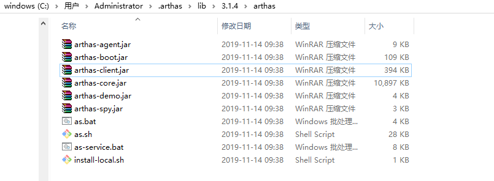

# Arthas - 交互式工具
    Arthas简介
    官网文档介绍
    快速入门
      安装及启动
      使用
      卸载
      退出
    最佳练习
      编写项目代码
      编译&运行
      arthas常用命令
    最佳部署

## Arthas简介 官网文档介绍 快速入门

Arthas是Alibaba开源的Java诊断工具

善于`在线排查问题，无需重启；动态跟踪Java代码；实时监控JVM状态。`

Arthas 支持JDK 6+，支持Linux/Mac/Windows，采用命令行交互模式

Github: https://github.com/alibaba/arthas

文档: https://alibaba.github.io/arthas/

官网文档，介绍的非常详细，请按照官网文档来学习

下面主要介绍下，特别注意的地方

## 官网文档介绍

1. 提供了在线教程，可以快速了解和学习arthas
2. 提供如何安装&下载，启动arthas
3. 提供快速入门和进阶使用
4. 提供webConsole, 让你可以通过浏览器来诊断java程序


## 快速入门

以LockTest程序为例，假如启动进程Id为7712

* 安装及启动
* 使用
* 卸载
* 退出

### 安装及启动

在window10环境下安装

* 下载arthas启动器 - arthas-boot.jar
* 启动arthas，并进入交互界面

#### 下载arthas启动器 - arthas-boot.jar
```
wget https://alibaba.github.io/arthas/arthas-boot.jar  // 下载arthas启动器
或
wget https://arthas.gitee.io/arthas-boot.jar
```
或者使用脚本
```
curl -L https://alibaba.github.io/arthas/install.sh | sh
或
curl -L https://arthas.gitee.io/install.sh | sh
```

#### 启动arthas，并进入交互界面

执行下面命令
```
java -jar arthas-boot.jar               // 自动安装arthas并启动arthas

./as.sh
```

```
[INFO] arthas-boot version: 3.1.4
[INFO] Found existing java process, please choose one and hit RETURN.
* [1]: 7712 LockTest       // 这里将列出本地所有的java进程，按序号选择一个监控
1                          // 输入 1 回车
[INFO] Start download arthas from remote server: https://maven.aliyun.com/repository/public/com/taobao/arthas/arthas-packaging/3.1.4/arthas-packaging-3.1.4-bin.zip
[INFO] File size: 10.19 MB, downloaded size: 4.44 MB, downloading ...
[INFO] File size: 10.19 MB, downloaded size: 9.35 MB, downloading ...
[INFO] Download arthas success.
[INFO] arthas home: C:\Users\Administrator\.arthas\lib\3.1.4\arthas
[INFO] Try to attach process 7712        //载入7712的java进程
[INFO] Attach process 7712 success.
[INFO] arthas-client connect 127.0.0.1 3658
  ,---.  ,------. ,--------.,--.  ,--.  ,---.   ,---.
 /  O  \ |  .--. ''--.  .--'|  '--'  | /  O  \ '   .-'
|  .-.  ||  '--'.'   |  |   |  .--.  ||  .-.  |`.  `-.
|  | |  ||  |\  \    |  |   |  |  |  ||  | |  |.-'    |
`--' `--'`--' '--'   `--'   `--'  `--'`--' `--'`-----'


wiki      https://alibaba.github.io/arthas
tutorials https://alibaba.github.io/arthas/arthas-tutorials
version   3.1.4
pid       7712
time      2019-11-14 09:38:03

[arthas@7712]$
```

这个命令完成三件事情
1. 下载arthas到user home目录，若已经存在，则跳过下载
2. 启动arthas服务
3. 启动arthas客户端，并链接arthas服务，成功后进入交互界面

arthas目录结构




### 卸载

arthas安装为两个目录，arthas安装包目录，运行日志目录
```
Windows平台user home下面为.arthas和logs/arthas目录
Linux/Unix/Mac 平台user home下为
 ~/.arthas/
 ~/logs/arthas
```


若要卸载，直接删除这个两个目录，及已经下载arthas-boot.jar

### 退出

客户端退出，只是断开服务端的连接 `用quit或者exit命令`

服务端退出，关闭服务，所有客户端自动断开，`用shutdown命`

特别需要注意：
```
如果需要重启对另外一个java程序进行监控，请使用shutdown命令
若使用quit，服务端进程还没断，则不能用默认端口3658来启动arthas服务
```
### 使用

官网已详细介绍

https://alibaba.github.io/arthas/advanced-use.html

进入交互式界面后

1. 按tab键，可以快速列出所有命令， 或输出 help
2. 命令 -help, 可输出命令使用说明，例如 trace -help 或 trace -h

## 最佳练习

### 编写项目代码

计数器
```java
import java.util.concurrent.TimeUnit;

/**
 * @author : zhenyun.su
 * @comment :
 * @since : 2019-11-14
 */

public class Counter {
    private static int idindex = 0;
    private final int id = idindex++;
    private int count=0;

    public int inc() throws InterruptedException {
        TimeUnit.MILLISECONDS.sleep(300);
        return ++count;
    }

    public int getCount() {
        return count;
    }

    public void print() throws InterruptedException {
        TimeUnit.MILLISECONDS.sleep(500);
        System.out.println(this);
    }

    @Override
    public String toString() {
        return "Counter{" +
                "id=" + id +
                ", count=" + count +
                '}';
    }
}
```
编写计数器任务，完成计数递增，并输出计数值
```java
import java.util.concurrent.TimeUnit;

public class CounterJob implements Runnable {
    private Counter counter;
    public CounterJob(Counter counter) {
        this.counter = counter;
    }
    @Override
    public void run() {
        System.out.println("CounterJob, running");
        try{
            while(!Thread.interrupted()){
                synchronized (counter){
                    counter.inc();
                    TimeUnit.MILLISECONDS.sleep(200);
                    counter.print();
                }
            }
        }catch(Exception e){
            System.out.println("CounterJob, exception:"+e.getMessage());
        }
        System.out.println("CounterJob, finish");
    }
}
```

编写使用两个线程来执行计数器任务
```java
import java.util.concurrent.ExecutorService;
import java.util.concurrent.Executors;
import java.util.concurrent.TimeUnit;

public class ArthasTest {
    public static void main(String[] args) {
        Counter counter = new Counter();
        ExecutorService executorService = Executors.newCachedThreadPool();
        executorService.execute(new CounterJob(counter));
        executorService.execute(new CounterJob(counter));
        try{
            TimeUnit.SECONDS.sleep(600);
            executorService.shutdownNow();
        }catch(Exception e){
            e.printStackTrace();
        }
    }
}
```

### 编译&运行

```
javac ArthasTest.java
java ArthasTest
```

### arthas常用命令

* 通过反编译来查看源码 - jad
* 查看已加载类信息 - sc
* 查看类的调用堆栈 - stack
* 观察方法的子调用时间 - trace
* 统计方法执行情况 - monitor
* 记录方法调用信息 - tt
* 查看类加载器 - classloader
* 获取类静态变量值 - ognl
* 观察方法的入参出参信息 - watch

#### 通过反编译来查看源码 - jad
[arthas@30800]$ jad Counter
```
ClassLoader:
+-sun.misc.Launcher$AppClassLoader@73d16e93
  +-sun.misc.Launcher$ExtClassLoader@811efdf

Location:
/E:/6_Java/4_workdemo/java-learning/2%e6%b7%b1%e5%85%a5JAVA%e8%99%9a%e6%8b%9f%e6%9c%ba/5%e8%af%8a%e6%96%ad&%e8%b0%83%e4%bc%98/1%e8%af%8a%e6%96%ad/source/arthas/

/*
 * Decompiled with CFR.
 */
import java.io.PrintStream;
import java.util.concurrent.TimeUnit;

public class Counter {
    private static int idindex = 0;
    private final int id = idindex++;
    private int count = 0;

    public String toString() {
        return "Counter{id=" + this.id + ", count=" + this.count + '}';
    }

    public void print() throws InterruptedException {
        TimeUnit.MILLISECONDS.sleep(500L);
        System.out.println(this);
    }

    public int inc() throws InterruptedException {
        TimeUnit.MILLISECONDS.sleep(300L);
        return ++this.count;
    }

    public int getCount() {
        return this.count;
    }
}

Affect(row-cnt:1) cost in 816 ms.
```
#### 查看已加载类信息 - sc
[arthas@30800]$ sc -d Counter
```
 class-info        Counter
 code-source       /E:/6_Java/4_workdemo/java-learning/2%e6%b7%b1%e5%85%a5JAVA%e8%99%9a%e6%8b%9f%e6%9c%ba/5%e8%af%8a%e6%96%ad&%e8%b0%83%e4%bc%98/1%e8%af%8a%e6%96%ad/source/arthas/
 name              Counter
 isInterface       false
 isAnnotation      false
 isEnum            false
 isAnonymousClass  false
 isArray           false
 isLocalClass      false
 isMemberClass     false
 isPrimitive       false
 isSynthetic       false
 simple-name       Counter
 modifier          public
 annotation
 interfaces
 super-class       +-java.lang.Object
 class-loader      +-sun.misc.Launcher$AppClassLoader@73d16e93
                     +-sun.misc.Launcher$ExtClassLoader@811efdf
 classLoaderHash   73d16e93

Affect(row-cnt:1) cost in 16 ms.
```

#### 查看类的调用堆栈 - stack
[arthas@31928]$ stack Counter inc
```
Press Q or Ctrl+C to abort.
Affect(class-cnt:1 , method-cnt:1) cost in 62 ms.
ts=2019-11-14 15:16:50;thread_name=pool-1-thread-2;id=b;is_daemon=false;priority=5;TCCL=sun.misc.Launcher$AppClassLoader@73d16e93
    @Counter.inc()
        at CounterJob.run(CounterJob.java:22)
        at java.util.concurrent.ThreadPoolExecutor.runWorker(ThreadPoolExecutor.java:1142)
        at java.util.concurrent.ThreadPoolExecutor$Worker.run(ThreadPoolExecutor.java:617)
        at java.lang.Thread.run(Thread.java:745)

ts=2019-11-14 15:16:51;thread_name=pool-1-thread-1;id=a;is_daemon=false;priority=5;TCCL=sun.misc.Launcher$AppClassLoader@73d16e93
    @Counter.inc()
        at CounterJob.run(CounterJob.java:22)
        at java.util.concurrent.ThreadPoolExecutor.runWorker(ThreadPoolExecutor.java:1142)
        at java.util.concurrent.ThreadPoolExecutor$Worker.run(ThreadPoolExecutor.java:617)
        at java.lang.Thread.run(Thread.java:745)
```

#### 观察方法的子调用时间 - trace
[arthas@31928]$ trace Counter inc
```
Press Q or Ctrl+C to abort.
Affect(class-cnt:1 , method-cnt:1) cost in 14 ms.
`---ts=2019-11-14 15:19:26;thread_name=pool-1-thread-2;id=b;is_daemon=false;priority=5;TCCL=sun.misc.Launcher$AppClassLoader@73d16e93
    `---[294.7564ms] Counter:inc()
        `---[294.4843ms] java.util.concurrent.TimeUnit:sleep() #15

`---ts=2019-11-14 15:19:27;thread_name=pool-1-thread-2;id=b;is_daemon=false;priority=5;TCCL=sun.misc.Launcher$AppClassLoader@73d16e93
    `---[304.8275ms] Counter:inc()
        `---[304.421ms] java.util.concurrent.TimeUnit:sleep() #15
```

#### 统计方法执行情况 - monitor

每隔5秒输出一次，可统计次数，平均响应时间
[arthas@31928]$ monitor -c 5 Counter inc
```
Press Q or Ctrl+C to abort.
Affect(class-cnt:1 , method-cnt:1) cost in 2 ms.
 timestamp            class    method  total  success  fail  avg-rt(ms)  fail-rate
-----------------------------------------------------------------------------------
 2019-11-14 15:21:28  Counter  inc     4      4        0     303.30      0.00%

 timestamp            class    method  total  success  fail  avg-rt(ms)  fail-rate
-----------------------------------------------------------------------------------
 2019-11-14 15:21:33  Counter  inc     5      5        0     303.10      0.00%

 timestamp            class    method  total  success  fail  avg-rt(ms)  fail-rate
-----------------------------------------------------------------------------------
 2019-11-14 15:21:38  Counter  inc     5      5        0     305.58      0.00%
```

#### 记录方法调用信息 - tt

支持事后查看方法调用的参数，返回值，抛出的异常等信息，仿佛穿越时空隧道回到调用现场一般

[arthas@31928]$ tt -t Counter inc
```
Press Q or Ctrl+C to abort.
Affect(class-cnt:1 , method-cnt:1) cost in 15 ms.
 INDEX       TIMESTAMP                    COST(ms)       IS-RET      IS-EXP      OBJECT                CLASS                                        METHOD
-----------------------------------------------------------------------------------------------------------------------------------------------------------------------------------------------
 1000        2019-11-14 15:22:29          299.037        true        false       0x455f654f            Counter                                      inc
 1001        2019-11-14 15:22:30          304.3511       true        false       0x455f654f            Counter                                      inc
 1002        2019-11-14 15:22:31          305.1187       true        false       0x455f654f            Counter                                      inc
 1003        2019-11-14 15:22:32          304.3459       true        false       0x455f654f            Counter                                      inc
 1004        2019-11-14 15:22:33          303.1047       true        false       0x455f654f            Counter                                      inc
```

#### 查看类加载器 - classloader

[arthas@31928]$ classloader
```
 name                                       numberOfInstances  loadedCountTotal
 BootstrapClassLoader                       1                  1524
 com.taobao.arthas.agent.ArthasClassloader  1                  1182
 sun.reflect.DelegatingClassLoader          9                  9
 sun.misc.Launcher$AppClassLoader           1                  6
 sun.misc.Launcher$ExtClassLoader           1                  4
Affect(row-cnt:5) cost in 0 ms.
```

#### 获取类静态变量值 - ognl

[arthas@34428]$ ognl '@Counter@idindex'
```
@Integer[1]
```

#### 观察方法的入参出参信息 - watch

[arthas@34428]$ watch Counter inc {}
```
Affect(class-cnt:1 , method-cnt:1) cost in 60 ms.
ts=2019-11-14 15:57:30; [cost=303.6808ms] result=@ArrayList[isEmpty=true;size=0]
ts=2019-11-14 15:57:31; [cost=300.8629ms] result=@ArrayList[isEmpty=true;size=0]
ts=2019-11-14 15:57:32; [cost=301.2544ms] result=@ArrayList[isEmpty=true;size=0]
```

## 最佳实践
