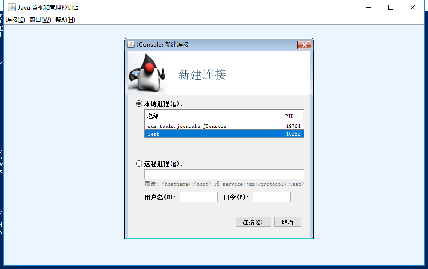
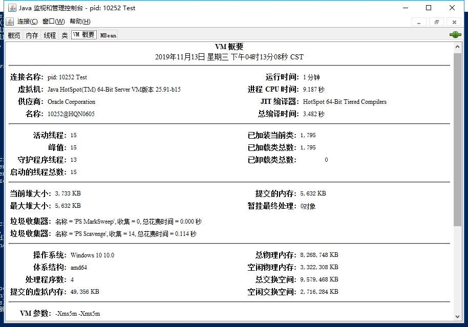
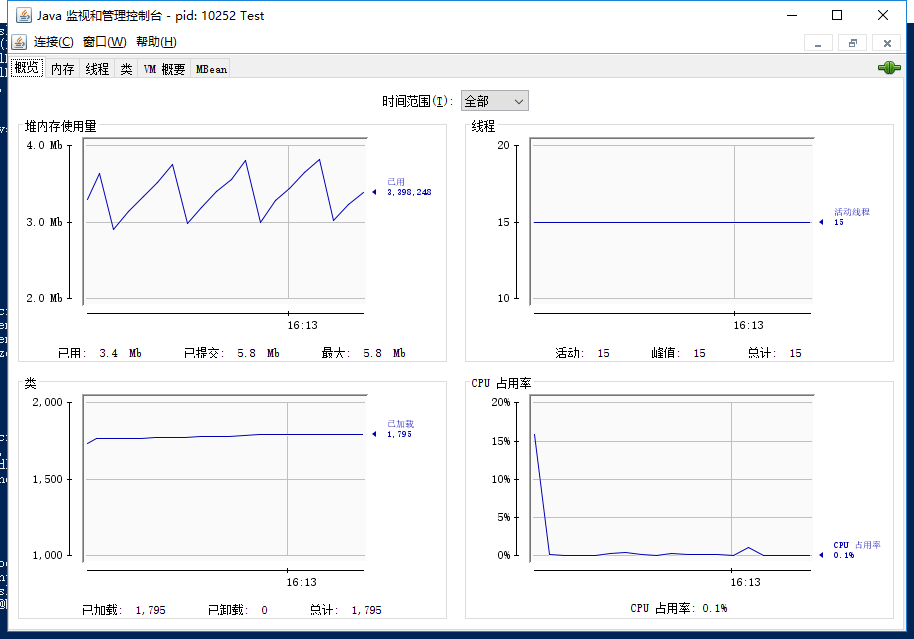
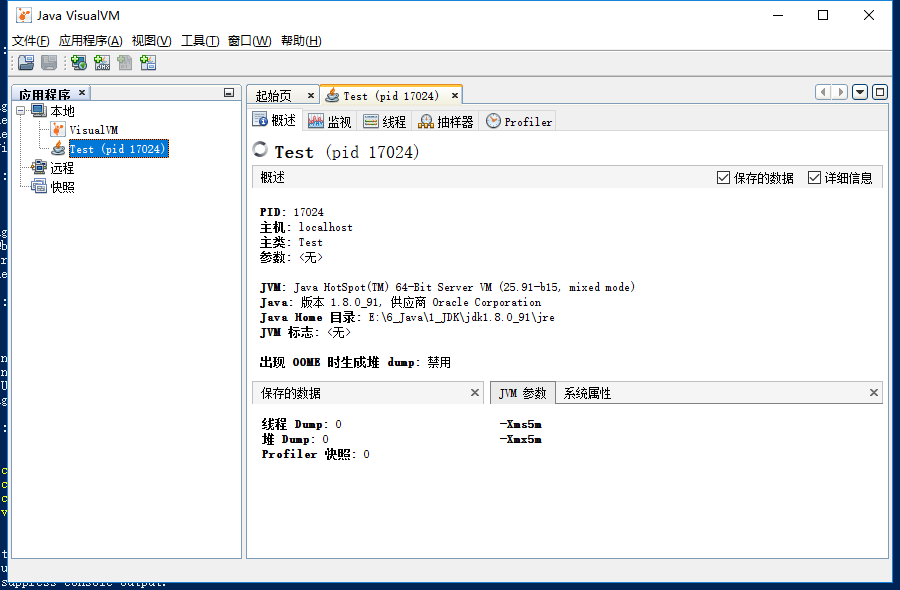
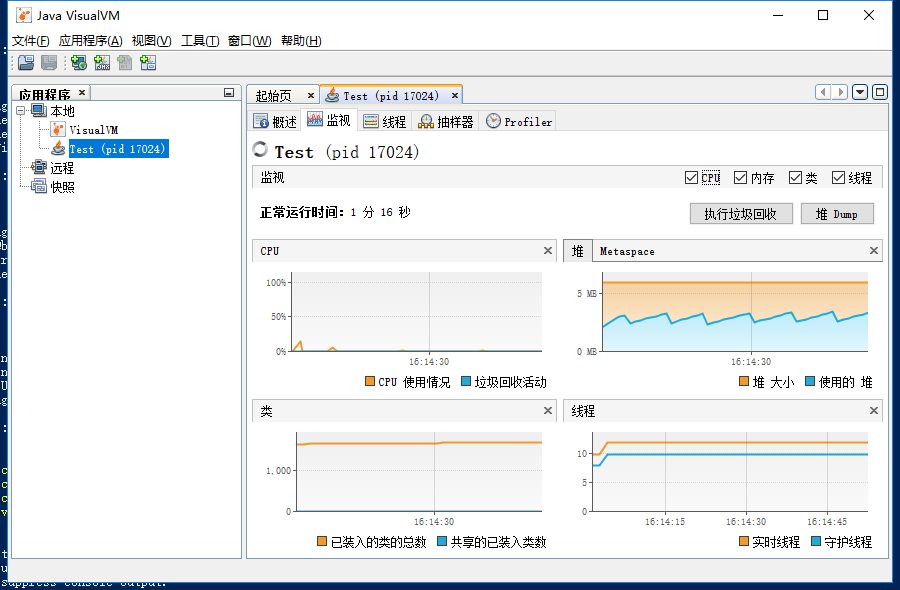
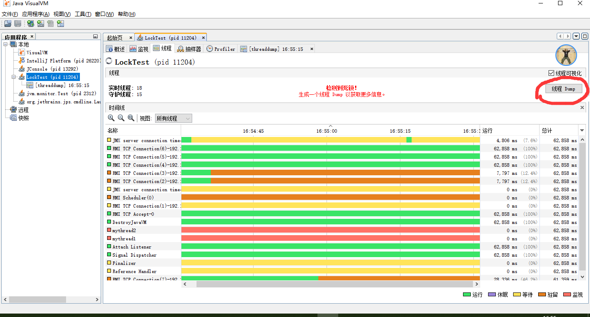

## 诊断
    创建java项目
      编写代码
      编译并运行
    监控工具
      jps - 进程信息
      jinfo - 用户信息，jvm信息，操作系统信息
      jstat - 堆内存, 类， 编译器
      jstack - 线程信息
      JConsole - 可视化工具
      JVisualVM - 可视化工具
    实战
      检测死锁
        编写死锁代码
        运行死锁程序
        检测死锁

## 创建java项目

### 编写代码
在指定目录jvmdemo，编写Test.java
```java
import java.time.Instant;
import java.util.concurrent.ExecutorService;
import java.util.concurrent.Executors;
import java.util.concurrent.TimeUnit;

/**
 * @author : zhenyun.su
 * @comment :
 * @since : 2019-11-13
 */

public class Test {
    public static void main(String[] args) {
        Thread thread = new Thread(){
            @Override
            public void run(){
                int i=0;
                try{
                    while(!Thread.interrupted()){
                        i++;
                        String s1 = new String("ok");
                        System.out.println(i+" "+Instant.now()+ " thread "+s1);
                        TimeUnit.SECONDS.sleep(1);
                    }
                }catch(Exception e){
                    System.out.println("interrupted");
                }
                System.out.println("finish");
            }
        };
        ExecutorService executorService = Executors.newCachedThreadPool();
        executorService.execute(thread);
         try{
            TimeUnit.SECONDS.sleep(500);
            executorService.shutdownNow();
        }catch(Exception e){

        }
    }
}
```

### 编译并运行

window10下启动powershell命令行窗口
```
cd jvmdem        //进入jvm目录
javac Test.java  //编译
java Test        //运行
java -Xms5m -Xmx5m Test  //使用启动参数运行，初始堆5M，最大堆5M， 用于下面监控工具
```

每个1秒输出
```
1 2019-11-13T07:19:03.758Z thread ok
2 2019-11-13T07:19:04.866Z thread ok
......
```

## 监控工具

### jps - 进程信息

#### 命令格式

jps -h
```
jps [-q] [-mlvV] [<hostid>]
```

#### 实例
jps -l
```
24324 sun.tools.jps.Jps
14232 Test
```

jps -v
```
14232 Test -Xms5m -Xmx5m
5832 Jps -Dapplication.home=E:\6_Java\1_JDK\jdk1.8.0_91 -Xms8m
```

### jinfo - 用户信息，jvm信息，操作系统信息
* 命令格式
* 运行环境信息
* 运行jvm参数信息

#### 命令格式

jinfo -h
```
    jinfo [option] <pid>
        (to connect to running process)
    jinfo [option] <executable <core>
        (to connect to a core file)
    jinfo [option] [server_id@]<remote server IP or hostname>
        (to connect to remote debug server)

where <option> is one of:
    -flag <name>         to print the value of the named VM flag
    -flag [+|-]<name>    to enable or disable the named VM flag
    -flag <name>=<value> to set the named VM flag to the given value
    -flags               to print VM flags
    -sysprops            to print Java system properties
    <no option>          to print both of the above
    -h | -help           to print this help message
```

#### 运行环境信息

jinfo -sysprops 14232
```
Attaching to process ID 14232, please wait...
Debugger attached successfully.
Server compiler detected.
JVM version is 25.91-b15
java.runtime.name = Java(TM) SE Runtime Environment
java.vm.version = 25.91-b15

java.version = 1.8.0_91
java.ext.dirs = E:\6_Java\1_JDK\jdk1.8.0_91\jre\lib\ext;C:\WINDOWS\Sun\Java\lib\ext
java.vendor = Oracle Corporation
java.class.path = .

sun.java.command = Test
file.encoding = GBK
java.specification.version = 1.8

user.country = CN
user.dir = E:\6_Java\4_workdemo\java-learning\2深入JAVA虚拟机\调优\诊断
user.name = Administrator
user.home = C:\Users\Administrator
user.timezone = Asia/Shanghai

os.name = Windows 10
os.arch = amd64
os.version = 10.0
   ......
```

#### 运行jvm参数信息
jinfo -flags 21628
```
Attaching to process ID 21628, please wait...
Debugger attached successfully.
Server compiler detected.
JVM version is 25.91-b15
Non-default VM flags: -XX:CICompilerCount=3 -XX:InitialHeapSize=6291456 -XX:MaxHeapSize=6291456 -XX:MaxNewSize=2097152 -XX:MinHeapDeltaBytes=524288 -XX:NewSize=2097152 -XX:OldSize=4194304 -XX:+UseCompressedClassPointers -XX:+UseCompressedOops -XX:+UseFastUnorderedTimeStamps -XX:-UseLargePagesIndividualAllocation -XX:+UseParallelGC
Command line:  -Xms5m -Xmx5m
```


### jstat - 堆内存, 类， 编译器

* 命令格式
* 查看内存信息
* 查看类信息
* 查看编译器信息

#### 命令格式

```
jstat -<option> [-t] [-h<lines>] <vmid> [<interval[s|ms]> [<count>]]
```

option如下


#### 查看内存信息

每隔1秒获取GC的堆内存数据

jstat -gc 14232 1s
```
 S0C    S1C    S0U    S1U      EC       EU        OC         OU       MC     MU    CCSC   CCSU   YGC     YGCT    FGC    FGCT     GCT
512.0  512.0  504.0   0.0    1024.0   531.6     4096.0     432.0    4864.0 3682.2 512.0  404.6       2    0.003   0      0.000    0.003
512.0  512.0  504.0   0.0    1024.0   531.6     4096.0     432.0    4864.0 3682.2 512.0  404.6       2    0.003   0      0.000    0.003
512.0  512.0  504.0   0.0    1024.0   545.9     4096.0     432.0    4864.0 3682.2 512.0  404.6       2    0.003   0      0.000    0.003
512.0  512.0  504.0   0.0    1024.0   545.9     4096.0     432.0    4864.0 3682.2 512.0  404.6       2    0.003   0      0.000    0.003
```

每隔100毫秒获取GC的新生代内存数据 `jstat -gcnew 14232 100ms`

每隔100毫秒获取GC的老生代内存数据 `jstat -gcold 14232 100ms`

#### 查看类信息

jstat -class 14232 2s
```
Loaded  Bytes  Unloaded  Bytes     Time
   723  1419.3        0     0.0       0.20
   723  1419.3        0     0.0       0.20
   723  1419.3        0     0.0       0.20
```

#### 查看编译器信息

jstat -compiler 14232 2s
```
Compiled Failed Invalid   Time   FailedType FailedMethod
     188      0       0     0.10          0
     188      0       0     0.10          0
     188      0       0     0.10          0
```


### jstack - 线程信息

#### 命令格式

jstack -h
```
Usage:
    jstack [-l] <pid>
        (to connect to running process)
    jstack -F [-m] [-l] <pid>
        (to connect to a hung process)
    jstack [-m] [-l] <executable> <core>
        (to connect to a core file)
    jstack [-m] [-l] [server_id@]<remote server IP or hostname>
        (to connect to a remote debug server)

Options:
    -F  to force a thread dump. Use when jstack <pid> does not respond (process is hung)
    -m  to print both java and native frames (mixed mode)
    -l  long listing. Prints additional information about locks
    -h or -help to print this help message
```

#### 查看当前线程

jstack -l 14232
```
2019-11-13 16:03:05
Full thread dump Java HotSpot(TM) 64-Bit Server VM (25.91-b15 mixed mode):

"pool-1-thread-1" #11 prio=5 os_prio=0 tid=0x0000000013f7d000 nid=0x468 waiting on condition [0x0000000014a8e000]
   java.lang.Thread.State: TIMED_WAITING (sleeping)
        at java.lang.Thread.sleep(Native Method)
        at java.lang.Thread.sleep(Thread.java:340)
        at java.util.concurrent.TimeUnit.sleep(TimeUnit.java:386)
        at Test$1.run(Test.java:23)
        at java.util.concurrent.ThreadPoolExecutor.runWorker(ThreadPoolExecutor.java:1142)
        at java.util.concurrent.ThreadPoolExecutor$Worker.run(ThreadPoolExecutor.java:617)
        at java.lang.Thread.run(Thread.java:745)

   Locked ownable synchronizers:
        - <0x00000000fffcfa68> (a java.util.concurrent.ThreadPoolExecutor$Worker)

"Service Thread" #9 daemon prio=9 os_prio=0 tid=0x0000000013f1e000 nid=0x1f98 runnable [0x0000000000000000]
   java.lang.Thread.State: RUNNABLE

   Locked ownable synchronizers:
        - None
```
#### 查看死锁

jstack -F 25004
```
Attaching to process ID 25004, please wait...
Debugger attached successfully.
Server compiler detected.
JVM version is 25.91-b15
Deadlock Detection:

No deadlocks found.

Thread 16: (state = BLOCKED)
 - java.lang.Thread.sleep(long) @bci=0 (Interpreted frame)
 - java.lang.Thread.sleep(long, int) @bci=57, line=340 (Interpreted frame)
 - java.util.concurrent.TimeUnit.sleep(long) @bci=23, line=386 (Interpreted frame)
 - Test$1.run() @bci=65, line=23 (Interpreted frame)
 - java.util.concurrent.ThreadPoolExecutor.runWorker(java.util.concurrent.ThreadPoolExecutor$Worker) @bci=95, line=1142 (Interpreted frame)
 - java.util.concurrent.ThreadPoolExecutor$Worker.run() @bci=5, line=617 (Interpreted frame)
 - java.lang.Thread.run() @bci=11, line=745 (Interpreted frame)


Thread 10: (state = BLOCKED)
```


### JConsole - 可视化工具

#### 命令格式

`jconsole`

选择 Test程序 进程ID




#### 监控画面





### JVisualVM - 可视化工具

#### 命令格式

`jvisualvm`

#### 监控画面





## 实战

### 检测死锁

* 编写死锁代码
* 运行死锁程序
* 检测死锁

#### 编写死锁代码

```java
import java.util.concurrent.TimeUnit;

/**
 * @author : zhenyun.su
 * @comment :
 * @since : 2019-11-13
 */

public class LockTest {
    private static final Object lock1 = new Object();
    private static final Object lock2 = new Object();

    public static void main(String[] args) {
        Thread t1 = new Thread(new Runnable() {
            public void run() {
                try {
                    synchronized (lock1) {
                        System.out.println(Thread.currentThread().getName());
                        TimeUnit.SECONDS.sleep(1);
                        synchronized (lock2) {
                            System.out.println(Thread.currentThread().getName());
                        }
                    }
                } catch (InterruptedException e) {
                    e.printStackTrace();
                }
            }
        });
        Thread t2 = new Thread(new Runnable() {
            public void run() {
                try {
                    synchronized (lock2) {
                        System.out.println(Thread.currentThread().getName());
                        TimeUnit.SECONDS.sleep(1);
                        synchronized (lock1) {
                            System.out.println(Thread.currentThread().getName());
                        }
                    }
                } catch (InterruptedException e) {
                    e.printStackTrace();
                }
            }
        });
        t1.setName("mythread1");
        t2.setName("mythread2");
        t1.start();
        t2.start();
    }
}
```

#### 运行死锁程序

```
javac .\LockTest.java
java LockTest
```

输出
```
mythread1
mythread2
```

该程序已经造成死锁了，假如进程ID为 11204

#### 检测死锁

* 使用jstack命令
* 使用jconsole
* 使用jvisualvm
*
##### 使用jstack命令

jstack -F 11204
```
Attaching to process ID 11204, please wait...
Debugger attached successfully.
Server compiler detected.
JVM version is 25.91-b15
Deadlock Detection:

Found one Java-level deadlock:
=============================

"mythread1":
  waiting to lock Monitor@0x0000000003307d78 (Object@0x00000000d5fe0110, a java/lang/Object),
  which is held by "mythread2"
"mythread2":
  waiting to lock Monitor@0x00000000033056f8 (Object@0x00000000d5fe0100, a java/lang/Object),
  which is held by "mythread1"

Found a total of 1 deadlock.

Thread 1: (state = BLOCKED)
```


##### 使用jconsole


##### 使用jvisualvm




