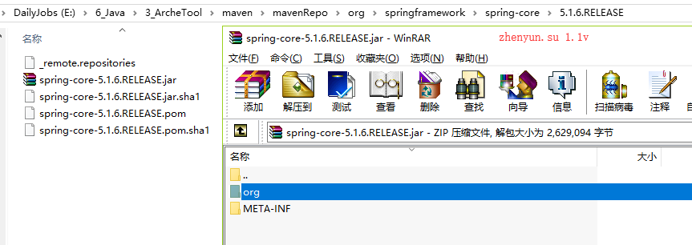
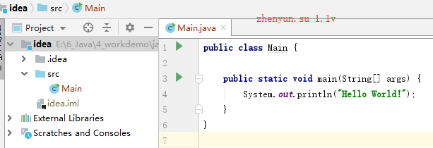
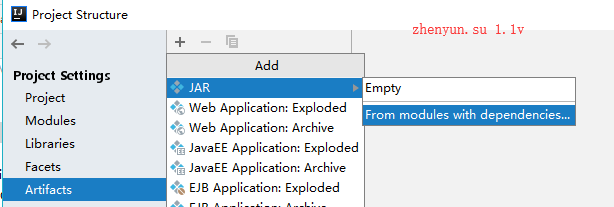
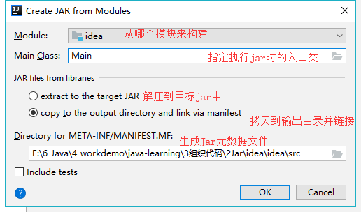
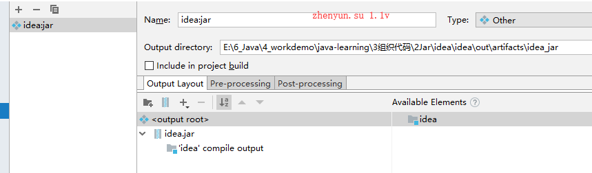
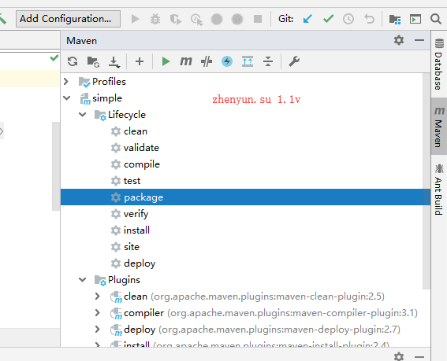
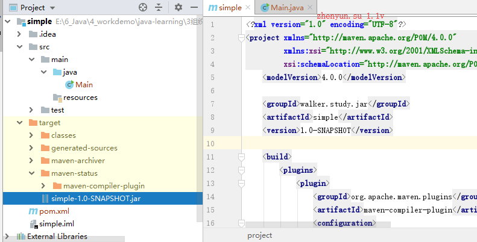

# 2快速入门
    1认识Jar
      什么是Jar
      Jar目录结构
    2构建Jar
      java打包jar
      idea打包jar
      maven打包jar

## 1认识Jar

### 什么是Jar

JAR(Java Archive）是一种软件包文件格式，

用于聚合大量的Java类文件、相关的元数据和资源（文本、图片等）文件，以便开发Java平台应用软件或库。

以ZIP格式构建，以.jar为文件扩展名, 可使用JDK自带的jar命令创建或提取JAR文件。

Jar可以将java项目代码，进行模块化管理

### Jar目录结构


* org目录存放spring框架的class文件
* META-INF目录存放该Jar包的元数据
* 文件浏览器中地址栏，指定了spring-core的maven安装路径

Jar元数据，查看MANIFEST.MF文件
```
Manifest-Version: 1.0
Implementation-Title: spring-core
Automatic-Module-Name: spring.core
Implementation-Version: 5.1.6.RELEASE
Created-By: 1.8.0_201 (Oracle Corporation)
```

这个Jar是不能单独执行的，因为没有指定主类 `Main-Class: `

项目我们用不同的方式来实现jar


## 2构建Jar

### 2java打包jar

src/Hero.Java
```java
class Hello{
    public static void main(String[] agrs){
        System.out.println("hello jar");
    }
}
```

```
javac Hello.java  #用于编译
java Hello #执行Hello.class
jar -cvf hello.jar Hello.class #用于打包 c表示创建 v表示打包进度 f表示jar文件
```

执行jar `java -jar hello.jar`

报错，因为没有在jar元数据中指定java的入口类

在META-INF/MANIFEST.MF 新增 `Main-Class: Hello` **空格**不能省略
```
Manifest-Version: 1.0
Created-By: 1.8.0_91 (Oracle Corporation)
Main-Class: Hello
```

重新执行jar就能成功输出: hello jar


**下面使用带路径来说明**

src/asu/Hero.Java
```java
package asu;
class AsuHello{
    public static void main(String[] agrs){
        System.out.println("hello Asu jar");
    }
}
```

```
javac .\asu\*  #编译asu目录下所有java
java asu.AsuHello #执行asu/AsuHello.class
jar -cvf hello.jar Hello.class #用于打包 c表示创建 v表示打包进度 f表示jar文件
java -jar AsuHello.jar # 执行
```

在META-INF/MANIFEST.MF 新增 `Main-Class: asu.AsuHello`


在我们了解了如何使用jdk进行构建jar后，下面我们使用ide工具来快速构建


### idea打包jar

####  新建项目
新建名字叫idea的项目


#### 编辑构建Artifact

Project Structure -> Artifacts -> 新增 -> 选择Jar -> 选择





如果只是作为公用jar包使用，则不需要指定入口类


如果选择include in project build 则会在build 项目也构建jar包

编译jar `Build -> Build Artifacts`


由于指定了入口类，因此我们选择运行idea.jar

按这个方法，我们可以建构更多公用Jar包，也给其他项目使用。


### maven打包jar

#### 搭建Jar项目

新建simple的空maven项目

添加Main类
```java
/**
 * @author : zhenyun.su
 * @since : 2019/5/24
 */

public class Main {
    public static void main(String[] args) {
        System.out.println("Hello World!");
    }
}
```


pom.xml添加maven构建jar插件
```xml
<?xml version="1.0" encoding="UTF-8"?>
<project xmlns="http://maven.apache.org/POM/4.0.0"
         xmlns:xsi="http://www.w3.org/2001/XMLSchema-instance"
         xsi:schemaLocation="http://maven.apache.org/POM/4.0.0 http://maven.apache.org/xsd/maven-4.0.0.xsd">
    <modelVersion>4.0.0</modelVersion>

    <groupId>walker.study.jar</groupId>
    <artifactId>simple</artifactId>
    <version>1.0-SNAPSHOT</version>

    <build>
        <plugins>
            <plugin>
                <groupId>org.apache.maven.plugins</groupId>
                <artifactId>maven-compiler-plugin</artifactId>
                <configuration>
                    <source>1.8</source>
                    <target>1.8</target>
                </configuration>
            </plugin>
            <plugin>
                <groupId>org.apache.maven.plugins</groupId>
                <artifactId>maven-jar-plugin</artifactId>
                <configuration>
                    <archive>
                        <manifest>
                            <addClasspath>true</addClasspath>
                            <useUniqueVersions>false</useUniqueVersions>
                            <classpathPrefix>lib/</classpathPrefix>
                            <mainClass>Main</mainClass>
                        </manifest>
                        <manifestEntries>
                            <version>${project.version}</version>
                        </manifestEntries>
                    </archive>
                </configuration>
            </plugin>
        </plugins>
    </build>
</project>
```

maven-compiler-plugin 用于指定编译的Jdk版本
maven-jar-plugin 用于配置Jar

#### 执行打包



在target目录下生成 simple-1.0-SNAPSHOT.jar

打开jar包，发现只有META-INF和Main.class

使用maven打包和直接idea打包区别，是在META-INF目录下除了MANIFEST.MF外，还多了maven目录

maven目录存放了项目pom.xml文件和pom.properties
