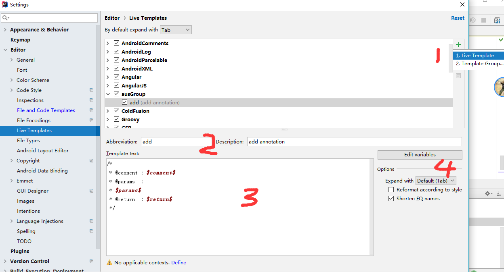

# Configure   ------    配置

		个性化配置
			外观设置
			编码设置
		注释配置
			文件头注释模板
			方法头注释模板
			验证注释模板

		导出导入配置信息
			导出配置信息
			导入配置信息


## 个性化设置

### 外观设置

	设置主题：Appearance -> Theme[IntelliJ]
	设置背景图：Appearance -> backgroup image
	快捷键： Default

### 编码设置

导航：settings -> File Encodings


Global And Project 都设置为UTF-8编码格式

对于属性文件 properties file：

Defaule encoding for properties files属性设置成utf-8

Transparent native-to-ascii conversion勾选，表示将本地编码格式转换为统一的上面设置的utf-8 编码格式。

设置后效果就能中文显示，

i18n/language_zh_CN.properties

```
language.cn = 中文
language.en = English
internationalisation = 国际化
welcome = 这是中文环境
introduce= 这是国际化的事例

```


## 注释配置

### 文件头注释模板

打开配置窗口
`Setting -> Editor -> File and Code Templates -> Files -> Class `

可以选择class, interface, Enum等类型添加注释模板


类的注释模板
```
/**
 * @author     : zhenyun.su      
 * @since      : ${DATE}
 */
```
或
```
/**
 * @author     : zhenyun.su      
 * @since      : ${DATE}
 * @see   
 */
```
@see是为了查看相关类或方法提供超链接，也可以使用 {@link }


为了保持代码简洁，没有添加更多的内容。

为了让其他开发者理解这个class文件作用，可以在@author之前添加描述说明。

可以在描述说明版权和许可证


在创建文件时，会自动添加文件头的注释

### 方法头注释模板

添加我们个性的模板组
`Setting -> Editor -> live Templates -> + -> template Group


添加写ausGroup

添加个人模板

`Setting -> Editor -> live Templates -> ausGroup -> + -> live template



Abbreviation： 输入添加方法头注释密令

这里我们输入 add， 在使用时输入add 按回车或tab键完成添加注释。

输入模板内容
```
/*
 * @comment : $comment$
 * @params  : 
 * $params$
 * @return  : $return$
 */
```

配置参数


params: methodParameters()
return: methodReturnType()

no applicableContext **define**

勾选： EveryWhere


注释模板也配置好了，我们可以愉快的使用了


### 验证注释模板

创建一个TestAnnotation类，并添加方法printlnValue

```
package user.client;

import java.io.Serializable;

/**
 * @author : zhenyun.su
 * @since : 2018-07-25
 * @see Serializable
 */

public class TestAnnotation implements Serializable {

    /*
     * @comment :
     * @params  :
     * [value]
     * @return  : void
     */
    public void printlnValue(String value){
        System.out.println("TestAnnotation.printlnValue"+value);
    }
}
```

在方法体里面 执行add+enter/tab, 生成注释，才会自动添加参数和返回值，这个需要优化

但是按简洁之道，尽量减少代码注释，好的命令风格就可以减少注释。


## 导出导入配置信息

### 导出配置信息


启动idea  -> 选择项目的欢迎界面 -> configure


选择 Export Setting

或者 打开idea主界面后 -> file -> Export Setting

选择所有，选择保存路径 D:\7_Computer\3_Personal Set\idea 填写 settings-yyyymmdd.jar

### 导入配置信息

Import Setting

一样的导入时，选择文件 settings-yyyymmdd.jar进行导入

可根据需要，选择对应分类进行导入。


