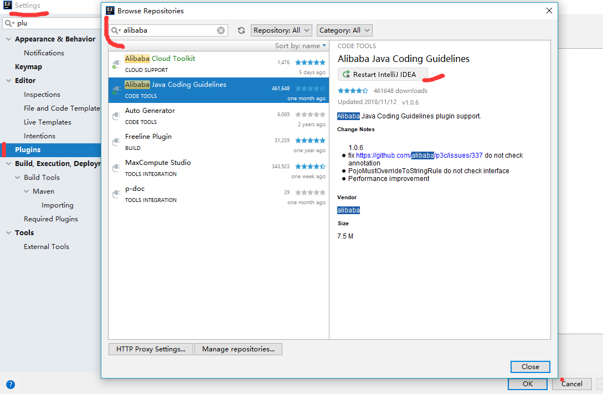
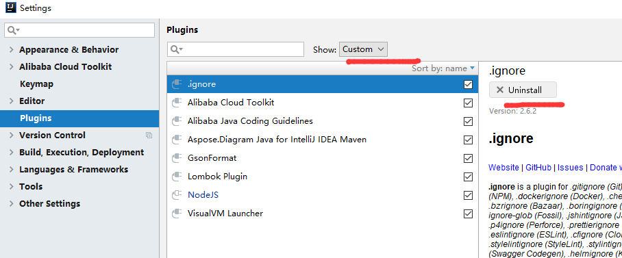
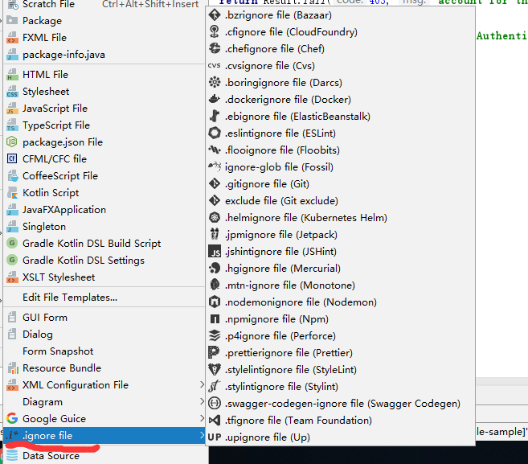
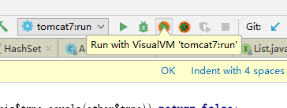

## plugin   ------    插件

		插件管理
			安装插件
			卸载插件
		常用插件
			.ignore 使用
			Alibaba Java Coding Guidelines
			VisualVM Launcher


## 插件管理


### 安装插件




显示 IntelliJ IDEA 的插件分类，

* All plugins：显示 IntelliJ IDEA 支持的所有插件；
* Enabled：显示当前以前启用的插件；
* Disabled：显示当前未启用的插件；
* Bundled：显示 IntelliJ IDEA 所有自带的插件；
* Custom：显示我们自己安装的插件。

打钩√表示为已经启用的插件，反之禁止


另外安装插件支持

* 安装 JetBrains 开发的插件；

* 安装插件仓库提供的插件；

* 安装本地已经下载完的插件。

若使用插件仓库安装，若查找不到，可以重新修改插件仓库地址


安装插件后，需要重新启动Idea工具


### 卸载插件



## 常用插件
|插件名称|插件功能描述|
|-|-|
|.ignore|针对不同的开发语言和工具，来快速生成Git的ignore文件模版 |
|Alibaba Java Coding Guidelines |Java开发规范|
|VisualVM Launcher|本地调试JVM性能情况|
|GsonFormat |使用JSON数据，生成视图类|
|Lombok Plugin|简化实体创建语法|
|Alibaba Cloud Toolkit |阿里云开发套件|
|Aspose.Diagram Java for IntelliJ IDEA Maven |生成图表|


### .ignore 使用

file -> .ignore file




### Alibaba Java Coding Guidelines


### VisualVM Launcher



####  安装visualVM客户端及配置环境

在使用插件之前，需要安装visualVM客户端及本地运行配置环境

官网下载: https://visualvm.github.io/index.html

安装在：E:\6_Java\1_JDK\visualvm_142

visualvm本身也是java程序，若启动/bin/visualvm.exe 

报错(Cannot find Java 1.8 or higher.)需要手工配置JDK路径

```
打开配置文件 /etc/visualvm.conf

修改：visualvm_jdkhome为JDK绝对路径 

visualvm_jdkhome="E:\6_Java\1_JDK\jdk1.8.0_91"
```

#### 配置idea

打开settings->Other Settings-> VisualVM Launcher


选择VisualVM 程序

#### 如何使用呢？

可直接运行，或通过idea  按钮运行 


左侧显示本地和运程的JAVA程序，由于VisualVM 本身也Java程序，因此也可以监控自己。

右侧显示

1. java程序进程情况比如JDK启动参数
2. 监控CPU，内存情况
3. 监控线程情况
4. 实时获取CPU，内存，线程样本数据


