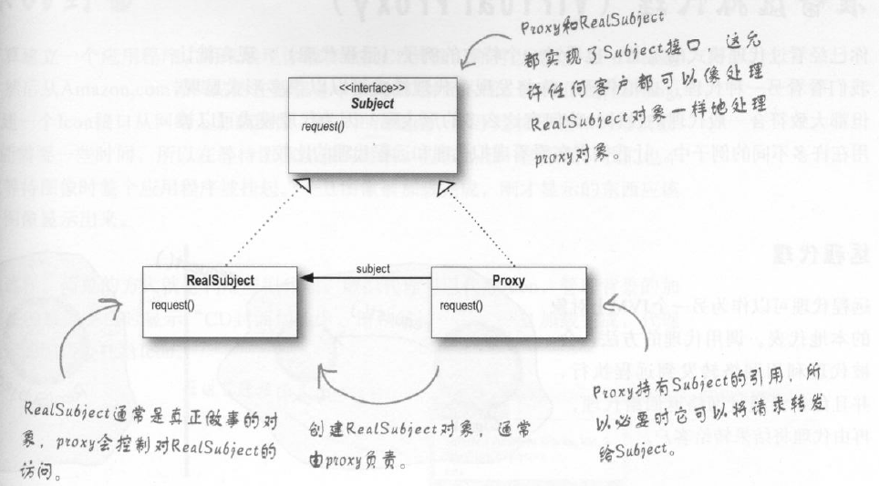
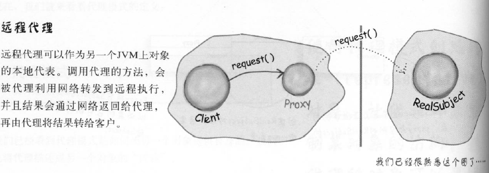
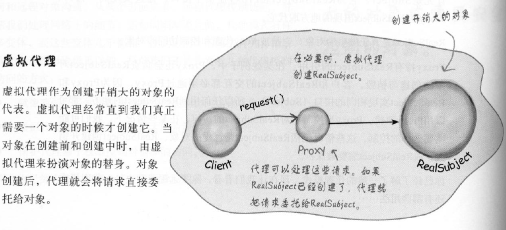
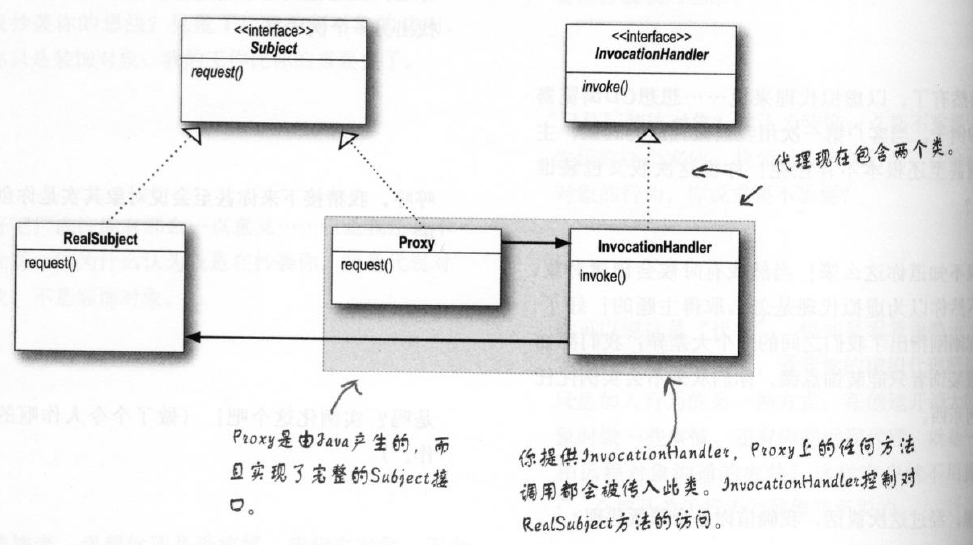
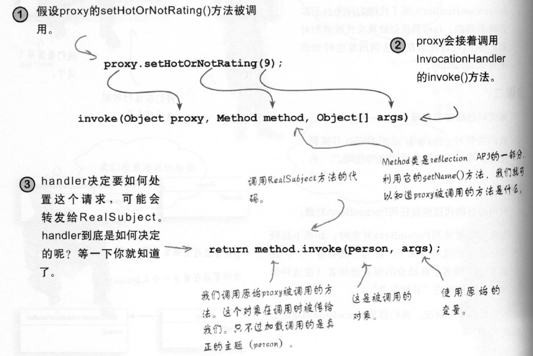

# 11代理模式

    业务场景
    面向对象解决方法
    代码实现
    模式定义
    深度和其他模式差异及主要应用在哪些场景

状态模式核心思想是解决控制和管理访问。

你能提供很优质的服务，但是你不希望每个人都叫你做事，因此你可以找个黑脸控制对你的访问。

## 业务场景


## 面向对象解决方法


## 代码实现


## 模式定义

代理模式(proxy Pattern)定义：为另外一个对象提供一个替身，以控制对这个对象的访问。

使用代理模式创建代表对象，让代表对象控制某些对象的访问，

被代理的对象可以是远程对象，创建开销大的对象或哦需要安全控制的对象

代理模式类图：


## 深度和其他模式差异及主要应用在哪些场景

### 代理模式更多应用

#### 远程代理



#### 虚拟代理



### 和装饰者模式区别

装饰者模式为对象增加行为，而代理模式是控制对象的访问。

我们是如何让客户使用代理而不是真正对象

常用技巧提供一个工厂，实例化并返回主题。因为在工厂内部发生的，客户并不知道也不在乎。

### 和其他模式区别

适配器模式：包装另外一个对象，并提供客户期望的接口
外观模式： 包装许多对象以简化它们的接口的访问
装饰者模式：包装另外一个对象，并提供额外的行为
代理模式：包装另外一个对象，并控制对它的访问


### 如何使用Java Api来实现代码

* 场景描述
* 代码实现
* 总结思考

java为我们提供代理工具java.lang.reflect，利用它可用快速开发代理功能

代理类图


由于Java自动为你创建proxy类，我们不能将方法直接放在proxy类，那么放在哪里呢？

放在invocationHandle中，由它响应代理的任何调用。

#### 场景描述

约会的配对服务，我们需要读取和写入人员信息，并且对人喜欢程度做出评价

自己可用读取和修改自己信息，但是不能对自己做出喜欢的评价

其他人可用读取信息，并且做出喜欢评价，但是不能更新其他个人信息

#### 代码实现

```java
package headfirst.proxy.jdk;

/**
 * @author : zhenyun.su
 * @comment :
 * @since : 2019/8/30
 */
public interface PersonBean {
    String getName();
    String getGender();
    Integer getHotOrNotRating();
    void setName(String name);
    void setGender(String gender);
    void setHotOrNotRating(Integer rating);
}

```

```java
public class PersonBeanImpl implements PersonBean {
    String name;
    String gender;
    Integer rating=0;
    Integer ratingCount=0;
    @Override
    public String getName() {
        return name;
    }
    @Override
    public String getGender() {
        return gender;
    }
    @Override
    public Integer getHotOrNotRating() {
        if (ratingCount ==0){return 0;}
        return rating/ratingCount;
    }
    @Override
    public void setName(String name) {
        this.name = name;
    }
    @Override
    public void setGender(String gender) {
        this.gender = gender;
    }
    @Override
    public void setHotOrNotRating(Integer rating) {
        this.rating+= rating;
        this.ratingCount++;
    }
}

```

现在我们要使用这个类的话，那么不管是自己还是其他人，都可用读取和修改信息。不安全。

现在添加代理来控制访问

访问自己代理
```java
package headfirst.proxy.jdk;
import java.lang.reflect.InvocationHandler;
import java.lang.reflect.Method;
/**
 * @author : zhenyun.su
 * @comment : 访问自己时，不能修改评分
 * @since : 2019/8/30
 */
public class OwnerInvocationHandler implements InvocationHandler {
    private PersonBean personBean;

    public OwnerInvocationHandler(PersonBean personBean) {
        this.personBean = personBean;
    }

    @Override
    public Object invoke(Object proxy, Method method, Object[] args) throws Throwable {
        try {
            if (method.getName().startsWith("get")) {
                return method.invoke(personBean, args);
            } else if (method.getName().equals("setHotOrNotRating")) {
                throw  new IllegalAccessException();
            } else if (method.getName().startsWith("set")) {
                return method.invoke(personBean, args);
            }
        } catch (Exception e){
            e.printStackTrace();
        }
        return null;
    }
}
```



访问他人代理
```java
public class NotOwnerInvocationHandler implements InvocationHandler {
    private PersonBean personBean;

    public NotOwnerInvocationHandler(PersonBean personBean) {
        this.personBean = personBean;
    }

    @Override
    public Object invoke(Object proxy, Method method, Object[] args) throws Throwable {
        try {
            if (method.getName().startsWith("get")) {
                return method.invoke(personBean, args);
            } else if (method.getName().equals("setHotOrNotRating")) {
                return method.invoke(personBean, args);
            } else if (method.getName().startsWith("set")) {
                throw  new IllegalAccessException();
            }
        } catch (Exception e){
            e.printStackTrace();
        }
        return null;
    }
}
```

使用简单工厂模式，来返回PersonBean代理类
```java
public class PersonBeanFactory {
    //返回访问自己的代理
    public static PersonBean getOwnerProxy(PersonBean person){
        return (PersonBean) Proxy.newProxyInstance(
                person.getClass().getClassLoader(),
                person.getClass().getInterfaces(),
                new OwnerInvocationHandler(person));
    }

    //返回访问其他人的代理
    public static PersonBean getNotOwnerProxy(PersonBean person){
        return (PersonBean) Proxy.newProxyInstance(
                person.getClass().getClassLoader(),
                person.getClass().getInterfaces(),
                new NotOwnerInvocationHandler(person));
    }
}
```

测试代码

```java
    public static void startTest(){
        PersonBean person1 = new PersonBeanImpl();
        person1.setGender("女");
        person1.setName("lili");
        person1.setHotOrNotRating(8);
        PersonBean owner = PersonBeanFactory.getOwnerProxy(person1);
        System.out.println(owner.getName()+" is "+owner.getGender()+"; 分数："+owner.getHotOrNotRating());
        try{
            owner.setGender("男");
            System.out.println(owner.getName()+" is "+owner.getGender()+"; 分数："+owner.getHotOrNotRating());
            owner.setHotOrNotRating(6);
        }catch (Exception e){
            System.out.println(e.getMessage());
        }
        PersonBean other = PersonBeanFactory.getNotOwnerProxy(person1);

        System.out.println(other.getName()+" is "+other.getGender()+"; 分数："+other.getHotOrNotRating());
        try{
            other.setGender("男");
        }catch (Exception e){
            System.out.println(e.getMessage());
        }
        other.setHotOrNotRating(6);
        System.out.println(other.getName()+" is "+other.getGender()+"; 分数："+other.getHotOrNotRating());
    }
```

返回信息
```
lili is 女; 分数：8
lili is 男; 分数：8
java.lang.IllegalAccessException
	at headfirst.proxy.jdk.OwnerInvocationHandler.invoke(OwnerInvocationHandler.java:25)
	at com.sun.proxy.$Proxy0.setHotOrNotRating(Unknown Source)
	at headfirst.proxy.jdk.Test.startTest(Test.java:26)
	at headfirst.proxy.jdk.Test.main(Test.java:12)
lili is 男; 分数：8
java.lang.IllegalAccessException
	at headfirst.proxy.jdk.NotOwnerInvocationHandler.invoke(NotOwnerInvocationHandler.java:27)
	at com.sun.proxy.$Proxy0.setGender(Unknown Source)
	at headfirst.proxy.jdk.Test.startTest(Test.java:34)
	at headfirst.proxy.jdk.Test.main(Test.java:12)
lili is 男; 分数：7
```

#### 总结思考

1. 之所以被称为动态代理，是因为代理类是再运行时动态创建。
2. InvocationHandler不是代理类，它只是帮助代理类的执行方法，Proxy利用newProxyInstance()方法在运行时动态生成代理类
3. 使用isProxyClass()方法来判断是不是代理类
4. 只支持接口代理，不支持类方法，接口方法设置public，或者必须在同一个package内
