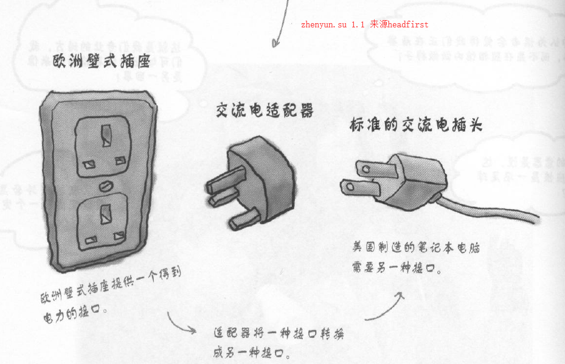
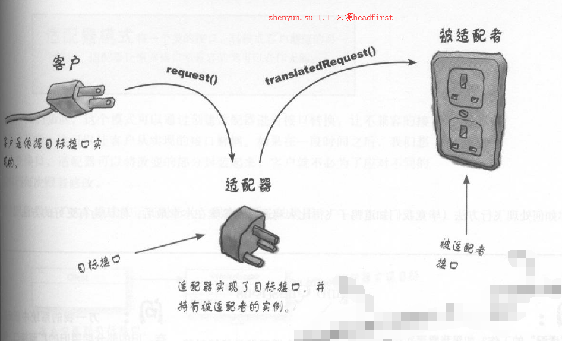
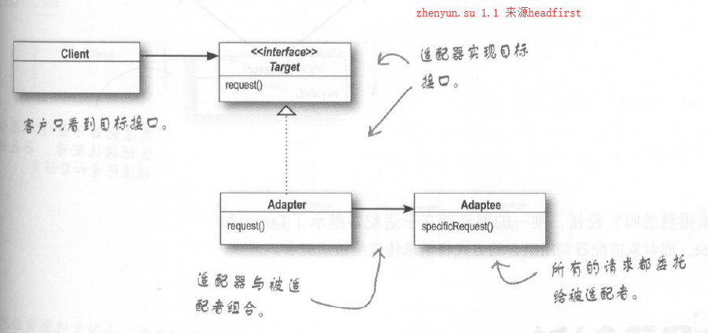
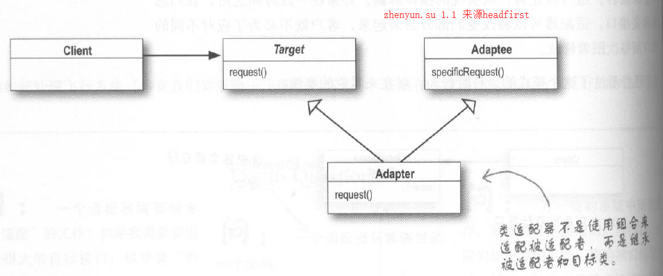

# 5适配器模式

    业务场景
    面向对象解决方法
    代码实现
    适配器模式定义
    深度和其他模式差异及主要应用在哪些场景

适配器核心思想是解决新老接口兼容性问题。

## 业务场景
我们面对场景，交流电适配

解决的业务场景

## 面向对象解决方法

提供了两种解决方法

### 对象适配器模式(推荐)

使用适配器过程如下

1. 客户通过目标接口调用适配器的方法对适配器发出请求
2. 适配器使用被适配者接口把请求转换成被适配者的一个或多个调用接口
3. 客户收到调用结果，但并未察觉这一切是适配器在起转换作用

对象适配器模式，使用组合的方式

### 类适配器模式

类适配器模式,使用继承的方式

### 两者区别

对象适配器模式使用接口注入的方式，因此比类适配器更加具有扩展性，

类适配器使用继承的方式，因此实例化适配器时，被适配者也被同时实例化，简化代码开发

推荐使用对象适配模式

## 代码实现

## 适配器模式定义

适配器模式：将一个类的接口，转换成客户期望的另一个接口。

适配器让原本接口不兼容的类可以**兼容**

正常情况下一个适配器包装一个被适配者，如果包装多个被适配者，者涉及到另外一个外观者模式

## 深度和其他模式差异及主要应用在哪些场景

装饰者模式：不改变接口，但加入责任

外观模式：让接口更加简单

适配器模式：将一个接口转换成另外一个客户期望的接口

我们在下一章，介绍外观模式
