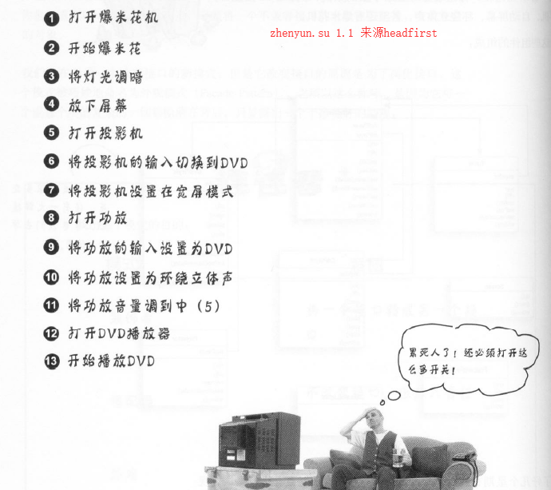
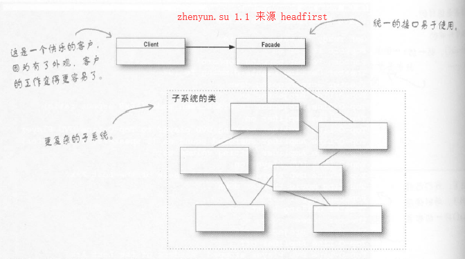

# 6外观模式 - Facade-Pattern

    业务场景
    面向对象解决方法
    代码实现
    适配器模式定义
    深度和其他模式差异及主要应用在哪些场景
    面向对象设计原则

外观核心思想是解决繁琐的调用子系统一群接口，简化为统一接口。

## 业务场景
我们面对场景，家庭影院

假如我们已经组建一套家庭影院设备，有灯，DVD播放机，立体音响，投影仪，自动屏幕，甚至还有爆米花机。

当要观看电影时，需要如下操作

如果结束观影，是不是需要反向操作一遍呢？

我们需要一键开关电影。

解决的业务场景

## 面向对象解决方法

提供了两种解决方法

### 对象适配器模式(推荐)

使用适配器过程如下

1. 客户通过目标接口调用适配器的方法对适配器发出请求
2. 适配器使用被适配者接口把请求转换成被适配者的一个或多个调用接口
3. 客户收到调用结果，但并未察觉这一切是适配器在起转换作用

对象适配器模式，使用组合的方式

### 类适配器模式

类适配器模式,使用继承的方式

### 两者区别

对象适配器模式使用接口注入的方式，因此比类适配器更加具有扩展性，

类适配器使用继承的方式，因此实例化适配器时，被适配者也被同时实例化，简化代码开发

推荐使用对象适配模式

## 代码实现

## 模式定义

外观模式：提供了一个统一接口来，访问多个子系统中一群接口。

外观定义了一个高层接口，让子系统更加容易使用。

外观模式，并没有封装子系统的类，只是通过包装简化接口，客户依然可以使用子系统的类。

外观模式，是可以新增功能，让子系统使用更加方便

外观模式，不仅仅简化了接口，也将客户从组件的子系统中解耦出来。这样当在升级子系统时，只要修改外观代码就可以了。

## 深度和其他模式差异及主要应用在哪些场景

外观模式和适配器模式差异不在它们包装几个类，而是它们的意图，

外观意图是简化接口，而适配器意图是将接口转换成客户期望接口。

我们在下一章，介绍外观模式

## 面向对象设计原则
