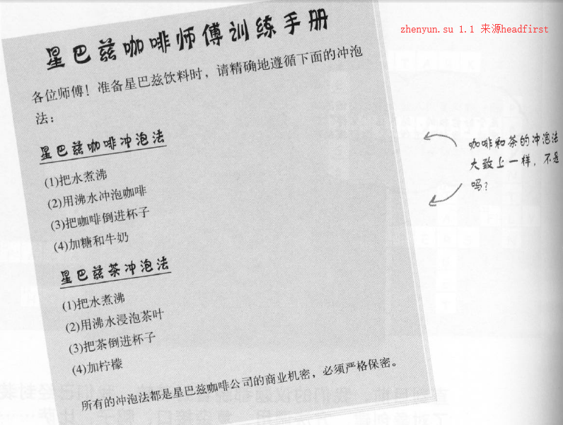
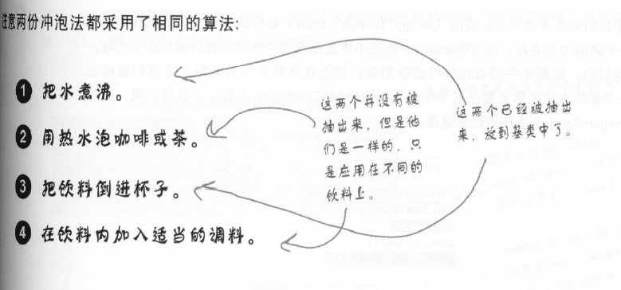
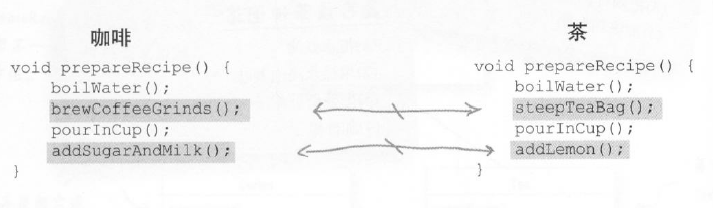
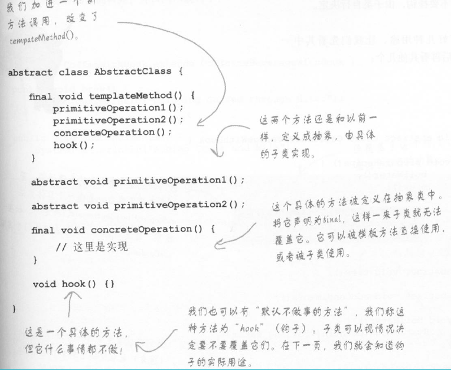
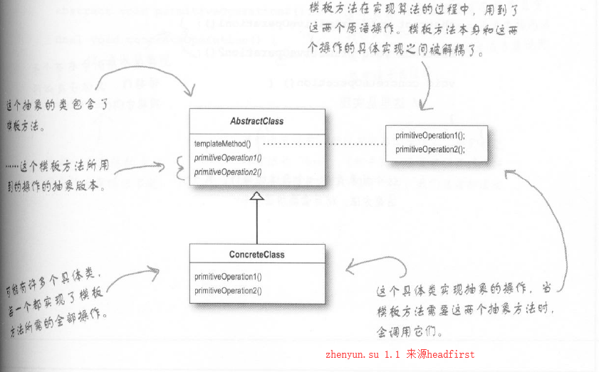
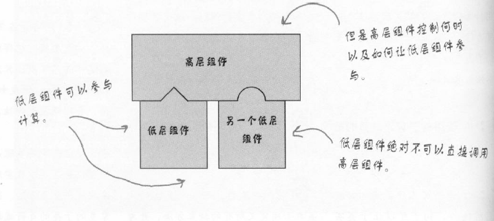

# 1策略模式

    业务场景
    面向对象解决方法
    代码实现
    模式定义
    深度和其他模式差异及主要应用在哪些场景

适配器核心思想是解决新老接口兼容性问题。

## 业务场景

我们面对场景，冲泡咖啡和茶，两者有很多相似地方



冲泡咖啡实现如下
```java
public class Coffee {
  //咖啡冲泡方法,每个步骤实现在独立方法中
    void prepareRecipe(){
        boilWater();
        brewCoffee();
        pourInCup();
        addSugarAndMilk();
    }

    public void boilWater(){
        System.out.println("boil water");
    }
    public void brewCoffee(){
        System.out.println("brew coffee");
    }
    public void pourInCup(){
        System.out.println("pour in cup");
    }
    public void addSugarAndMilk(){
        System.out.println("add sugar and milk");
    }
}
```
冲泡茶叶实现如下
```java
public class Tea {
  //茶浸泡方法,每个步骤实现在独立方法中
    void prepareRecipe(){
        boilWater();
        steepTea();
        pourInCup();
        addLemon();
    }

    public void boilWater(){
        System.out.println("boil water");
    }
    public void steepTea(){
        System.out.println("steep tea");
    }
    public void pourInCup(){
        System.out.println("pour in cup");
    }
    public void addLemon(){
        System.out.println("add sugar and milk");
    }
}
```

上面的实现过程，代码很多重复了，如何解决呢？

不管咖啡和茶，这两个方法`boilWater()和pourInCup()`是一样，可以放在基类中实现，然后咖啡和茶从基类继承

```java
public class CoffeineBeverage {
    public void boilWater(){
        System.out.println("boil water");
    }
    public void pourInCup(){
        System.out.println("pour in cup");
    }
}
```

能不能更进一步解决呢？

咖啡和茶都要经过四个步骤来实现


只是下面这两个方法不一样


那么是否可以将prepareRecipe也抽象呢？
```java
public abstract class CoffeineBeverage {
    //冲泡饮料模板方法
    final void prepareRecipe(){
        boilWater();
        brew();
        pourInCup();
        addCondiments();
    }
    public void boilWater(){
        System.out.println("boil water");
    }
    public abstract void brew();
    public void pourInCup(){
        System.out.println("pour in cup");
    }
    public abstract void addCondiments();
}
```

`prepareRecipe()` 被声明为 final 因为我们不希望在子类被修改。

`boilWater()和pourInCup()` 咖啡，茶叶及其他饮料，**煮开水和倒入杯中** 这两个步骤都一样的。直接实现

`brew()和addCondiments()` 每种饮料都不一样，因此由具体子类来实现

对于咖啡或茶子类只要实现`brew()和addCondiments()`就可以了

### 在模板方法的中，新增钩子hook()方法

可以用于改变模板算法结构。



有些饮料是需要添加调料，有些不要，那么我们需要钩子来影响抽象类中模板方法
```java
public abstract class CoffeineBeverage {
    //冲泡饮料模板方法
    final void prepareRecipe(){
        boilWater();
        brew();
        pourInCup();
        if (needCondiment()) {
            addCondiments();
        }
    }
    public void boilWater(){
        System.out.println("boil water");
    }
    public abstract void brew();
    public void pourInCup(){
        System.out.println("pour in cup");
    }

    public abstract void addCondiments();
    public boolean needCondiment(){
        return true;
    }
}
```

## 面向对象解决方法

类图如下


## 代码实现


## 模式定义

模板方法模式(Template Pattern)定义：在一个方法中定义一个算法框架，而将一些步骤实现放在子类中。

模板方法使子类在不变算法结构下，重新实现算法中某些步骤。

算法结构是在抽象类存在一个包含多个已实现的方法和抽象方法，完成一个功能的模板方法

其中抽象方法，需要子类中完成，子类不改变算法结构。

抽象类的模板方法关注算法本身，子类提供完整的实现，将代码复用最大化。

## 深度和其他模式差异及主要应用在哪些场景

### 模板方法中，何时使用实现方法，抽象方法，钩子方法

1. 实现方法，不变的逻辑， 所有子类都具有相同逻辑，放在抽象类实现
2. 抽象方法，会变得逻辑， 所有子类都具有不同逻辑，放子类中实现
3. 钩子方法，用于影响模板算法结构。使模板算法更有弹性

子类必须实现所有抽象类的抽象方法，这样模板算法是完整的

抽象方法不是越多越好，也不是越少越好，越少比较没有弹性，越多子类实现很麻烦，具体看业务情况而定。

### 好莱坞原则
好莱坞原则：别调用我们，我们会调用你。防止类之间**依赖腐败**

依赖腐败
```
高层组件依赖底层组件，底层组件又依赖边侧组件，边侧组件又依赖高层组件，
依赖腐败就发生了，没人能搞懂这个系统设计
```
好莱坞原则是高层组件对待底层组件的方式别来调用我们，我们会来调用你的。


回顾模板方法设计模式，高层CoffeineBeverage实现模板方法，在需要时候才会调用底层子类的方法。

### 好莱坞原则和依赖倒置原则

依赖倒置原则是尽量避免使用具体类，而使用超类，接口或抽象类，

而好莱坞原则在创建组件上一种技巧，将底层组件挂钩在算法中，在需要时调用子类的方法，而不是依赖底层组件。

当然并不是底层就不能调用高层组件了，在需要时也会调用。

模板方法模式：子类来决定如何实现算法中的步骤。

策略模式：封装可互换的行为，然后用委托的方式来决定要使用哪种行为。

工厂模式：由子类来决定实例化哪个具体类。
