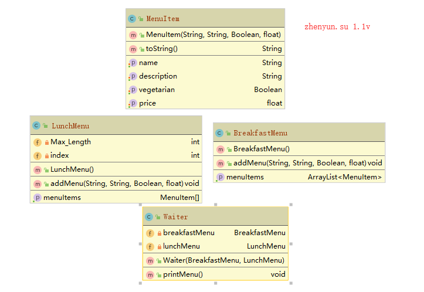
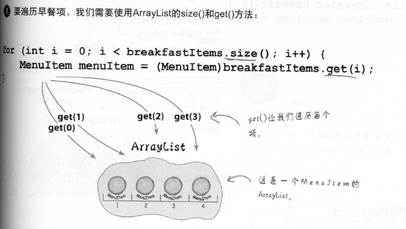
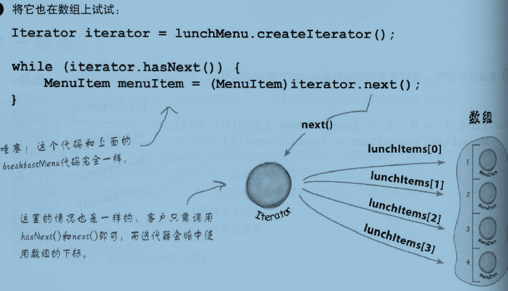
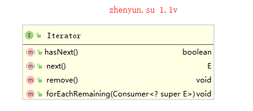
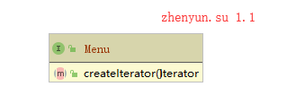
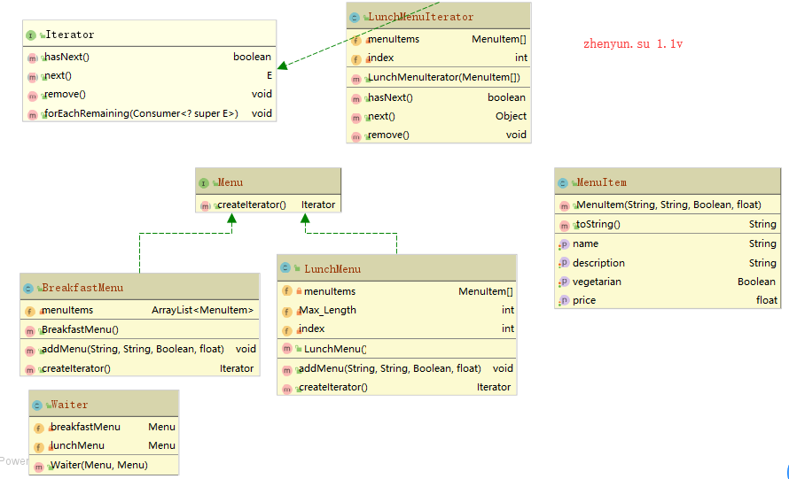
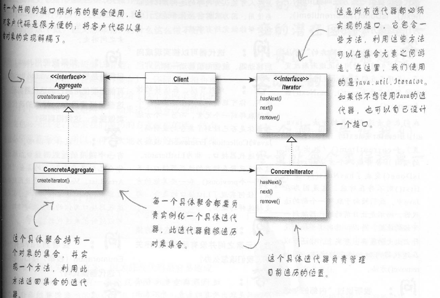

# 8迭代模式

    业务场景
    面向对象解决方法
    代码实现
    模式定义
    深度和其他模式差异及主要应用在哪些场景

迭代模式核心思想是解决聚合对象遍历问题。

## 业务场景

我们面对场景，现在有一个包子早餐店，一个午餐店，被同一个老板收购，

需要合并为一个店，可同时经营早餐和午餐。

因此我们需要合并菜单，使用服务员能提供早餐和午餐的菜品。
结构图如下：


菜品属性
```java
package headfirst.iterator.scene;
/**
 * @author : zhenyun.su
 * @comment : 菜单的菜品
 * @since : 2019/8/27
 */
public class MenuItem {
    private String name;
    private String description;
    private Boolean vegetarian;
    private float price;
    public MenuItem(String name, String description, Boolean vegetarian, float price) {
        this.name = name;
        this.description = description;
        this.vegetarian = vegetarian;
        this.price = price;
    }
    // getter and setting
    @Override
    public String toString() {
        return "MenuItem{" +
                "name='" + name + '\'' +
                ", description='" + description + '\'' +
                ", vegetarian=" + vegetarian +
                ", price=" + price +
                '}';
    }
}
```

包子早餐店菜单如下：
```java
import java.util.ArrayList;
/**
 * @author : zhenyun.su
 * @comment : 面条，牛奶，热狗，肉包的早餐店
 * @since : 2019/8/27
 */
public class BreakfastMenu {
    private ArrayList<MenuItem> menuItems= new ArrayList<>();
    public BreakfastMenu() {
        addMenu("noodle", "Onion oil noodles", true, 6.0f);
        addMenu("milk", "Pure milk", false, 3.5f);
        addMenu("Hot dog", "Hot dog", true, 5.0f);
        addMenu("Meat bag", "Meat bag", true, 2.0f);
    }
    public void addMenu(String name, String desc, Boolean vege, float price){
        menuItems.add(new MenuItem(name, desc, vege, price));
    }
    public ArrayList<MenuItem> getMenuItems() {
        return menuItems;
    }
}
```
午餐店菜单如下：
```java
package headfirst.iterator.scene;
/**
 * @author : zhenyun.su
 * @comment : 提供牛肉饭，牛肉面，土豆饭的午餐店
 * @since : 2019/8/27
 */
public class LunchMenu {
    private MenuItem[] menuItems;
    private int Max_Length = 6;
    private int index=0;
    public LunchMenu() {
        this.menuItems = new MenuItem[6];
        addMenu("Beef Rice", "Beef Rice", false, 11.0f);
        addMenu("beef noodle", "beef noodle", false, 12.5f);
        addMenu("Potato rice", "Potato rice", true, 9.0f);
    }
    public void addMenu(String name, String desc, Boolean vege, float price){
        menuItems[index]=new MenuItem(name, desc, vege, price);
        index=index+1;
    }
    public MenuItem[] getMenuItems() {
        return menuItems;
    }
}
```

早餐店的菜单采用ArrayList，而午餐店的菜单使用的是菜品数值，他们采用不同结构的来聚合对象。

这个会有什么问题呢？，请看下面服务员是如何打印菜单的。

服务员打印菜单
```java
package headfirst.iterator.scene;
import java.util.ArrayList;
/**
 * @author : zhenyun.su
 * @comment : 服务员提供早餐和午餐的菜单
 * @since : 2019/8/27
 */
public class Waiter {
    private BreakfastMenu breakfastMenu;
    private LunchMenu lunchMenu;
    public Waiter(BreakfastMenu breakfastMenu, LunchMenu lunchMenu) {
        this.breakfastMenu = breakfastMenu;
        this.lunchMenu = lunchMenu;
    }

    public void printMenu(){
        System.out.println("print breakfast Menu");
        ArrayList<MenuItem> breakfastItems= breakfastMenu.getMenuItems();
        for (int i = 0; i <breakfastItems.size()-1; i++) {
            System.out.println(breakfastItems.get(i).toString());
        }

        System.out.println("print lunch Menu");
        MenuItem[] lunchItems = lunchMenu.getMenuItems();
        for (int i = 0; i < lunchItems.length-1; i++) {
            if (lunchItems[i] !=null){
                System.out.println(lunchItems[i].toString());
            }
        }
    }
}
```

1. 不同的菜单采用不同方法来遍历聚合对象，若新增一个不同结构菜单，Waiter要新增遍历的方法
2. Waiter对菜单的遍历采用具体实现编码，而不是**接口编程**，这违反接口编程原则
3. Waiter需要了解每个菜单如何遍历集合对象，违反了封装原则

下面使用面向对象设计原则，优化成功迭代模式

## 面向对象解决方法




1. 定义迭代器接口，定义不同结构的集合对象遍历方法。在每个不同集合结构中实现迭代器接口




定义迭代器接口


2. 定义菜单接口createIterator()，每个菜单实现菜单接口来中返回迭代器

定义菜单接口


3. 在Waiter中实现迭代器对集合对象遍历

```java
    public void printMenu(Iterator iterator){
        while(iterator.hasNext()){
            MenuItem menuItem = (MenuItem)iterator.next();
            System.out.println(menuItem.toString());
        }
    }
```


## 代码实现

如何实现呢？

### 迭代器接口实现

迭代器接口，java已经提供提供，而ArrayList本身是可以直接返回Iterator的，所以不用实现

午餐数组结构的迭代器实现
```java
package headfirst.iterator.demo;
import java.util.Iterator;
/**
 * @author : zhenyun.su
 * @comment : 午餐迭代器
 * @since : 2019/8/27
 */
public class LunchMenuIterator implements Iterator {
    private MenuItem[] menuItems;
    private int index=0;
    public LunchMenuIterator(MenuItem[] menuItems) {
        this.menuItems = menuItems;
    }
    @Override
    public boolean hasNext() {
        return (index < menuItems.length)&&(menuItems[index]!=null);
    }
    @Override
    public Object next() {
        index= index+1;
        return menuItems[index-1];
    }
    @Override
    public void remove() {
        if (this.hasNext()){
            int removeIndex=index;
            for (int i = index; i < menuItems.length-1; i++) {
                menuItems[i]=menuItems[i+1];
                removeIndex=removeIndex+1;
            }
            menuItems[removeIndex]=null;
        }
    }
}
```

### 菜单接口实现

菜单接口
```java
import java.util.Iterator;

public interface Menu {
    public Iterator createIterator();
}

```


早餐菜单
```java
public class BreakfastMenu implements Menu {
    private ArrayList<MenuItem> menuItems= new ArrayList<>();
    public BreakfastMenu() {
        addMenu("noodle", "Onion oil noodles", true, 6.0f);
        addMenu("milk", "Pure milk", false, 3.5f);
        addMenu("Hot dog", "Hot dog", true, 5.0f);
        addMenu("Meat bag", "Meat bag", true, 2.0f);
    }
    public void addMenu(String name, String desc, Boolean vege, float price){
        menuItems.add(new MenuItem(name, desc, vege, price));
    }

    @Override
    public Iterator createIterator() {
        return menuItems.iterator();
    }
}
```

午餐菜单
```java
public class LunchMenu implements Menu  {
    private MenuItem[] menuItems;
    private int Max_Length = 6;
    private int index=0;
    public LunchMenu() {
        this.menuItems = new MenuItem[6];
        addMenu("Beef Rice", "Beef Rice", false, 11.0f);
        addMenu("beef noodle", "beef noodle", false, 12.5f);
        addMenu("Potato rice", "Potato rice", true, 9.0f);
    }
    public void addMenu(String name, String desc, Boolean vege, float price){
        menuItems[index]=new MenuItem(name, desc, vege, price);
        index=index+1;
    }

    @Override
    public Iterator createIterator() {
        return new LunchMenuIterator(menuItems);
    }
}
```

服务员打印菜单
```java
public class Waiter {
    private Menu breakfastMenu;
    private Menu lunchMenu;

    public Waiter(Menu breakfastMenu, Menu lunchMenu) {
        this.breakfastMenu = breakfastMenu;
        this.lunchMenu = lunchMenu;
    }

    public void printMenu(){
        System.out.println("print breakfast Menu");
        Iterator breakfastIterator = breakfastMenu.createIterator();
        printMenu(breakfastIterator);

        System.out.println("print lunch Menu");
        Iterator lunchIterator = lunchMenu.createIterator();
        printMenu(lunchIterator);
    }

    public void printMenu(Iterator iterator){
        while(iterator.hasNext()){
            MenuItem menuItem = (MenuItem)iterator.next();
            System.out.println(menuItem.toString());
        }
    }
}
```

类结构图如下：


测试代码
```java
    public static void main(String[] args) {
        Menu breakfastMenu = new BreakfastMenu();
        Menu lunchMenu =  new LunchMenu();
        Waiter waiter = new Waiter(breakfastMenu, lunchMenu);
        waiter.printMenu();
    }
```
输出如下
```
print breakfast Menu
MenuItem{name='noodle', description='Onion oil noodles', vegetarian=true, price=6.0}
MenuItem{name='milk', description='Pure milk', vegetarian=false, price=3.5}
MenuItem{name='Hot dog', description='Hot dog', vegetarian=true, price=5.0}
MenuItem{name='Meat bag', description='Meat bag', vegetarian=true, price=2.0}
print lunch Menu
MenuItem{name='Beef Rice', description='Beef Rice', vegetarian=false, price=11.0}
MenuItem{name='beef noodle', description='beef noodle', vegetarian=false, price=12.5}
MenuItem{name='Potato rice', description='Potato rice', vegetarian=true, price=9.0}
```

这样的好处是什么呢？

1. 通过迭代器，实现菜单和集合对象解耦，不同的集合对象实现迭代器方法，而菜单提供获取迭代方法，给服务员使用。
2. 通过菜单接口，实现服务员和菜单的解耦, 菜单提供迭代器，服务员使用统一迭代器接口来变量菜单，而无需知道每个菜单存储菜品的结构。

## 模式定义

迭代模式是**提供一种方法遍历一个不同的集合对象，而又不暴露内部结构**



遵循的面向对象原则：**单一职责原则** 一个类应该只有一个引起变化的原因。

java提供集合对象，都已经实现迭代器，比如ArrayList, Vector, LinkedList, Stack, PriorityQueue等等

## 深度和其他模式差异及主要应用在哪些场景

若希望在午餐菜单中，添加一个子菜单，比如四川菜系的菜单。

现在又如何实现呢？我们不仅仅需要多个菜单，甚至还要支持菜单中的菜单

按上面菜单结构完全不行的，请看下面一章**组合模式**来实现

### 单一职责原则

**单一职责原则** 一个类应该只有一个引起变化的原因。

讲究高内聚，低耦合，

所谓高内聚是指一组相关功能放在一个类或模块中，所谓低内聚是指一组不相关功能放在一个类或模块中
