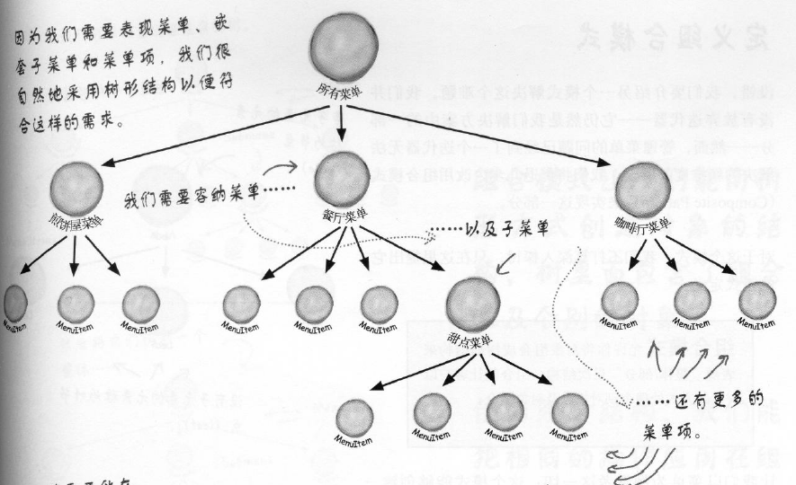
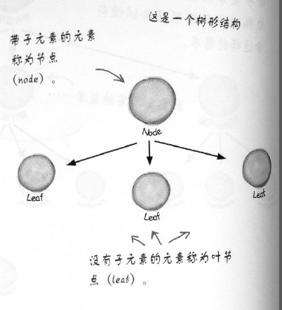
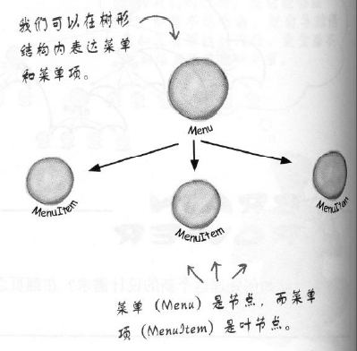

# 9组合模式

    业务场景
    面向对象解决方法
    代码实现
    模式定义
    深度和其他模式差异及主要应用在哪些场景

组合模式核心思想是解决菜单和子菜单问题。

## 业务场景

我们面对场景，使用什么方式来表示菜单，嵌套菜单，菜单项



## 面向对象解决方法







## 代码实现


## 模式定义

模板方法模式(Template Pattern)定义：在一个方法中定义一个算法框架，而将一些步骤实现放在子类中。

模板方法使子类在不变算法结构下，重新实现算法中某些步骤。

算法结构是在抽象类存在一个包含多个已实现的方法和抽象方法，完成一个功能的模板方法

其中抽象方法，需要子类中完成，子类不改变算法结构。

抽象类的模板方法关注算法本身，子类提供完整的实现，将代码复用最大化。

## 深度和其他模式差异及主要应用在哪些场景

### 模板方法中，何时使用实现方法，抽象方法，钩子方法

1. 实现方法，不变的逻辑， 所有子类都具有相同逻辑，放在抽象类实现
2. 抽象方法，会变得逻辑， 所有子类都具有不同逻辑，放子类中实现
3. 钩子方法，用于影响模板算法结构。使模板算法更有弹性

子类必须实现所有抽象类的抽象方法，这样模板算法是完整的

抽象方法不是越多越好，也不是越少越好，越少比较没有弹性，越多子类实现很麻烦，具体看业务情况而定。

### 好莱坞原则
好莱坞原则：别调用我们，我们会调用你。防止类之间**依赖腐败**

依赖腐败
```
高层组件依赖底层组件，底层组件又依赖边侧组件，边侧组件又依赖高层组件，
依赖腐败就发生了，没人能搞懂这个系统设计
```
好莱坞原则是高层组件对待底层组件的方式别来调用我们，我们会来调用你的。


回顾模板方法设计模式，高层CoffeineBeverage实现模板方法，在需要时候才会调用底层子类的方法。

### 好莱坞原则和依赖倒置原则

依赖倒置原则是尽量避免使用具体类，而使用超类，接口或抽象类，

而好莱坞原则在创建组件上一种技巧，将底层组件挂钩在算法中，在需要时调用子类的方法，而不是依赖底层组件。

当然并不是底层就不能调用高层组件了，在需要时也会调用。

模板方法模式：子类来决定如何实现算法中的步骤。

策略模式：封装可互换的行为，然后用委托的方式来决定要使用哪种行为。

工厂模式：由子类来决定实例化哪个具体类。
