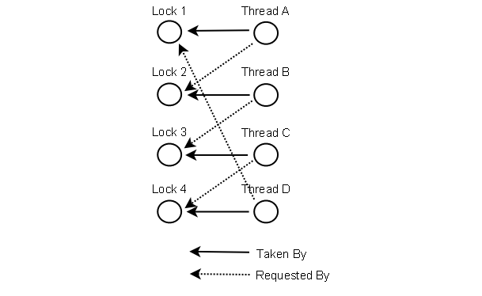

# Thread Deadlock   ------  线程死锁

		什么是线程死锁
		如何产生死锁
			实例讲解
			数据库死锁
		如何防止死锁
			1. 锁定顺序
			2. 锁定超时
			3. 死锁检测
			

## 什么是线程死锁

线程死锁是指两个或多个线程相互阻塞，线程一直卡死。

如果线程1锁定A，并尝试锁定B，而线程2已经锁定B，并尝试锁定A，则会出现死锁。

线程1永远不会得到B，而线程2永远不会得到A.此外，它们都不会知道。 

它们将永远被阻塞在每个对象A和B上，这种情况就是死锁

```
Thread 1  locks A,   waits for B

Thread 2  locks B,   waits for A
```

## 如何产生死锁

### 实例讲解

```
public class TreeNode {
 
  TreeNode parent   = null;  
  List     children = new ArrayList();

  public synchronized void addChild(TreeNode child){
    if(!this.children.contains(child)) {
      this.children.add(child);
      child.setParentOnly(this);
    }
  }
  
  public synchronized void addChildOnly(TreeNode child){
    if(!this.children.contains(child){
      this.children.add(child);
    }
  }
  
  public synchronized void setParent(TreeNode parent){
    this.parent = parent;
    parent.addChildOnly(this);
  }

  public synchronized void setParentOnly(TreeNode parent){
    this.parent = parent;
  }
}
```

现在有两个线程1和线程2同时调用
```
Thread 1: parent.addChild(child); //locks parent
          --> child.setParentOnly(parent);

Thread 2: child.setParent(parent); //locks child
          --> parent.addChildOnly()
```

上面有TreeNode的两个实例parent和child

由于addChild设置为synchronized 同步，因此线程1锁定父对象parent

而setParent设置为synchronized 同步，因此线程2锁定子对象child

在addChild方法中调用child.setParentOnly(this)，它也设置了synchronized，线程1还要锁定子对象child，而子对象child已被线程2锁定，处于阻塞

在setParent方法要调用parent.addChildOnly()，它也设置了synchronized，线程2还要锁定父对象parent，而父对象parent已被线程1锁定，处于阻塞

现在两个线程都被阻塞，等待获取另一个线程持有的锁，形成死锁

要想发生死锁，必须注意下面两点

1. 两个线程必须在如上所述的同时调用parent.addChild（child）和child.setParent（parent）
2. 并且在相同的两个父实例和子实例上发生死锁。

上面的代码可能会很长时间执行，直到突然崩溃。

如果线程1位于线程2之前，已同时锁定A和B，这时线程2在尝试锁定B时，线程2将被阻塞。则不会发生死锁。

最常见死锁发生在数据库

### 数据库死锁

可能发生死锁的更复杂的情况是数据库事务

 A database transaction may consist of many SQL update requests. 
 
 When a record is updated during a transaction, that record is locked for updates from other transactions, until the first transaction completes

```
Transaction 1, request 1, locks record 1 for update
Transaction 2, request 1, locks record 2 for update
Transaction 1, request 2, tries to lock record 2 for update.
Transaction 2, request 2, tries to lock record 1 for update.
```

## 如何防止死锁

在某些情况下可以防止死锁, 我将在本文中描述三种技术：

1. 锁定顺序
2. 锁定超时
3. 死锁检测

### 锁定顺序

当多个线程需要相同的锁但以不同的顺序获取它们时，会发生死锁。

如果确保任何线程始终以相同的顺序执行所有锁定，则不会发生死锁
```
Thread 1:
  lock A 
  lock B

Thread 2:
   wait for A
   lock C (when A locked)

Thread 3:
   wait for A
   wait for B
   wait for C
```

线程1锁定A和B，而线程2或线程3的第一步都是先锁定A，才能锁定B和C。若先锁定B或C，则有可能发死锁。 

锁定顺序是一种简单而有效的死锁预防机制。 

只有在了解所有可能发生的锁定时后，才能使用它。


### 锁定超时

另一种死锁预防机制是对锁定尝试设置超时

如果一个线程在给定的 **超时**内没有成功获取所有必要的锁，它将备份释放所有锁，等待一段 **随机时间**然后重试。

在这段随机时间内其他线程尝试获取所有锁,在执行完后释放，这时这个线程也可以获取所有需要的锁并执行。

下面是两个线程尝试以不同顺序获取相同的两个锁的示例，其中线程备份并重试：
```
Thread 1 locks A
Thread 2 locks B

Thread 1 attempts to lock B but is blocked
Thread 2 attempts to lock A but is blocked

Thread 1's lock attempt on B times out
Thread 1 backs up and releases A as well
Thread 1 waits randomly (e.g. 257 millis) before retrying.

Thread 2's lock attempt on A times out
Thread 2 backs up and releases B as well
Thread 2 waits randomly (e.g. 43 millis) before retrying.
```

需要记住的一个问题是，仅仅锁定超时并不一定意味着线程已经死锁。

它也有可能只意味着持有锁的线程（导致另一个线程超时）需要很长时间才能完成其任务

从代码实现上看，暂时无法设置在Java中输入同步块的超时。

您必须创建自定义锁类或使用java.util.concurrency包类来实现

在以后的章节详细说明

### 死锁检测


#### 
死锁检测是一种较重的死锁防止机制，针对无法进行锁定的情况并且锁定超时不可行情况才使用死锁检测。


看下面死锁实例
```
Thread 1  locks A,   waits for B

Thread 2  locks B,   waits for A
```

如果线程1请求锁B，但线程2保持锁B，则线程1可以检查线程2要请求的锁是否有已经被线程1锁定的锁，

如果有，这时线程2再请求，则发生死锁（线程1已锁定A，请求锁定B，线程2已锁定B，请求锁定A）

下面是4个线程（A，B，C和D）获取和请求的锁定图。像这样的数据结构，可用于检测死锁



线程A锁定1，请求锁定2，发现2被线程B锁定，而线程B请求锁定3，发现3被线程C锁定，

而线程C请求锁定4，发现4被线程D锁定，线程D请求锁定1，发现1被线程A锁定，则最终判断出发生死锁。

#### 检测到死锁后线程会做什么？

**1. 简单锁定超时机制**

一种可能的操作是释放所有锁，备份，等待一段随机时间，然后重试。 

这类似于更简单的锁定超时机制，除了线程仅在实际发生死锁时进行备份。 

不只是因为他们的锁定请求超时。 但是如果很多线程竞争相同的锁，即使它们备份并等待，它们也可能反复陷入死锁。

**2. 随机分配优先级**

更好的选择是确定或分配线程的优先级，以便只有一个（或几个）线程备份。 

其余的线程继续获取他们需要的锁，就像没有发生死锁一样。 

如果分配给线程的优先级是固定的，则相同的线程将始终具有更高的优先级。 

为避免这种情况，您可以在检测到死锁时随机分配优先级。


