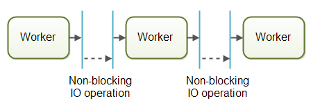

# Java concept   ------   概念

		Single-threaded
		Multithreading		
		Benefits
		Cost
		Concurrecy Model
			并行工作者模式
			流水线并发模型
			同一线程模型
		并发和并行概念

我们知道在操作系统启动一个应用程序就启动了一个进程，一个进程中包含很多不同的单一线程。

这些单一线程，只能在一个CPU上执行，性能时低下的。当然你也可以启动多个任务，多个进程在不同服务器并行执行。

## Single-threaded 

为了什么会存在单一线程的系统呢？

单线程系统已经普及，因为它们的并发模型比多线程系统简单得多。 

单线程系统不与其他线程共享任何数据。 这使单线程能够使用非并发数据结构，并更好地利用CPU和CPU缓存。

不幸的是，单线程系统没有充分利用现代CPU。 现代CPU通常配有2个，4个或更多内核。 每个核心都作为单独的CPU运

因此下面我们开始介绍多线程并发模型

## Multithreading

Multithreading can be a great way to increase the performance of some types of programs. 
However, mulithreading is even more challenging than multitasking

The threads are executing within the same program and are hence reading and writing the same memory simultanously

If a thread reads a memory location while another thread writes to it, what value will the first thread end up reading? 
The old value? The value written by the second thread? Or a value that is a mix between the two? Or, 
if two threads are writing to the same memory location simultanously, what value will be left when they are done? 
The value written by the first thread? The value written by the second thread? Or a mix of the two values written?

Multithreading and Concurrency in Java

java was one of the first languages to make multithreading easily available to developers.

Modern computers, though, come with multi core CPUs, and even with multiple CPUs too. 

This means that separate threads can be executed by separate cores or CPUs simultanously.

## Multithreading Benefits

The reason multithreading is still used in spite of its challenges is that multithreading can have several benefits. Some of these benefits are:

1. Better resource utilization.

2. Simpler program design in some situations.

3. More responsive programs

## Multithreading Costs

### More complex design

多线程更加复杂设计，

多线程同步引起的错误可能很难检测，重现和修复.

### 多线程本身也会消耗资源

## Concurrecy Model

### 并行工作者模式

第一个并发模型就是我所说的并行工作模型。 

传入的工作分配给不同的工作人员

在并行工作者并发模型中，委托者将传入的作业分发给不同的工作者。 每个工人完成各自工作。

这些工作程序并行工作，在不同的线程中运行，并且可能在不同的CPU上运行。

大多数程序都是采用并行工人模式，java提供 **java.util.concurrent** Java package来实现

并行工作者并发模型的优点是易于理解。 要增加应用程序的并行化，您只需添加更多工作程序

并行工作者并发模型的缺点是共享数据变的很难

无状态工作者模式 Stateless Workers

共享状态可以由系统中的其他线程修改，工人必须在每次需要时重新阅读状态，以确保它正在处理最新的副本。

如果内部不保留状态的工作者称为 **无状态**

作业执行顺序不确定。

并行工作者模式作业执行顺序是不确定的，这使得很难保证执行作业A前，执行作业B的需求。

### 流水线并发模型

#### 流水线并发模型概念
第二个并发模型就是我所说的流水线并发模型。

工人的组织就像工厂装配线上的工人一样。每个工人只执行完整工作的一部分。当该部分完成时，工人将工作转发给下一个工人。

每个工作者都在自己的线程中运行，并且不与其他工作者共享任何状态。这有时也称为无共享并发模型。

#### 流水线并发模型的系统通常设计为使用非阻塞IO

非阻塞IO意味着当工作者启动操作时，工作人员不会等待操作调用完成。

若操作很慢，等待操作完成会浪费CPU时间。同时CPU可能正在做其他事情。

当操作完成时将操作的结果被传递给另一个工作者。

大多数系统可以执行多个作业，因此作业会根据需要完成的工作从工作人员流向工作人员。 

实际上，可能会有多个不同的流水线同时进行。 

这就是流水线系统的工作流程可能看起来如何：

甚至可以将作业转发给多个工作者以进行并发处理。

也有可能实现业务场景更加复杂

使用流水线并发模型有时也称为 **响应式并发模型(事件驱动系统)** Reactive, Event Driven Systems

现在已经有很多现成响应式编程平台 比如node.js

流水线并发模型有两种实现方式 **演员和频道**

演员方式：演员可以直接向对方发送消息。 消息以异步方式发送和处理

渠道方式：工人不直接相互沟通。 相反，他们在不同的渠道上发布他们的消息（事件）。 

然后，其他工作人员可以在这些频道上收听消息，而发送者不知道谁在听

哪种并发模型最好？

如果作业相互独立并没有共享状态的话，并行工作者模型比较好
如果作业不是平行的也不是独立的，流水线并行模型比较

当然两种也可以一起使用

通过上面了解多线并发模型思想和分布式系统相似。

## 并发和并行概念

并发是指应用程序 **同时处理**多个任务

并行是指将任务分解多个子任务，这些子任务并行执行(相对串行)

并行有利于一个任务在多个CPU执行。

1. 应用程序可以是并发的但不是并行的。这意味着它同时处理多个任务，但任务不会分解为子任务

2. 应用程序也可以是并行的但不是并发的。这意味着应用程序一次只能处理一个任务，并且此任务被分解为可以并行处理的子任务。

3. 应用程序既不能并发也不能并行。这意味着它一次只能处理一个任务，并且该任务永远不会分解为并行执行的子任务。

4. 应用程序也可以是并发和并行的，因为它既可以同时处理多个任务，也可以将每个任务分解为子任务以便并行执行。
但是，在这种情况下，并发和并行性的一些好处可能会丢失，因为计算机中的CPU已经相当忙于单独使用并发或并行。
将其组合可能只会导致性能提升甚至性能下降。在盲目采用并发并行模型之前，请确保进行分析和测量。
