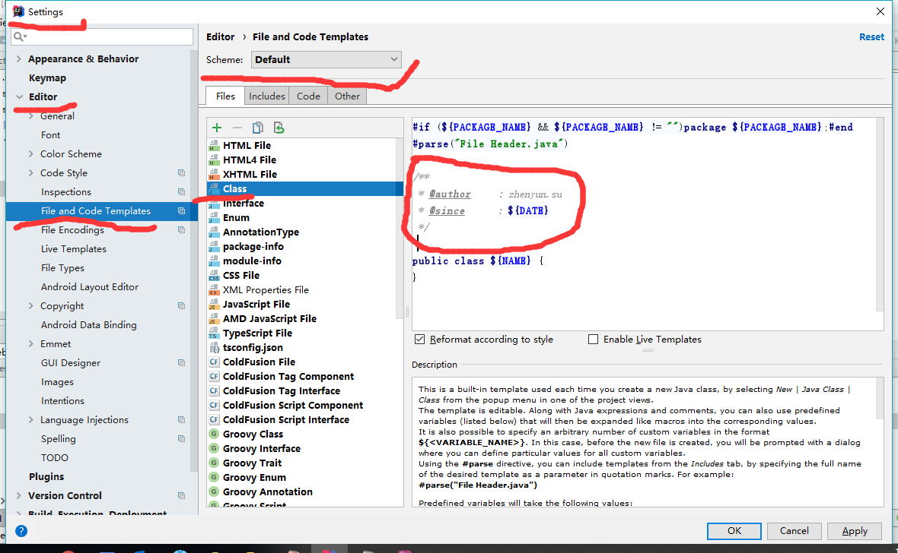
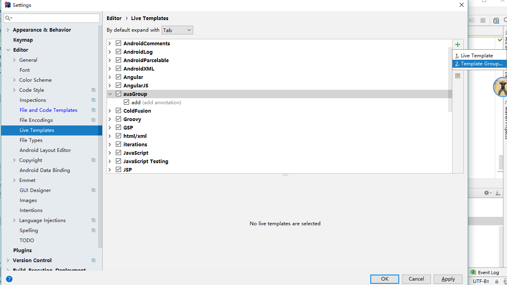
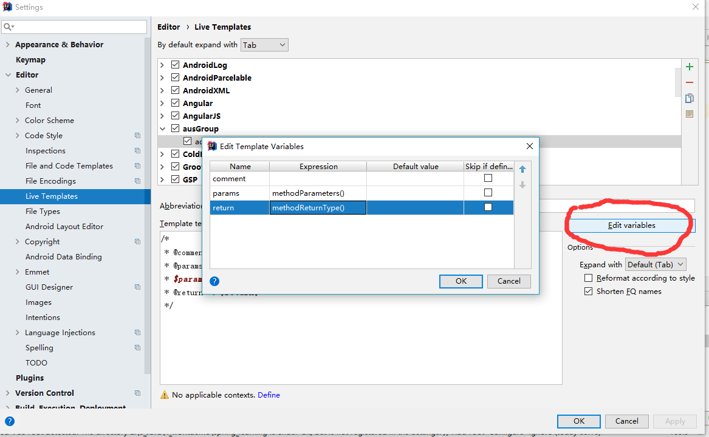

# IntelliJIDEA  ------chapter-88-01

		概况
		快捷键
		注释配置

## 快捷键


|文件操作|快捷键|操作|
|-|-|-|
|文件查找|全局查找任意文件|Shift+Shift|
|文件查找|查找最近文件|Ctrl+E/Ctrl+Shift+E|
|文件查找|查找类文件|Ctrl+N|
|文件结构|生成相关的结构图|Ctrl+Alt+U|
|文件结构|文件方法结构|Ctrl+F12|
|文件切换|按Tab文件向左或右切换|Alt+left/right|

|光标操作|快捷键|操作|
|-|-|-|
|光标移动|移动之前或之后位置|Ctrl+Alt+left/right|
|光标移动|上下快速移动|Alt+Up / Alt+Down|
|光标移动|左右快速移动|Ctrl+left / Ctrl+Right|

|代码操作|快捷键|操作|
|-|-|-|
|代码生成|补全代码|Alt+Insert|
|代码生成|包裹代码|Ctrl+Alt+T|
|代码生成|生成测试代码|Ctrl+Shift+T|
|代码整理|格式化代码|Ctrl+Alt+L|
|代码编辑|复制当前行，光标下移|Ctrl+D|
|代码编辑|删除当前行，光标下移|Ctrl+Y|
|代码编辑|向下插入新行|Shift+Enter|
|代码编辑|向上插入新行|Ctrl+Alt+Enter|
|代码编辑|大小写转换|Ctrl+Shift+U|
|代码编辑|选择相同变量名，统一修改|Alt+j|


|注释操作|快捷键|操作|
|-|-|-|
|注释添加|添加或取消//注释|Ctrl+/|
|注释添加|添加或取消/**/注释|Ctrl+Shift+/|


|窗口操作|快捷键|操作|
|-|-|-|
|切换窗口|项目结构窗口|Alt+1|
|切换窗口|文件结构窗口|Alt+7|

|建构操作|快捷键|操作|
|-|-|-|
|编译|运行|Shift+F10|
|编译|选择运行操作|Alt + Shift + F10|
|编译|Debug|Shift+F9|
|编译|选择debug操作|Alt + Shift + F9|	


## 注释配置

### 文件头注释模板

打开配置窗口
`Setting -> Editor -> File and Code Templates -> Files -> Class `

可以选择class, interface, Enum等类型添加注释模板




类的注释模板
```
/**
 * @author     : zhenyun.su      
 * @since      : ${DATE}
 */
```
或
```
/**
 * @author     : zhenyun.su      
 * @since      : ${DATE}
 * @see   
 */
```
@see是为了查看相关类或方法提供超链接，也可以使用 {@link }


为了保持代码简洁，没有添加更多的内容。

为了让其他开发者理解这个class文件作用，可以在@author之前添加描述说明。

可以在描述说明版权和许可证


在创建文件时，会自动添加文件头的注释

### 方法头注释模板

添加我们个性的模板组
`Setting -> Editor -> live Templates -> + -> template Group



添加写ausGroup

添加个人模板

`Setting -> Editor -> live Templates -> ausGroup -> + -> live template


Abbreviation： 输入添加方法头注释密令

这里我们输入 add， 在使用时输入add 按回车或tab键完成添加注释。

输入模板内容
```
/*
 * @comment : $comment$
 * @params  : 
 * $params$
 * @return  : $return$
 */
```

配置参数



params: methodParameters()
return: methodReturnType()

no applicableContext **define**

勾选： EveryWhere


注释模板也配置好了，我们可以愉快的使用了

但是按简洁之道，尽量减少代码注释，好的命令风格就可以减少注释。


## 个性化设置

	设置主题：Appearance -> Theme[Darcula]
	设置背景图：Appearance -> backgroup image


