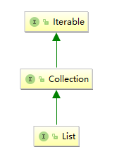
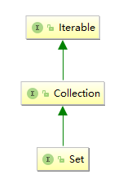
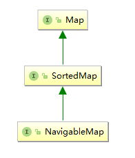

# collections interface

		Overview of Java Collections
		Iterable interface
		collection interface
		集合方法实例


## Java Collections - Overview
 The Java Collections API's provide Java developers with a set of classes and interfaces that makes it easier to handle collections of objects

 it is useful to have an overview of the interfaces it contains

 there are two "groups" of interfaces: Collection's and Map's.

interface hierarchy 

list interface hierarchy



set interface hierarchy



map intrface hierarchy


集合根接口iterable

## Iterable interface

The Iterable interface (*java.lang.Iterable*) is one of the root interfaces of the Java collection classes. 
The Collection interface extends Iterable, so all subtypes of Collection also implement the Iterable interface

The Iterable interface has only one method:
```
public interface Iterable<T> {
  public Iterator<T> iterator();    
}
```

iterable 提供返回iterator迭代器，通过迭代器可以实现集合的遍历

```
public interface Iterator<E> {
    boolean hasNext();
    E next();
```

如下遍历
```
    while (xxx.hasNext){
        statement;
	xxx.next;
    }
```

## collection interface

The Collection interface (java.util.Collection) is one of the root interfaces of the Java collection classes. 

collection接口主要提供如下方法

1. Adding and Removing Elements
2. Checking if a Collection Contains a Certain Element
3. Collection Size
4. Iterating a Collection
5. Collection Subtypes

### collection主要方法

|方法|描述|
|-|-|
|add|添加一个元素|
|addAll|添加所有元素|
|remove|移除一个元素|
|removeAll|移除所有元素|
|iterator|返回迭代器|
|size|集合大小|
|clear|清空集合|
|contains|集合是否包含某个元素|
|isEmpty|集合是否为空|


### Collection Subtypes

* List
* Set
* SortedSet
* NavigableSet
* Queue
* Deque

## 集合方法实例

```
public class MyCollectionUtil {

    public static void printlnItem(Collection collection){
        Iterator iterator = collection.iterator();
        while (iterator.hasNext()){
            System.out.println(iterator.next());
        }
    }
}


public class MyMain {
    public static void main(String[] args){
        List<String> list = new ArrayList<>();
        list.add("zhenyun.su");

        Set<Integer> set = new HashSet<>();
        set.add(1);
        set.add(2);

        MyCollectionUtil.printlnItem(list);
        MyCollectionUtil.printlnItem(set);
    }
}

```

#### Adding and Removing Elements

```
public class MyCollectionUtil {

    public static void addItem(Collection collection, Object o){
        collection.add(o);
    }

    public static void clearItem(Collection collection){
        collection.clear();
    }

    public static void remoteItem(Collection collection, Object o){
        collection.remove(o);
    }
}

public class MyMain {
    public static void main(String[] args){
        List<String> list = new ArrayList<>();
        list.add("zhenyun.su");

        Set<Integer> set = new HashSet<>();
        set.add(1);
        set.add(2);

        Map<Integer, String> map = new HashMap<>();
        map.put(1, "asu1");
        map.put(2, "asu2");

        MyCollectionUtil.clearItem(list);
        MyCollectionUtil.addItem(list, "asushiye");
        MyCollectionUtil.printlnItem(list);

        MyCollectionUtil.remoteItem(set, 2);
        MyCollectionUtil.printlnItem(set);
        MyCollectionUtil.printlnItem(map.entrySet());

    }
}

```
addAll Collection from other collection

```
        Collection collection = new HashSet();
        collection.addAll(set);
        MyCollectionUtil.printlnItem(collection);
        collection.removeAll(set);
```


#### Checking if a Collection Contains a Certain Element and collection size

```
        System.out.println(collection.contains(1));
        collection.removeAll(set);
        System.out.println(collection.contains(1));
	int numberOfElements = collection.size();
```


refer to：JavaGenerics


