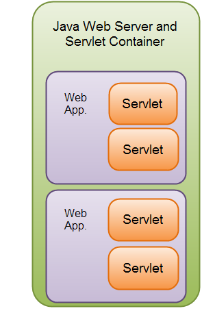
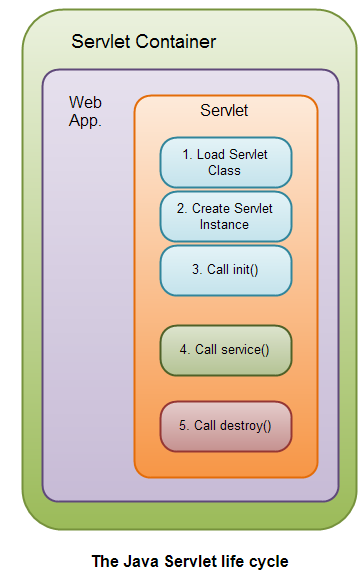

# java servlets tutriol

chapter-30-01

Java Servlets is a web technology for Java,You will need to run your Java Servlets inside a Servlet compatible "Servlet Container" (e.g. web server) in order for them to work.

```
        What is a Servlet?
        Servlet Life Cycle
        Java Servlet Example
            create web project - web.xml
            create web project - annotation
```

## What is a Servlet?

A Java Servlet is a Java object that responds to HTTP requests. It runs inside a Servlet container.


A Servlet is part of a Java web application. A Servlet container may run multiple web applications at the same time, each having multiple servlets running inside



A Java web application can contain other components than servlets. It can also contain Java Server Pages (JSP), Java Server Faces (JSF) and Web Services

### HTTP Request and Response

The browser sends an HTTP request to the Java web server. The web server checks if the request is for a servlet. If it is, the servlet container is passed the request. The servlet container will then find out which servlet the request is for, and activate that servlet. The servlet is activated by calling the Servlet.service() method.

Once the servlet has been activated via the service() method, the servlet processes the request, and generates a response. The response is then sent back to the browser.

### Servlet Containers

Java servlet containers are usually running inside a Java web server. A few common well known, free Java web servers are:

- Jetty

- Tomcat

## Servlet Life Cycle

- Load Servlet Class
- Create Instance of Servlet
- Call the Servlets init() Method
- Call the Servlets service() Method
- Call the Servlets destroy() Method

A servlet follows a certain life cycle. The servlet life cycle is managed by the servlet container. The life cycle contains the following steps:

1. Load Servlet Class.

   > first http request or web.xml configuration load-on-startup load servlet class
2. Create Instance of Servlet.

   > When the servlet class is loaded, the servlet container creates an instance of the servlet.
3. Call the servlets init() method.

   > When a servlet instance is created, its init() method is invoked. The init() method allows a servlet to initialize itself before the first request is processed.
4. Call the servlets service() method.

   > For every request received to the servlet, the servlets service() method is called. 
5. Call the servlets destroy() method.

   > A servlet is unloaded by the container if the container shuts down, or if the container reloads the whole web application at runtime.When a servlet is unloaded by the servlet container, its destroy() method is called



Step 1, 2 and 3 are executed only once, when the servlet is initially loaded. By default the servlet is not loaded until the first request is received for it. You can force the container to load the servlet when the container starts up though. See web.xml Servlet Configuration for more details about that.

Step 4 is executed multiple times - once for every HTTP request to the servlet.
Step 5 is executed when the servlet container unloads the servlet.

## Java Servlet Example

A Java Servlet is just an ordinary Java class which implements the interface

`javax.servlet.Servlet;`

The easiest way to implement this interface is to extend either the class **GenericServlet or HttpServlet**.

### create web project -web.xml

use IntelliJ IDEA + tomcat 8.0 +JDK 8 to create project

1. create project 

> new project ->java EE ->web application 

2. load servlet-api.jar 

> project setting ->libraries add tomcat 8.0v servlet-api.jar

3. create WEB-INF and WEB-INF/web.xml

```
   <?xml version="1.0" encoding="UTF-8"?><web-app xmlns="http://xmlns.jcp.org/xml/ns/javaee"
      xmlns:xsi="http://www.w3.org/2001/XMLSchema-instance"
      xsi:schemaLocation="http://xmlns.jcp.org/xml/ns/javaeehttp://xmlns.jcp.org/xml/ns/javaee/web-app_3_1.xsd"
      version="3.1">

   <servlet>
     <servlet-name>SimpleServlet</servlet-name>
     <servlet-class>SimpleServlet</servlet-class>
   </servlet>

   <servlet-mapping>
    <servlet-name>SimpleServlet</servlet-name>
    <url-pattern>/yesOrNo</url-pattern>
  </servlet-mapping>

</web-app>
```

4. create SimpleServlet

```
public class SimpleServlet extends GenericServlet {
    @Override
    public void service(ServletRequest servletRequest, ServletResponse servletResponse) throws ServletException, IOException {
        String yesOrNoParam = servletRequest.getParameter("param");
        servletResponse.setContentType("text/html");
        if ("YES".equals(yesOrNoParam)){
            servletResponse.getWriter().write("<html><body>You said YES!</body></html>");
        }

        if ("NO".equals(yesOrNoParam)){
            servletResponse.getWriter().write("<html><body>You said NO!</body></html>");
        }

    }
}
```

5. tomcat run 

> edit configuration -> tomcat -> local

6. test url

> http://localhost:8080/yesOrNo?param=NO

### create web project -annotation

create HelloWorld Servlet extends HttpServlet

```
@javax.servlet.annotation.WebServlet(value = "/hello",loadOnStartup=1)
public class HelloWorld extends javax.servlet.http.HttpServlet {
    protected void doPost(javax.servlet.http.HttpServletRequest request, javax.servlet.http.HttpServletResponse response) throws javax.servlet.ServletException, IOException {
        this.doGet(request, response);
    }

    protected void doGet(javax.servlet.http.HttpServletRequest request, javax.servlet.http.HttpServletResponse response) throws javax.servlet.ServletException, IOException {
       // request.getRequestDispatcher("/index.jsp").forward(request, response);

        response.setContentType("text/html");
        response.setCharacterEncoding("UTF-8");
        PrintWriter writer=response.getWriter();
        writer.append("<!DOCTYPE html>")
                .append("<html><head></head><body>")
                .append("HelloWorld")
                .append("</body></html>");
    }
}
```

http://localhost:8080/hello

javax.servlet.annotation.WebServlet

```
public @interface WebServlet {
    String name() default "";

    String[] value() default {};

    String[] urlPatterns() default {};

    int loadOnStartup() default -1;

    WebInitParam[] initParams() default {};

    boolean asyncSupported() default false;

    String smallIcon() default "";

    String largeIcon() default "";

    String description() default "";

    String displayName() default "";
}
```
